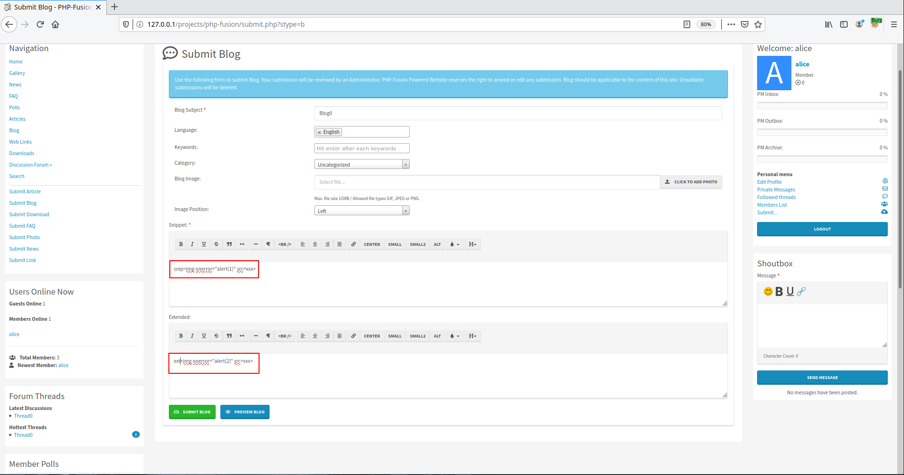
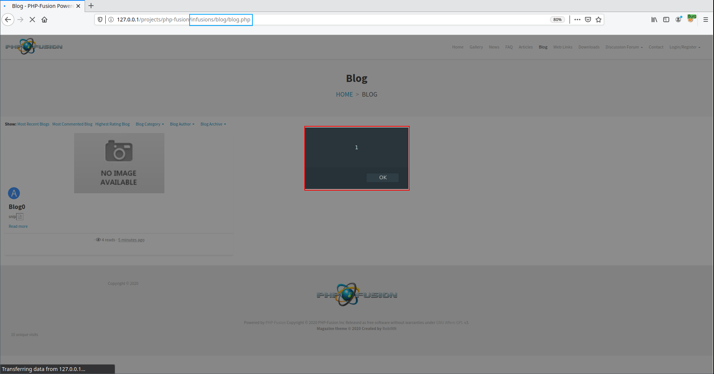
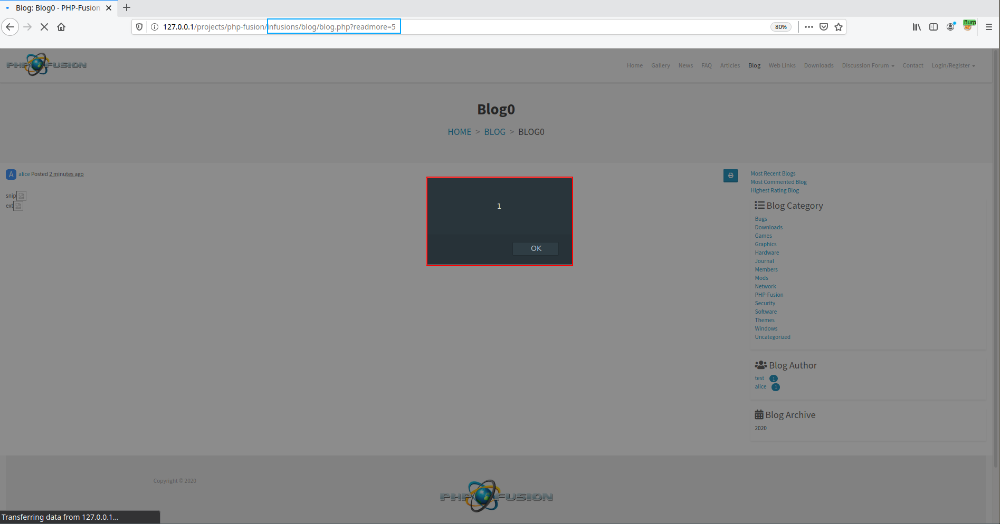


# B0: I just want to help

After contacting the editors of PHP-Fusion to inform them about the identified vulnerabilities, they answered me that they were already aware of it and that it would be fixed in the next update (update for which a GitHub link has been given to me). So I downloaded the update and found out that the vulnerabilities were actually still present. Their rejection makes me want to find a new way of exploiting the same vulnerability as the one presented in chapter C101. The new vulnerable feature is blog publishing. An authenticated user can publish a blog with HTML code in its body, leading to a Stored XSS. 

This post being a bonus and not a proper chapter I'm not going to linger on the analysis of the vulnerable code. What's interesting for me is that our XSS is triggered at multiple points in the application.

For the route \<ROOT\>/infusions/blog/blog.php:

as well as for the route \<ROOT\>infusions/blog/blog.php?readmore=\<BLOG_ID\>:

And probably others, but I didn't take the trouble to check them all. The vulnerability is also triggered in non-authenticated users browser because they have access to the blogs.
