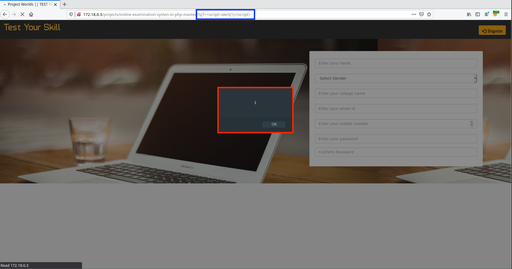
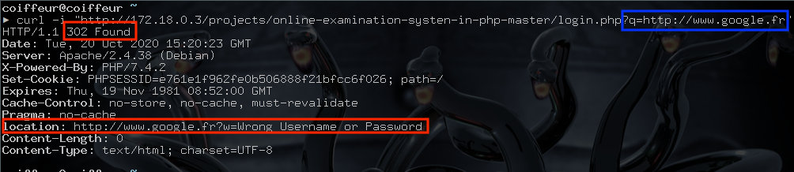
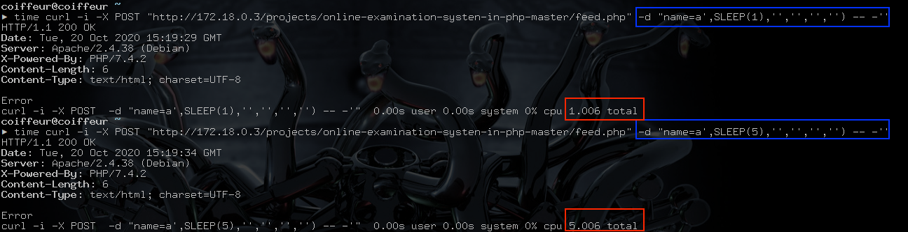


# B3: Back to basics

[PROJECTWORLDS](https://projectworlds.in/) offers both a platform to introduce developers to the PHP language and a code base
for people wishing to deploy PHP applications. However, this duality implies a risk. Most of the applications offered for download
are vulnerable. This makes this platform a good playground to learn how to search for vulnerabilities. In addition, it can be
interesting to use the proposed source code to develop our own static analysis tools.

So we are going to be interested in the PHP code of:

- [Online Examination System Project in PHP MySQL](https://projectworlds.in/free-projects/php-projects/online-examination/)

Note:<br>A cool feature of the PROJECTWORLDS platform is that a features section is filled in for each project which help
us to identify sensitive features within the application such as upload features, etc.

## Online Examination System Project in PHP MySQL

I'm not going to explain in detail how and why this project exists and I'll directly answer you that yes, this project
is deployed in the wild.

I will simply quote you the description made by the author:
> Online examination system is a non removable examination pattern of today’s life. We need more time saving and more accurate
examination system as the number of applicants is increasing day by day. For all IT students and professionals, it is very important
to have some basic understanding about the online examination system. On this site you will get source code with the running project.
It will help you to understand the concept of the project.

So we are going to download the [sources](https://github.com/projectworlds32/online-examination-systen-in-php/archive/master.zip)
of the project and directly use [PhpStorm]() in order to analyze all this.  In order to begin the search for vulnerabilities the
simplest method is to look at pages of code in order to understand the general functionnment of the application. Here it is not
very difficult since the application does not use a framework. Let's take a look at the <span style="color:red">\<ROOT\>index.php</span> page.

### Reflected XSS

File: <span style="color:red">\<ROOT\>/index.php</span>
```php

...

<?php if(@$_GET['q7'])
{ echo'<p style="color:red;font-size:15px;">'.@$_GET['q7'];}?>
<!-- Button -->
<div class="form-group">
  <label class="col-md-12 cont2020-10-20_16-45.rol-label" for=""></label>
  <div class="col-md-12"> 
    <input  type="submit" class="sub" value="sign up" class="btn btn-primary"/>
  </div>
</div>

...

```

We see that if the variable `$_GET['q7']` is defined then this one is reflected in the source code without beeins sanitized
which results in an XSS.



### Open Redirect


File: <span style="color:red">\<ROOT\>/login.php</span>
```php
<?php
session_start();
if(isset($_SESSION["email"])){
session_destroy();
}

include_once 'dbConnection.php';
$ref=@$_GET['q'];
$email = $_POST['email'];
$password = $_POST['password'];

$email = stripslashes($email);
$email = addslashes($email);
$password = stripslashes($password); 
$password = addslashes($password);
$password=md5($password); 
$result = mysqli_query($con,"SELECT name FROM user WHERE email = '$email' and password = '$password'") or die('Error');
$count=mysqli_num_rows($result);
if($count==1){
while($row = mysqli_fetch_array($result)) {
	$name = $row['name'];
}
$_SESSION["name"] = $name;
$_SESSION["email"] = $email;
header("location:account.php?q=1");
}
else
header("location:$ref?w=Wrong Username or Password");


?>
```

Based on the above code, we understand that if variables `$_POST['email']` and `$_POST['password']` are not defined, then the query
`"SELECT name FROM user WHERE email = '$email' and password = '$password'"` becomes `"SELECT name FROM user WHERE email = '' and password = ''"`.
This does not validate the `if` condition `$count==1` and allows us to trigger the code of `else`. Since we control the variable
`$_GET['q']` it is possible to control the redirection.



### Time Based SQLi

The last vulnerability presented is a Time Based SQL injection within <span style="color:red">\<ROOT\>/feed.php</span> which we can exploit via one of the following parameters:
- `$_POST['name']`
- `$_POST['email']`
- `$_POST['subject']`
- `$_POST['feedback']`

File: <span style="color:red">\<ROOT\>/feed.php</span>
```php
<?php
include_once 'dbConnection.php';
$ref=@$_GET['q'];
$name = $_POST['name'];
$email = $_POST['email'];
$subject = $_POST['subject'];
$id=uniqid();
$date=date("Y-m-d");
$time=date("h:i:sa");
$feedback = $_POST['feedback'];
$q=mysqli_query($con,"INSERT INTO feedback VALUES  ('$id' , '$name', '$email' , '$subject', '$feedback' , '$date' , '$time')")or die ("Error");
header("location:$ref?q=Thank you for your valuable feedback");
?>
```

The explanation of the vulnerability is not detailed, but the result is available below.



## Then

Certainly the identification of these vulnerabilities may seem trivial, but, what will be interesting now is to identify the presence of these vulnerabilities in an automated way, thanks to a static analysis tool that I will try to develop.
