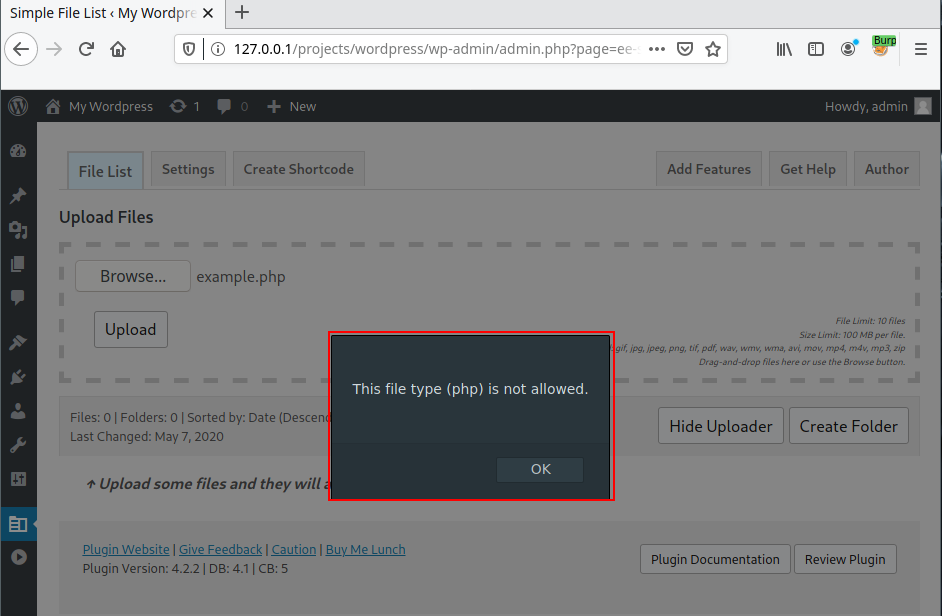
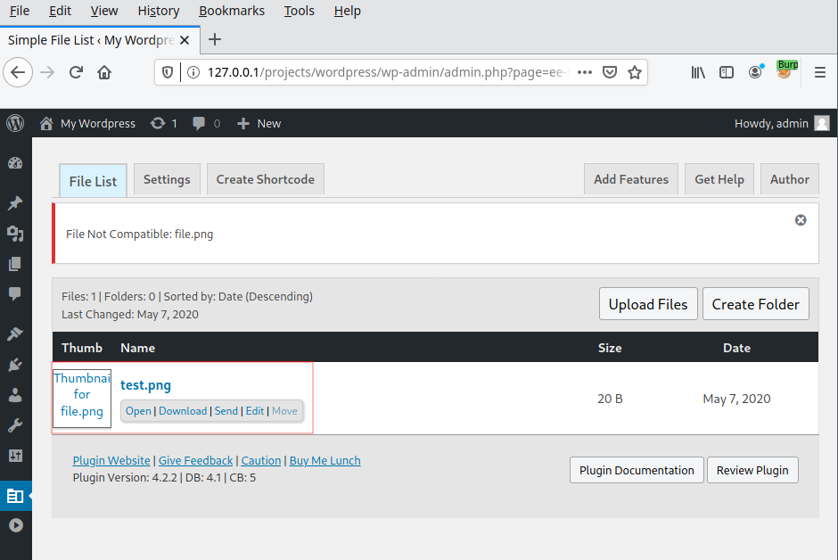
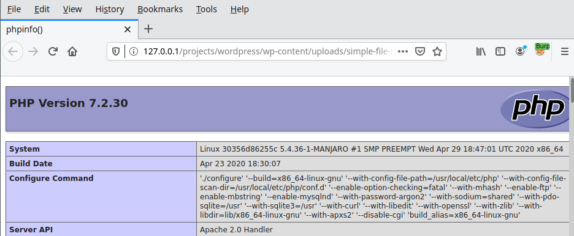
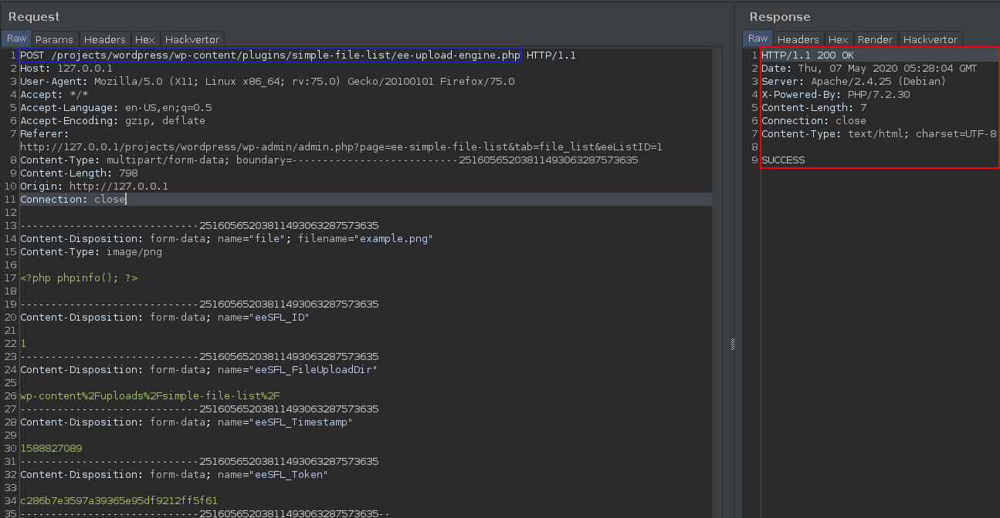
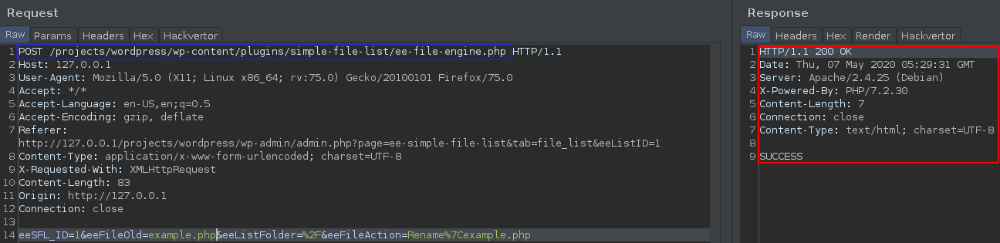


# C0: Wordpress plugin Simple File List <= v4.2.2, RCE (pre-auth)

Well, at the beginning I thought, "Okay, man, you gotta get some 0day to be cool !". So when you're a beginner like me and you want to find vulnerabilities, you're generally thinking that it would be a good idea to take the first CMS you get your hands on, take an IDE and dive into the code. But guess what? You're wrong. After 5 minutes of grep you realized that:

1. You didn't understand anything of this [shit](https://www.tiktok.com/@paytoejohnson/video/6820566457647156485)
2. You stopped because you're completely frustrated

Then comes to me the idea of David vs Goliath. We only need one weak spot to be able to take down an ennemy. For most CMS, it is possible to add plugins developed by members of its community and for the WordPress CMS, the list of public plugins is available at [https://wordpress.org/plugins/](https://wordpress.org/plugins/). All we have to do now is to find a plugin with not too much usage and which uses sensitive features. In our case it will be the [Simple File List](https://wordpress.org/plugins/simple-file-list/) v4.2.2 plugins whose description can be seen below:

> Simple File List is a free plugin that gives your WordPress website a list of your files allowing your users to open and download them. Users can also upload files if you choose.

## How?

In order to find vulnerabilities in the plugin we will use:

- [Docker](https://www.docker.com/) and the projet [docker-compose-lamp](https://github.com/sprintcube/docker-compose-lamp) developed by [sprintcube](https://github.com/sprintcube)
- [Burp Suite](https://portswigger.net/burp)
- [PhpStorm](https://www.jetbrains.com/phpstorm/)

First, we generate a testing file <span style="color:red">example.php</span> to play with the upload form:

File: <span style="color:red">example.php</span>
```
▶ echo "<?php phpinfo(); ?>" > example.php && cat example.php
<?php phpinfo(); ?>
```

After uploading the file <span style="color:red">example.php</span>, we faced an error caused by the absence of the PHP extension within the string variable `var eeSFL_FileFormats`, which is used to trigger error if the file extension does not correspond to one of the extensions below.

```javascript
var eeSFL_FileFormats = "gif,jpg,jpeg,png,tif,pdf,wav,wmv,wma,avi,mov,mp4,m4v,mp3,zip"; // Allowed file extensions
```


But because it's client side, we could bypass this protection by modifying the file extension between the browser and the server using the proxy [Burp Suite](https://portswigger.net/burp).

Then two cases arose:

1. The server responds with a 500 status code when the file extension is php.
2. The server responds with a 200 status code when the file extension is png.

")

")

An interesting approach is to ask yourself if another feature would allow us to get a PHP file anyway. In most file managers it is possible to rename an existing file, so let's try to rename <span style="color:red">test.png</span> to <span style="color:red">test.php</span>.

Here are the steps to follow:

1. Upload a png file <span style="color:red">test.png</span> containing PHP code as in <span style="color:red">example.php</span>.
2. Rename the file from <span style="color:red">test.png</span> to <span style="color:red">test.php</span>.
3. Locate the file on the server.



")



Cool we were able to fully upload the PHP file as an administrator. Because during all the tests administrator's cookies were stored in our browser. So now the question is, what happen, if we replay the requests 1 and 2 from the previous list without thoses cookies?

Well, it's rarely the case, but this time it works.





The only thing left to do is to write a python script to automate the whole thing.

## Why?

The exploitation has been possible in black-box, but it's often interesting to understand what's behind. It is possible to exploit the vulnerability for a number of reasons. For both files <span style="color:red">\<ROOT\>/wp-content/plugins/simple-file-list/ee-upload-engine.php</span> and <span style="color:red">\<ROOT\>/wp-content/plugins/simple-file-list/ee-file-engine.phpw</span>:

- No protection has been put in place in order to avoid direct access.
- User rights are not controlled, allowing any user to interact with the scripts.

The security mechanism preventing a file from being uploaded is the following condition:

File: <span style="color:red">\<ROOT\>/wp-content/plugins/simple-file-list/ee-upload-engine.php</span>
```php
<?php

...

$verifyToken = md5('unique_salt' . $_POST['eeSFL_Timestamp']);

if($_POST['eeSFL_Token'] == $verifyToken) { 
    
    <UPLOAD>
}
    
...

?>
```

By controlling elements `eeSFL_Timestamp` and `eeSFL_Token` from `$_POST` variable we were able to always validate the condition.

The author of the plugin has been informed of the vulnerability.

## Ref

- [POC](https://github.com/therealcoiffeur/therealcoiffeur.github.io/blob/master/tools/Wordpress/simple_file_list_4.2.2.py)
- [https://wpvulndb.com/vulnerabilities/10192](https://wpvulndb.com/vulnerabilities/10192)
