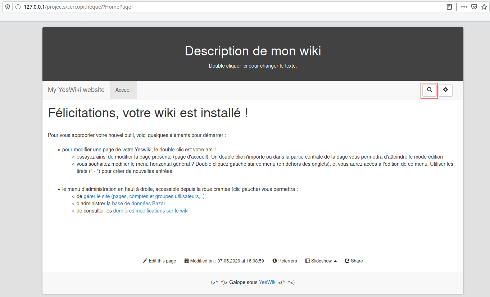
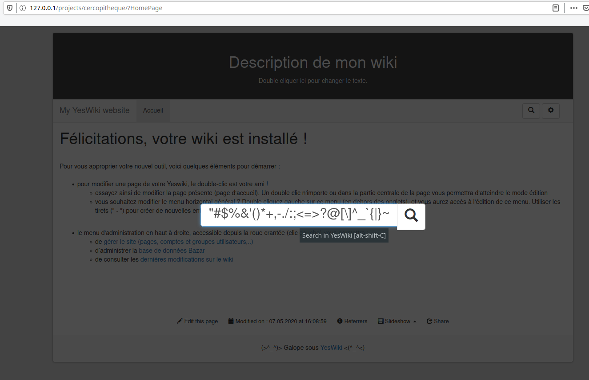
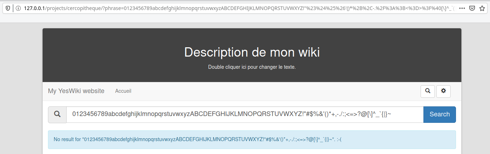
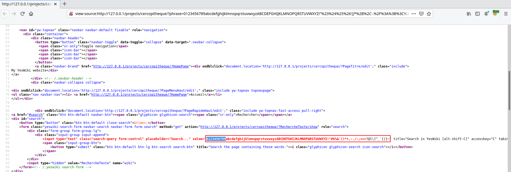
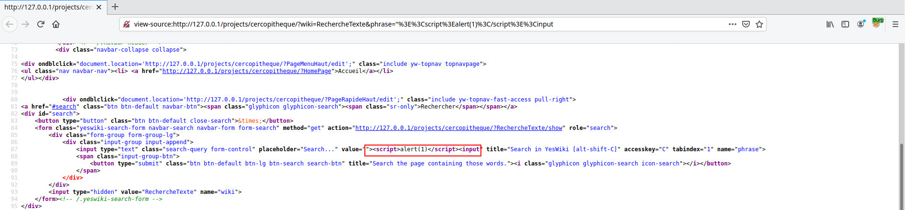
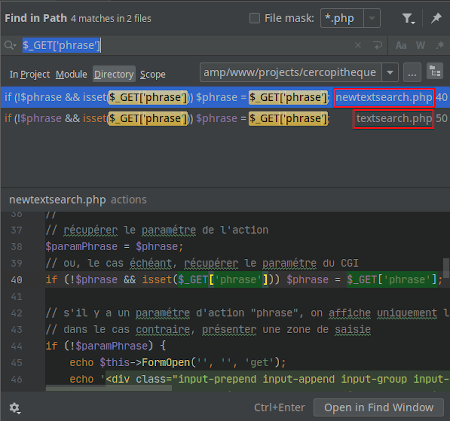


# C1: YesWiki version cercopitheque 2020-04-18-1, Reflected XSS (pre-auth)

After finding by chance this first vulnerability I thought it might be better to look for an application in which I would really invest some time to level up and maybe find something cool. I decided to look at the app's code of [YesWiki](https://yeswiki.net/) version cercopitheque 2020-04-18-1 an application to create wikis. The source code of the application is available via their [website](https://yeswiki.net/?PageCreer) or via their [GitHub](https://github.com/YesWiki/yeswiki).

## How?

The lab remains the same as in the previous chapter:

- [Docker](https://www.docker.com/) and the projet [docker-compose-lamp](https://github.com/sprintcube/docker-compose-lamp) developed by [sprintcube](https://github.com/sprintcube)
- [Burp Suite](https://portswigger.net/burp)
- [PhpStorm](https://www.jetbrains.com/phpstorm/)

Just install the application and start looking for vulns. My first reflex and I think it's the case for many beginners is to test visible fields (search, contact, etc.) with the payload below. 

```
▶ python2 -c 'import string; print string.printable' 
0123456789abcdefghijklmnopqrstuvwxyzABCDEFGHIJKLMNOPQRSTUVWXYZ!"#$%&'()*+,-./:;<=>?@[\]^_`{|}~
```

Then:

- Inspect the page HTML source code to detect reflected values, errors, etc.
- Inspect the server response time.
- Inspect the status code from the server response.

Sometimes you will be lucky and you will realize that your payload can lead to the discovery of XSS, SQLi and some other vulnerabilities. 









In our case the payload was reflected in the server response page and allows us to escape from the `<input>` tag attribute `value`.




The problem of this vulnerability is that it requires a part of social engineering to show some results. So I decided not to go any further in the exploitation.

## Why?

Knowing the vulnerable parameter, I inspected the code looking for its use. With PhpStorm comme the features to look for string in the entire projetcs.



But if some of you prefer to stay in a terminal, you will get a similar result using grep:

```
▶ grep -R -i --text "\$_GET\['phrase'\]"
actions/textsearch.php:if (!$phrase && isset($_GET['phrase'])) $phrase = $_GET['phrase'];
actions/newtextsearch.php:if (!$phrase && isset($_GET['phrase'])) $phrase = $_GET['phrase'];
```

The code below is an extract of the files referencing the element `phrase` of `$_GET` variable:

File: <span style="color:red">\<ROOT\>/actions/textsearch.php</span>
```php
if (!$phrase && isset($_GET['phrase'])) $phrase = $_GET['phrase'];

// s'il y a un paramétre d'action "phrase", on affiche uniquement le résultat
// dans le cas contraire, présenter une zone de saisie
if (!$paramPhrase)
{
	echo $this->FormOpen('', '', 'get');
	echo '<div class="input-prepend input-append input-group input-group-lg">
			<span class="add-on input-group-addon"><i class="glyphicon glyphicon-search icon-search"></i></span>
      <input name="phrase" type="text" class="form-control" placeholder="'.(($label) ? $label : '').'" size="', $size, '" value="', htmlspecialchars($phrase, ENT_COMPAT, YW_CHARSET), '" >
      <span class="input-group-btn">
        <input type="submit" class="btn btn-primary btn-lg" value="', $button, '" />
      </span>
    </div><!-- /input-group --><br>';
	echo "\n", $this->FormClose();
}
```

File: <span style="color:red">\<ROOT\>/actions/newtextsearch.php</span>
```php
if (!$phrase && isset($_GET['phrase'])) $phrase = $_GET['phrase'];

// s'il y a un paramétre d'action "phrase", on affiche uniquement le résultat
// dans le cas contraire, présenter une zone de saisie
if (!$paramPhrase) {
    echo $this->FormOpen('', '', 'get');
    echo '<div class="input-prepend input-append input-group input-group-lg">
          <span class="add-on input-group-addon"><i class="glyphicon glyphicon-search icon-search"></i></span>
          <input name="phrase" type="text" class="form-control" placeholder="'.(($label) ? $label : '').'" size="', $size, '" value="', htmlspecialchars($phrase, ENT_COMPAT, YW_CHARSET), '" >
          <span class="input-group-btn">
          <input type="submit" class="btn btn-primary btn-lg" value="', $button, '" />
          </span>
          </div>
          <span class="">
          <small>Un caract&eacute;re inconnu peut &ecirc;tre remplac&eacute; par « ? » plusieurs par « * »</small>
          </span><!-- /input-group --><br>';
    echo "\n", $this->FormClose();
}
```

It seems that the variable's element is sanitized with the function `htmlspecialchars()`, so I asked myself why the XSS is still triggering. The best way to found out is to read the [doc](https://www.php.net/manual/en/function.htmlspecialchars.php) and test with a simple PHP code.

>`htmlspecialchars ( string $string [, int $flags = ENT_COMPAT | ENT_HTML401 [, string $encoding = ini_get("default_charset") [, bool $double_encode = TRUE ]]] ) : string`<br><br>
Certain characters have special significance in HTML, and should be represented by HTML entities if they are to preserve their meanings. This function returns a string with these conversions made. If you require all input substrings that have associated named entities to be translated, use htmlentities() instead.

File: <span style="color:red">html_special_chars.php</span>
```php
<?php
$phrase = '"><script>alert(1)</script><input';
var_dump(htmlspecialchars($phrase, ENT_COMPAT, YW_CHARSET));
?>
```

Once executed, it gives us the following result:

```
▶ php html_special_chars.php
PHP Warning:  Use of undefined constant YW_CHARSET - assumed 'YW_CHARSET' (this will throw an Error in a future version of PHP) in /home/coiffeur/Documents/Dev/Vulnerability-Analysis/Labs/docker-compose-lamp/www/projects/poc.php on line 3
PHP Warning:  htmlspecialchars(): charset `YW_CHARSET' not supported, assuming utf-8 in /home/coiffeur/Documents/Dev/Vulnerability-Analysis/Labs/docker-compose-lamp/www/projects/poc.php on line 3
string(56) "&quot;&gt;&lt;script&gt;alert(1)&lt;/script&gt;&lt;input"
```

Realizing that the parameter was properly cleaned, I first thought that the problem was with my navigator but after having tried several navigators it seemed that the XSS was still present.

For the navigator I was completely wrong and that's what I found interesting in the narrative of this chapter. It may seem obvious, but I concentrated too much attention on the use of the element `phrase` from `$_GET` variable, which made me forget that in reality it is variable `$phrase` that we should be interested in. 

```
▶ grep -R -i --text "echo \$phrase"
cercopitheque/tools/templates/presentation/templates/moteurrecherche_basic.tpl.html:			<input type="text" class="input-small search-query" placeholder="<?php echo _t('TEMPLATE_SEARCH_PLACEHOLDER');?>" value="<?php echo $phrase;?>" title="<?php echo _t('TEMPLATE_SEARCH_INPUT_TITLE');?>" accesskey="C" tabindex="1" name="phrase" />
cercopitheque/tools/templates/presentation/templates/moteurrecherche_navbar.tpl.html:		    <input type="text" class="search-query form-control" placeholder="<?php echo _t('TEMPLATE_SEARCH_PLACEHOLDER');?>" value="<?php echo $phrase;?>" title="<?php echo _t('TEMPLATE_SEARCH_INPUT_TITLE');?>" accesskey="C" tabindex="1" name="phrase">
cercopitheque/tools/templates/presentation/templates/moteurrecherche_button.tpl.html:			    <input type="text" class="search-query form-control" placeholder="<?php echo _t('TEMPLATE_SEARCH_PLACEHOLDER');?>" value="<?php echo $phrase;?>" title="<?php echo _t('TEMPLATE_SEARCH_INPUT_TITLE');?>" accesskey="C" tabindex="1" name="phrase">
```

And there we have `<?php echo $phrase;?>` in file <span style="color:red">\<ROOT\>/tools/templates/presentation/templates/moteurrecherche_basic.tpl.html</span> the PHP code triggering our payload. This template file is render by <span style="color:red">\<ROOT\>/tools/templates/actions/moteurrecherche.php</span> as we can see below:

File: <span style="color:red">\<ROOT\>/tools/templates/actions/moteurrecherche.php</span>
```php
<?php

...

// on choisit le template utilisé
$template = $this->GetParameter('template'); 
if (empty($template)) {
	$template = 'moteurrecherche_basic.tpl.html';
}

...

include_once 'includes/squelettephp.class.php';
try {
    $squel = new SquelettePhp($template, 'templates');
    echo $squel->render($searchelements);
} catch (Exception $e) {
    echo '<div class="alert alert-danger">Erreur action {{moteurrecherche ..}} : ',  $e->getMessage(), '</div>'."\n";
}
?>
```

We made it ! We finaly understand why our payload have been trigger, so now we can have some rest. I learned that it is necessary to go further in the analysis while keeping distance from what we are looking for. Easier said than done, you might say !

The authors of the project has been informed of the vulnerability, additionally another vulnerability related to [YesWiki](https://yeswiki.net/) version cercopitheque 2020-04-18-1 will be detailed in the next chapter.
