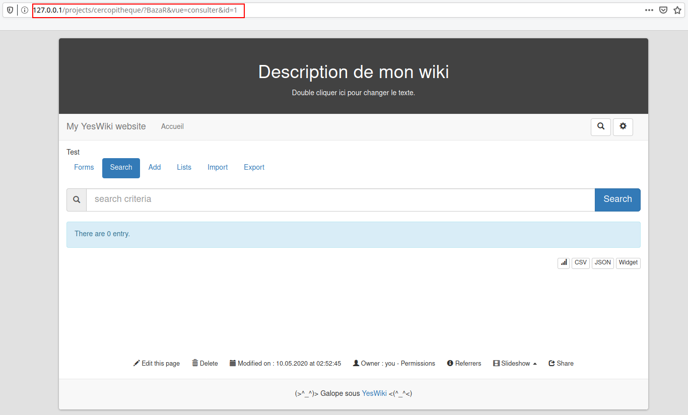
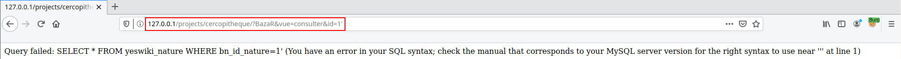
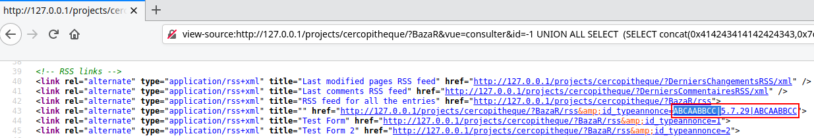


# C10: YesWiki version cercopitheque 2020-04-18-1, SQL injection (pre-auth)

In the previous chapter, we saw that at least one parameter is not properly sanitized by the whole application. This information being known, it tells us that there are potentially more vulnerabilities to be discovered. And indeed there are !

## How?

It is necessary before trying to exploit an application, to find the entry points. The easiest way to find thoses points is to use grep to search for references of the variables `$_POST` and `$_GET`.

To list references from the `$_GET` variable, use :

```
▶ grep -R --text "\$_GET\['.*'\]"

...

tools/attach/handlers/page/ajaxupload.php:            return $_GET['qqfile'];
tools/attach/handlers/page/ajaxupload.php:            if (isset($_GET['qqfile'])) {
tools/attach/actions/attach.class.php:            $this->file = $_GET['file'];
tools/attach/actions/attach.class.php:            $this->file = $_GET['file'];

...

```

And do the same for the `$_POST` variable:

```
▶ grep -R --text "\$_POST\['.*'\]"

...

setup/install.php:if (empty($_POST['config'])) {
setup/install.php:$config = $config2 = $_POST['config'];
setup/install.php:if (!$version || empty($_POST['admin_login'])) {
setup/install.php:    $admin_name = $_POST['admin_name'];

...

```

From the results of these two commands will start, the most fun part, get vulns or die tryin. However, it is also possible to take the problem in another way, by listing calls to dangerous functions:

- exec, passthru, pcntl_exec, passthru, proc_open, popen, shell_exec, system
- show_source, include, require, require_once, include_once, highlight_file, highlight_string, file_get_contents
- unserialize
- And many others ...

It seemed simpler to me to keep with the first method, but you should be free to change methods according to the situation.

## Why?

After reading some code, I finally found something I was interested in because of the file <span style="color:red">\<ROOT\>/tools/bazar/handlers/page/__widget.php</span>, let me explain ...

File: <span style="color:red">\<ROOT\>/tools/bazar/handlers/page/__widget.php</span>
```php
if (isset($_GET['id'])) {
    
    ...
    
    $formval = baz_valeurs_formulaire($_GET['id']);

    ...

```

Seeing that the function `baz_valeurs_formulaire()` takes as parameter a string we control `$_GET['id']`, I accessed the definition of the function using the shortcut "ctrl+b" in [PhpStorm](https://www.jetbrains.com/phpstorm/).

File: <span style="color:red">\<ROOT\>/tools/bazar/libs/bazar.fonct.php</span>
```php
function baz_valeurs_formulaire($idformulaire = [])
{
    if (is_array($idformulaire) and count($idformulaire) > 0) {

        ...

    } elseif ($idformulaire != '' and !is_array($idformulaire)) {
        if (!isset($GLOBALS['_BAZAR_']['form'][$idformulaire])) {
            $requete = 'SELECT * FROM '.$GLOBALS['wiki']->config['table_prefix'].'nature WHERE bn_id_nature='.$idformulaire;
            $tab_resultat = $GLOBALS['wiki']->LoadSingle($requete);
            if ($tab_resultat) {
                foreach ($tab_resultat as $key => $value) {
                    $GLOBALS['_BAZAR_']['form'][$idformulaire][$key] =
                    _convert($value, 'ISO-8859-15');
                }
            } else {
                return false;
            }
        }

        ...

    } else {

        ...
  
    }
    return isset($GLOBALS['_BAZAR_']['form']) ? $GLOBALS['_BAZAR_']['form'] : null;
}
```

The line `$requete = 'SELECT * FROM '.$GLOBALS['wiki']->config['table_prefix'].'nature WHERE bn_id_nature='.$idformulaire;` in the code above, will allow us to inject a payload in a string used to perform an SQL query. The query is made by calling the function `LoadSingle()` which itself calls `LoadAll()`. 

Both functions are detailed below:

File: <span style="color:red">\<ROOT\>/includes/YesWiki.php</span>
```php
public function LoadSingle($query)
{
    if ($data = $this->LoadAll($query)) {
        return $data[0];
    }

    return null;
}

public function LoadAll($query)
{
    $data = array();
    if ($r = $this->Query($query)) {
        while ($row = mysqli_fetch_assoc($r)) {
            $data[] = $row;
        }

        mysqli_free_result($r);
    }
    return $data;
}
```

With this understanding of the code, we could already say that a time based SQL injection is possible. In addition, the line [`$GLOBALS['_BAZAR_']['form'][$idformulaire][$key] = _convert($value, 'ISO-8859-15')`](https://fr.wikipedia.org/wiki/ISO/CEI_8859-15) means with a high probability that the result of the request is intended to be returned within the server response.

The following screeshots are only here to show how to exploit the vulnerability, if you are used to this kind of exercise, I recommend you to directly consult the exploit.

First we need to find the entry point:



Then we need to make sure the vulnerability is present:



Then determine the number of columns returned by the request without our payload:

 - part 1")

 - part 2")

So we're going to have to make an union on 6 columns. For the rest of the operation, I advise you to switch to the view-source mode of your navigator if you don't use a proxy.

To extract the version number of the server, I used the following payload:
`-1 UNION ALL SELECT  (SELECT concat(0x414243414142424343,0x7c,@@version,0x7c,0x414243414142424343)),NULL,NULL,NULL,NULL,NULL;--`. Where `concat(0x414243414142424343,0x7c,1337,0x7c,0x414243414142424343)` is used to find the information extracted from the database with more ease. In the server response, the information we are interested in, will be between the delimiters "ABCAABBCC|" and "|ABCAABBCC".



After having manually tested the exploitation of the vulnerability, we just have to automate it with a python script.

The author of the application has been informed of the vulnerability.

## Ref

- [POC](https://github.com/therealcoiffeur/therealcoiffeur.github.io/blob/master/tools/YesWiki/sqli_2020.04.18.1.py)
- [https://www.exploit-db.com/exploits/48432](https://www.exploit-db.com/exploits/48432)
