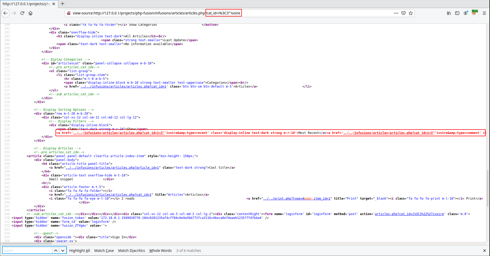
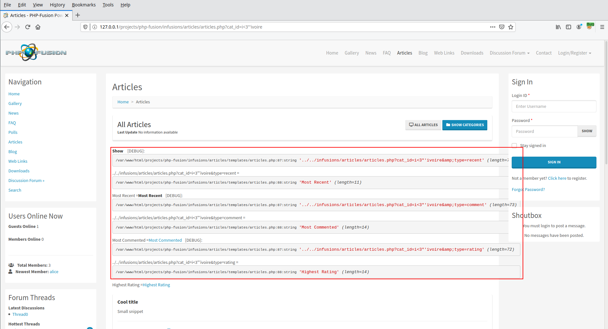


# C100: PHPFusion v9.03.50, Reflected XSS (pre-auth)

For the next part of my adventures, I was interested in the source code of [PHPFusion](https://www.php-fusion.co.uk/home.php) (version 9.03.50) also known as [PHP-Fusion](https://sourceforge.net/projects/php-fusion/), whose source code can be downloaded at the following address:

- https://sourceforge.net/projects/php-fusion/files/PHP-Fusion%20Archives/9.x/PHP-Fusion%209.03.50.zip/download

## How ?

After installing the application, I tried to list the actions I could perform as an unauthenticated user. And as for most CMS, it is possible to read content such as blogs, articles, etc.

The page <span style="color:red">\<ROOT\>/infusions/articles/articles.php</span> seems to be dynamically related to parameter `$_GET['cat_id']`.


By using the payload `i<3"'ivoire` to fuzz the parameter `$_GET['cat_id']` and looking for the string "ivoire" in the server response, we realize that we are able to escape from the `href` attribute of the `<a>` tag.



The last thing we need to do is to create a payload that executes himself correctly within the page (`<ROOT>/infusions/articles/articles.php?cat_id=<PAYLOAD>`). 

The following payload allows us to open an alert box containing the integer 1:

```
'></a><script>alert(1)</script><a 
```

`")

## Why ?

Now that we have seen, that it is possible to execute JavaScript code in a user's browser. It is necessary to understand why is this possible. We know that the vulnerability is present when we ask for the page <span style="color:red">\<ROOT\>/infusions/articles/articles.php</span>. So, a first thing to do is to read the code on the corresponding page.

File: <span style="color:red">\<ROOT\>/infusions/articles/articles.php</span>
```php

...

require_once __DIR__.'/../../maincore.php';

if (!defined('ARTICLES_EXIST')) {
    redirect(BASEDIR."error.php?code=404");
}

require_once THEMES.'templates/header.php';
require_once INCLUDES."infusions_include.php";
require_once INFUSIONS."articles/infusion_db.php";
require_once ARTICLE_CLASS."autoloader.php";
require_once INFUSIONS."articles/templates/articles.php";
\PHPFusion\Articles\ArticlesServer::Articles()->display_articles();
require_once THEMES.'templates/footer.php';
```

It's by remembering that the Reflected XSS found in chapter C1 was due to a unsanitized parameter in the template that I had the idea to look at the code of the page <span style="color:red">\<ROOT\>/infusions/articles/templates/articles.php</span>.

After placing debug elements in the code to find out which part of the code was responsible for the vulnerability, it was identified that the responsible part was the following lines:

File: <span style="color:red">\<ROOT\>/infusions/articles/templates/articles.php</span>
```php
<!-- Display Sorting Options -->
<div class="row m-t-20 m-b-20">
    <div class="col-xs-12 col-sm-12 col-md-12 col-lg-12">
        <!-- Display Filters -->
        <div class="display-inline-block">
            <span class="text-dark strong m-r-10"><?php echo $locale['show']; ?></span>
            <?php $i = 0;
            foreach ($info['article_filter'] as $link => $title) {
                $filter_active = (!isset($_GET['type']) && $i == '0') || isset($_GET['type']) && stristr($link, $_GET['type']) ? "text-dark strong" : "";
                echo "[DEBUG]: ".var_dump($link); // DEBUG added
                echo "<a href='".$link."' class='display-inline $filter_active m-r-10'>".$title."</a>";
                $i++;
            }
            ?>
        </div>
    </div>
</div>
```



From the above capture it is obvious that it is the `$link` variable that is responsible. But where does this variable came from?

This variable cames from using `foreach` on `$info['article_filter']`. After running grep to get the references to `$info` and parsing it, I realized that it was the `get_ArticleFilters()` function of the `abstract class Articles` that made the application vulnerable to this Reflected XSS.

File: <span style="color:red">\<ROOT\>/infusions/articles/classes/articles/articles.php</span>
```php
/**
* Outputs core filters variables
*
* @return array
*/
private function get_ArticleFilters() {
    
    ...
    
    foreach ($array['allowed_filters'] as $type => $filter_name) {
        $filter_link = INFUSIONS."articles/articles.php?".(isset($_GET['cat_id']) ? "cat_id=".$_GET['cat_id']."&amp;" : "")."type=".$type;
        $array['article_filter'][$filter_link] = $filter_name;
        unset($filter_link);
    }

    return (array)$array;
}
```

The element `cat_id`  of the `$_GET` variable is not sanitized before being concatenated and stored in the `$filter_link` variable. The call to the vulnerable code is then made within the same class when using the function `set_ArticlesInfo()`.

File: <span style="color:red">\<ROOT\>/infusions/articles/classes/articles/articles.php</span>
```php
/**
* Executes main page information
*
* @return array
*/
public function set_ArticlesInfo() {

    ...

    $info = array_merge($info, self::get_ArticleFilters());
    $info = array_merge($info, self::get_ArticleCategories());
    $info = array_merge($info, self::get_ArticleItems());
    $this->info = $info;

    return (array)$info;

}
```

The next chapter will cover the discovery of a Stored XSS.

The author of the application has been informed of the vulnerability.
