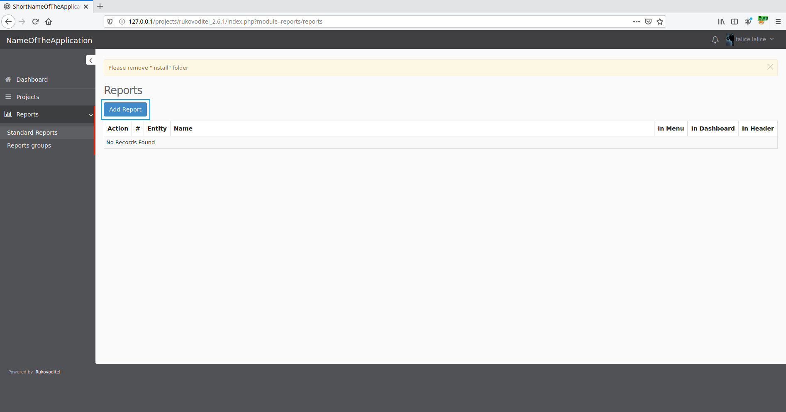
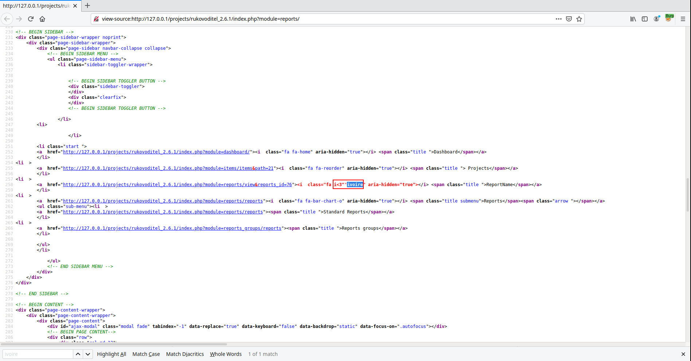
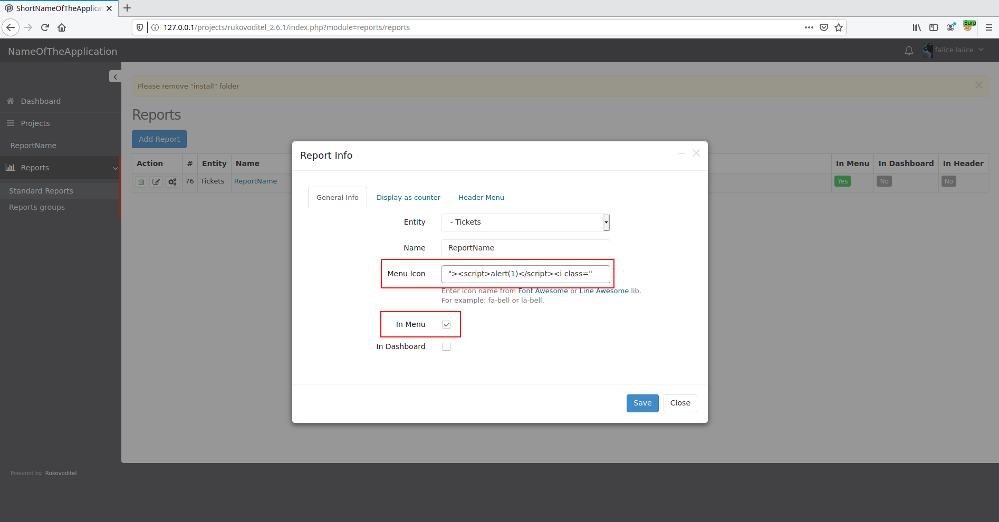
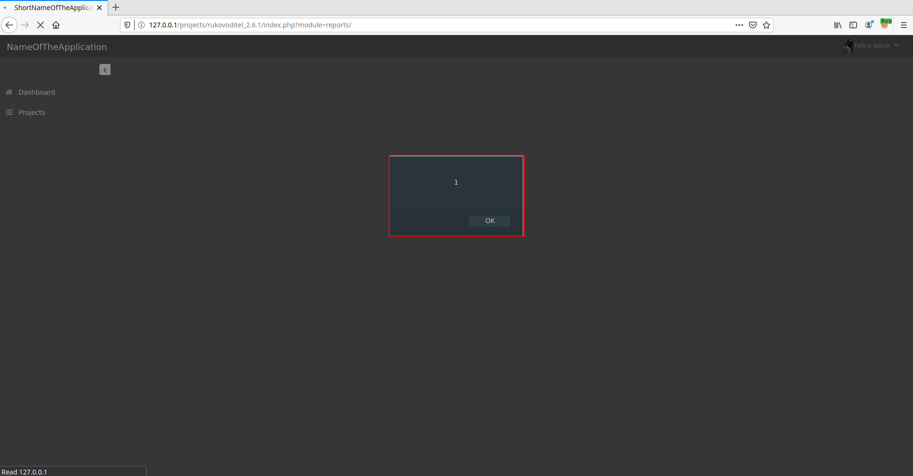
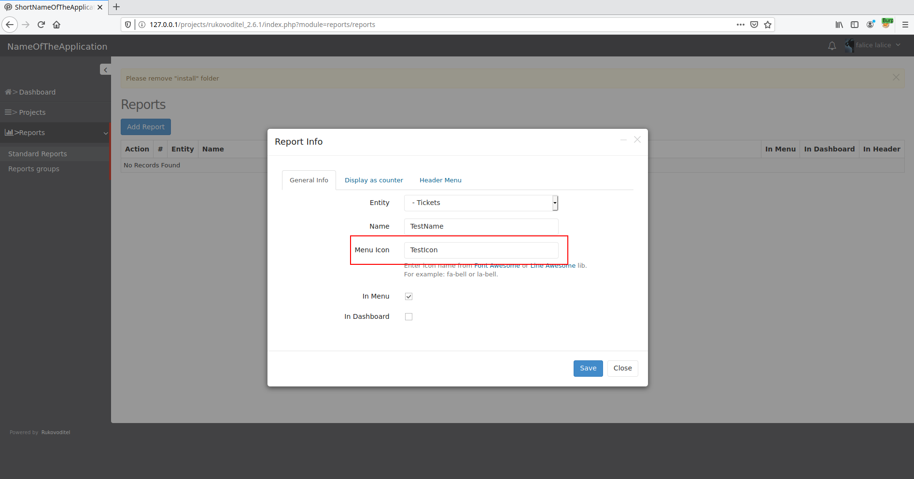


# C1000: Rukovoditel v2.7, Stored XSS (authenticated)

After a week playing warzone, I went back on the road to level up. It is in the source code of the open source CRM [Rukovoditel](https://www.rukovoditel.net/) that I was able to discover several vulnerabilities. 

>  Rukovoditel is an open source CRM designed for installation on server with PHP/MySQL support.

The source of the application can be obtained through the following link:

- https://www.rukovoditel.net/download.php
- https://sourceforge.net/projects/rukovoditel/

To access the features of the application, it is necessary to have an account in order to be authenticated. 

Account type:

- Administrator
- Developer
- Manager
- Client

So to exploit the vulnerabilities, it is necessary to have access to an account. Even if any type of account can be used to exploit these vulnerabilities, POCs will be performed using a so-called "Client" account (account with the least privileges).

## How?

This first vulnerability was discovered without the sources, but an analysis of the code will still be done to understand why it's there.

The first step is to add a report.



Report for which we can add a "Menu Icon". It is this value that we will fuzz using the string `i<3"'ivoire`.


By inspecting the source code of the page that we realize that we managed to escape the `class` attribute of the tag `<i>`.



So all we have to do is build a valid payload to exploit the vulnerability.

```html
"><script>alert(1)</script><i class"
```






## Why?

The request that allowed us to inject the HTML content is as follows:

Request:
```
POST /projects/rukovoditel_2.6.1/index.php?module=reports/reports&action=save HTTP/1.1
Host: 127.0.0.1
User-Agent: Mozilla/5.0 (X11; Linux x86_64; rv:76.0) Gecko/20100101 Firefox/76.0
Accept: text/html,application/xhtml+xml,application/xml;q=0.9,image/webp,*/*;q=0.8
Accept-Language: en-US,en;q=0.5
Accept-Encoding: gzip, deflate
Content-Type: application/x-www-form-urlencoded
Content-Length: 123
Origin: http://127.0.0.1
Connection: close
Referer: http://127.0.0.1/projects/rukovoditel_2.6.1/index.php?module=reports/
Cookie: cookie_test=please_accept_for_session; user_skin=grey; sid=f08b12c84d3304007e4a003c99d008c4; pma_lang=en
Upgrade-Insecure-Requests: 1

form_session_token=r%5E%21e8eu%24h%28&entities_id=23&name=TestName&menu_icon=TestIcon&in_menu=1&in_dashboard_counter_color=
```

The URL for which the request is made shows us that we need to read the code of the file <span style="color:red">\<ROOT\>/modules/reports/actions/reports.php</span> and more precisely to the actions realized during the switch condition related to `save`.

File: <span style="color:red">\<ROOT\>/modules/reports/actions/reports.php</span>
```php

...

switch($app_module_action)
{
  case 'save':
    $sql_data = array('name'=>db_prepare_input($_POST['name']),
                      'entities_id'=>$_POST['entities_id'],
                      'reports_type'=>'standard',
                      'menu_icon'=>$_POST['menu_icon'],                                              
                      'in_menu'=>(isset($_POST['in_menu']) ? $_POST['in_menu']:0),
                      ...
                      );
        
    if(isset($_GET['id']))
    {        
      
      $report_info = db_find('app_reports',$_GET['id']);
      
      //check reprot entity and if it's changed remove report filters and parent reports
      if($report_info['entities_id']!=$_POST['entities_id'])
      {
        db_query("delete from app_reports_filters where reports_id='" . db_input($_GET['id']) . "'");
        
        //delete paretn reports
        reports::delete_parent_reports($_GET['id']);
        $sql_data['parent_id']=0;
      }
      
      db_perform('app_reports',$sql_data,'update',"id='" . db_input($_GET['id']) . "' and created_by='" . $app_logged_users_id . "'");       
    }
    else
    {                     
      db_perform('app_reports',$sql_data);   
      
      $insert_id = db_insert_id();
      
      reports::auto_create_parent_reports($insert_id);               
    }
        
    redirect_to('reports/');      
  break;

...

```

As it can be seen, unlike variable `$_POST['name']`, variable `$_POST['menu_icon']` is not sanitized, which allows us to store HTML content within the database. This code will then be injected in the rendering of a page by calling the function `app_render_icon()`. Function that does not clean parameters before concatenating them to HTML code.

File: <span style="color:red">\<ROOT\>/includes/functions/app.php</span> 
```php
function app_render_icon($icon, $params = '')
{
	$icon = trim($icon);
	
	if(!strlen($icon)) return '';
	
	if(substr($icon,0,3)=='la-')
	{
		return '<i ' . $params . ' class="la ' . $icon . '" aria-hidden="true"></i>';
	}	
	else
	{	
		return '<i ' . $params . ' class="fa ' . $icon . '" aria-hidden="true"></i>';
	}
}
```

To confirm that this is the responsible function, we can modify it and inspect the source code of a newly rendered page.

File: <span style="color:red">\<ROOT\>/includes/functions/app.php</span> (edited)
```php
function app_render_icon($icon, $params = '')
{
	$icon = trim($icon);
	
	if(!strlen($icon)) return '';
	
	if(substr($icon,0,3)=='la-')
	{
		return '<i ' . $params . ' class="la ' . $icon . '" aria-hidden="true"></i>';
	}	
	else
	{	
		return '<i ' . $params . ' class="fa ' . $icon . '" aria-hidden="true" debug="hit !"></i>';
	}
}
```




The author of the application has been informed of the vulnerability.

The next vulnerability presented will be a SQL injection.
