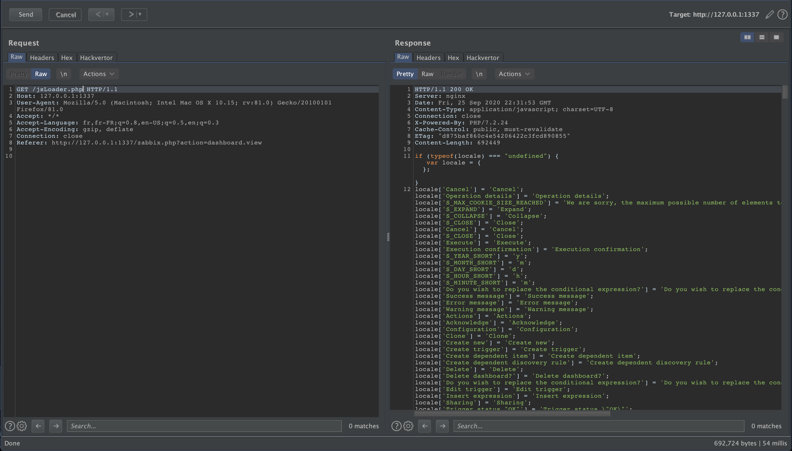


# C10000: Zabbix >= v5.2.0, PHP Object Injection (pre-auth)

[Zabbix](https://www.zabbix.com/) is an open source software for monitoring the status of various network services, servers and other network hardware. It is capable to produce dynamic graphs of resource consumption.

> Zabbix is the ultimate enterprise-level software designed for real-time monitoring of millions of metrics collected from tens of thousands of servers, virtual machines and network devices. 

It is possible to deploy an instance of Zabbix using the virtual machine offered on their site:

- https://www.zabbix.com/download_appliance

## Lab

The version that I was able to deploy in order to look for vulnerabilities is version:

| Version        | Release | Date         | Platform                          | Release Notes                     | Zabbix Manual                                             | Download                                                                                    |
|----------------|---------|--------------|-----------------------------------|-----------------------------------|-----------------------------------------------------------|---------------------------------------------------------------------------------------------|
| Zabbix 5.0 LTS | 5.0.3   | Aug 24, 2020 | Open virtualization format (.ovf) | [Notes](https://www.zabbix.com/rn/rn5.0.3) | [Manual](https://www.zabbix.com/documentation/5.0/manual/appliance) | [Download](https://cdn.zabbix.com/zabbix/appliances/stable/5.0/5.0.3/zabbix_appliance-5.0.3-ovf.tar.gz) |

After deploying an instance through virtualbox and configuring the following port forwarding rules:

| Name   | Protocol | Host IP   | Host Port | Guest IP | Guest Port |
|--------|----------|-----------|-----------|----------|------------|
| SSH    | TCP      | 127.0.0.1 | 1337      | 10.0.0.5 | 22         |
| NGINX  | TCP      | 127.0.0.1 | 1338      | 10.0.0.5 | 80         |

I retrieved the source code of the deployed instance with the following command:

```
▶ scp -r -P 1338 root@127.0.0.1:/usr/share/zabbix zabbix-sources-5.0.3
```

Once the source code was in my possession, all I had to do was read it.

## Looking for an entry point

The first reflex is to identify which part of the source code can be reached as an unauthenticated user. To do this I use my browser and with the help of [Burp Suite](https://portswigger.net/burp), I look at which PHP scripts are called and with which parameters these are called.

In addition, I use grep at the root of the project to know where the variables I can interact with are used:

```
▶ grep -R "\$_G\|\$_P\|\$_C\|\$_S" ./  
.//app/views/layout.htmlpage.php:			$url_to_check = array_key_exists('HTTP_REFERER', $_SERVER)
.//app/views/layout.htmlpage.php:				? parse_url($_SERVER['HTTP_REFERER'], PHP_URL_HOST)
.//jsLoader.php:if (isset($_GET['lang'])) {
.//jsLoader.php:		$locales = zbx_locale_variants($_GET['lang']);
.//jsLoader.php:if (empty($_GET['files'])) {
.//jsLoader.php:	if (array_key_exists(ZBX_SESSION_NAME, $_COOKIE)) {
.//jsLoader.php:		$js .= 'window.ZBX_SESSION_NAME = "'.crc32($_COOKIE[ZBX_SESSION_NAME]).'";';
.//jsLoader.php:	if (isset($_GET['showGuiMessaging']) && $_GET['showGuiMessaging']) {
.//jsLoader.php:	$files = $_GET['files'];
.//jsLoader.php:if (array_key_exists('HTTP_IF_NONE_MATCH', $_SERVER) && strpos($_SERVER['HTTP_IF_NONE_MATCH'], $etag) !== false) {
.//api_jsonrpc.php:if ($_SERVER['REQUEST_METHOD'] === 'OPTIONS') {
.//include/classes/core/CHttpRequest.php:	 * additional HTTP headers not prefixed with HTTP_ in $_SERVER superglobal

...

.//vendor/php-saml/src/Saml2/LogoutResponse.php:     * @param bool        $retrieveParametersFromServer True if we want to use parameters from $_SERVER to validate the signature
.//vendor/php-saml/src/Saml2/LogoutResponse.php:                if ($security['wantMessagesSigned'] && !isset($_GET['Signature'])) {
.//vendor/php-saml/src/Saml2/LogoutResponse.php:            if (isset($_GET['Signature'])) {
.//vendor/php-saml/src/Saml2/LogoutResponse.php:                $signatureValid = Utils::validateBinarySign("SAMLResponse", $_GET, $idpData, $retrieveParametersFromServer);
```

First, I realized that the script <span style="color:red">/usr/share/zabbix/jsLoader.php</span> interact with the variables:

- `$_GET['lang']`
- `$_GET['files']`
- `$_GET['showGuiMessaging']`
- `$_SERVER`, more specifically `$_SERVER['HTTP_IF_NONE_MATCH']`

and

- `$_COOKIE`, more specifically `$_COOKIE[ZBX_SESSION_NAME]`

And according to Burp logs we can call this script as an unauthenticated user.



File: <span style="color:red">/usr/share/zabbix/jsLoader.php</span>
```php

...

$js = '';
if (empty($_GET['files'])) {

    $files = [

        ...

    ];

    require_once dirname(__FILE__).'/include/defines.inc.php';

    if (array_key_exists(ZBX_SESSION_NAME, $_COOKIE)) {
        $js .= 'window.ZBX_SESSION_NAME = "'.crc32($_COOKIE[ZBX_SESSION_NAME]).'";';
        $files[] = 'class.localstorage.js';
    }

    // load frontend messaging only for some pages
    if (isset($_GET['showGuiMessaging']) && $_GET['showGuiMessaging']) {
        $files[] = 'class.browsertab.js';
        $files[] = 'class.notification.collection.js';
        $files[] = 'class.notifications.audio.js';
        $files[] = 'class.notification.js';
        $files[] = 'class.notifications.js';
    }
}
else {
    $files = $_GET['files'];
}

...

```

Knowing that the code from the virtual machine is not the one from the latest version available, I downloaded the latest version available (commit 175b839dc6185f572f95ff87b8728218bed54341) on [GitHub](https://github.com/zabbix/zabbix) in order to compare them:

```
▶ git clone https://github.com/zabbix/zabbix.git
```

```
▶ diff zabbix-sources-5.0.3/jsLoader.php zabbix-sources-latest/ui/jsLoader.php
109a110
> 	'class.tab-indicators.js' => '',
113a115
> 	'setup.js' => 'pages/',
382a385
> 	require_once dirname(__FILE__).'/include/classes/helpers/CCookieHelper.php';
384,385c387,389
< 	if (array_key_exists(ZBX_SESSION_NAME, $_COOKIE)) {
< 		$js .= 'window.ZBX_SESSION_NAME = "'.crc32($_COOKIE[ZBX_SESSION_NAME]).'";';
---
> 	if (CCookieHelper::has(ZBX_SESSION_NAME)) {
> 		$session = unserialize(base64_decode(CCookieHelper::get(ZBX_SESSION_NAME)));
> 		$js .= 'window.ZBX_SESSION_NAME = "'.crc32($session['sessionid']).'";';
```

To my astonishment I realize that a call to the function `unserialize()` is carried out with data controlled by the user as parameters and this since commit [2b1286f4846bce9514a2b595789fa7addff79fae](https://github.com/zabbix/zabbix/commit/2b1286f4846bce9514a2b595789fa7addff79fae) (18 June 2020).

File: <span style="color:red">\<ROOT\>/ui/jsLoader.php</span>
```php

...

$js = '';
if (empty($_GET['files'])) {

    $files = [

        ...

    ];

    require_once dirname(__FILE__).'/include/defines.inc.php';
    require_once dirname(__FILE__).'/include/classes/helpers/CCookieHelper.php';

    if (CCookieHelper::has(ZBX_SESSION_NAME)) {
        $session = unserialize(base64_decode(CCookieHelper::get(ZBX_SESSION_NAME)));
        $js .= 'window.ZBX_SESSION_NAME = "'.crc32($session['sessionid']).'";';
        $files[] = 'class.localstorage.js';
    }

    // load frontend messaging only for some pages
    if (isset($_GET['showGuiMessaging']) && $_GET['showGuiMessaging']) {
        $files[] = 'class.browsertab.js';
        $files[] = 'class.notification.collection.js';
        $files[] = 'class.notifications.audio.js';
        $files[] = 'class.notification.js';
        $files[] = 'class.notifications.js';
    }
}
else {
    $files = $_GET['files'];
}

...

```

The two conditions for reaching the `unserialize()` function are:

- `$_GET['files']` must be empty
- `CCookieHelper::has(ZBX_SESSION_NAME)` must return true

Lets inspect the code to meet these conditions.

## Triggering the bug

First identifying what `ZBX_SESSION_NAME` is equal to.

File: <span style="color:red">\<ROOT\>/include/defines.inc.php</span> (from v5.0.3) <=> <span style="color:red">\<ROOT\>/ui/include/defines.inc.php</span> (from commit 175b839dc6185f572f95ff87b8728218bed54341)
```php

...

define('ZBX_MD5_SIZE',			32);

define('ZBX_SESSION_NAME', 'zbx_session'); // Session cookie name for Zabbix front-end.

define('ZBX_KIBIBYTE',	'1024');

...

```

Let's add some debug to the scripts <span style="color:red">\<ROOT\>/ui/jsLoader.php</span> and <span style="color:red">\<ROOT\>/ui/include/classes/helpers/CCookieHelper.php</span> in order to reach `unserialize()`.

File:<span style="color:red">\<ROOT\>/ui/jsLoader.php</span>
```php

    ...

    require_once dirname(__FILE__).'/include/classes/helpers/CCookieHelper.php';

    echo "[DEBUG]: Before cookie check\n";
    
    if (CCookieHelper::has(ZBX_SESSION_NAME)) {
        echo "[DEBUG]: Before unserialiaze()\n";

        $session = unserialize(base64_decode(CCookieHelper::get(ZBX_SESSION_NAME)));

        echo "[DEBUG]: After unserialiaze()\n";
        
        $js .= 'window.ZBX_SESSION_NAME = "'.crc32($session['sessionid']).'";';
        $files[] = 'class.localstorage.js';
    }

    ...

```

File: <span style="color:red">\<ROOT\>/ui/include/classes/helpers/CCookieHelper.php</span>
```php

...

class CCookieHelper {

    ...

    public static function has(string $name): bool {
        echo "[DEBUG]: CCookieHelper::has() > Hit!\n";
        echo "[DEBUG]: CCookieHelper::has() > \$name:\n";
        var_dump($name);
        echo "[DEBUG]: CCookieHelper::has() > \$_COOKIE:\n";
        var_dump($_COOKIE);
        echo "[DEBUG]: CCookieHelper::has() return: \n";
        $r = array_key_exists($name, $_COOKIE);
        var_dump($r);
        return $r;
    }

    ...

    public static function get(string $name) {
        echo "[DEBUG]: CCookieHelper::get() > Hit!\n";
                echo "[DEBUG]: CCookieHelper::get() > \$name:\n";
                var_dump($name);
                echo "[DEBUG]: CCookieHelper::get() > \$_COOKIE:\n";
                var_dump($_COOKIE);
                echo "[DEBUG]: CCookieHelper::get() return:\n";
        $r = self::has($name) ? $_COOKIE[$name] : null;
        var_dump($r);
        return $r;
    }

    ...

}
```

Which allows us to obtain the following result:

` reached")

Request:
```
GET /jsLoader.php?files= HTTP/1.1
Host: 127.0.0.1:1337
User-Agent: Mozilla/5.0 (Macintosh; Intel Mac OS X 10.15; rv:81.0) Gecko/20100101 Firefox/81.0
Accept: */*
Accept-Language: fr,fr-FR;q=0.8,en-US;q=0.5,en;q=0.3
Accept-Encoding: gzip, deflate
Connection: close
Referer: http://127.0.0.1:1337/zabbix.php?action=dashboard.view
Cookie: PHPSESSID=random; zbx_sessionid=COIFFEUR;


```

Response (truncated):
```
HTTP/1.1 200 OK
Server: nginx
Date: Fri, 25 Sep 2020 23:54:27 GMT
Content-Type: application/javascript; charset=UTF-8
Connection: close
X-Powered-By: PHP/7.2.24
Cache-Control: public, must-revalidate
ETag: "11b602414aeeddc7e6d2de5eacb6c2aa"
Content-Length: 706786

[DEBUG]: Before cookie check
[DEBUG]: CCookieHelper::has() > Hit!
[DEBUG]: CCookieHelper::has() > $name:
string(13) "zbx_sessionid"
[DEBUG]: CCookieHelper::has() > $_COOKIE:
array(2) {
  ["PHPSESSID"]=>
  string(6) "random"
  ["zbx_sessionid"]=>
  string(8) "COIFFEUR"
}
[DEBUG]: CCookieHelper::has() return: 
bool(true)
[DEBUG]: Before unserialiaze()
[DEBUG]: CCookieHelper::get() > Hit!
[DEBUG]: CCookieHelper::get() > $name:
string(13) "zbx_sessionid"
[DEBUG]: CCookieHelper::get() > $_COOKIE:
array(2) {
  ["PHPSESSID"]=>
  string(6) "random"
  ["zbx_sessionid"]=>
  string(8) "COIFFEUR"
}
[DEBUG]: CCookieHelper::get() return:
[DEBUG]: CCookieHelper::has() > Hit!
[DEBUG]: CCookieHelper::has() > $name:
string(13) "zbx_sessionid"
[DEBUG]: CCookieHelper::has() > $_COOKIE:
array(2) {
  ["PHPSESSID"]=>
  string(6) "random"
  ["zbx_sessionid"]=>
  string(8) "COIFFEUR"
}
[DEBUG]: CCookieHelper::has() return: 
bool(true)
string(8) "COIFFEUR"
[DEBUG]: After unserialiaze()
window.ZBX_SESSION_NAME = "0";if (typeof(locale) === "undefined") { var locale = {}; }
locale['Cancel'] = 'Cancel';
```

It is important to note that:

File: <span style="color:red">test.php</span>
```php
<?php
$session = unserialize(base64_decode("COIFFEUR"));
$js .= 'window.ZBX_SESSION_NAME = "'.crc32($session['sessionid']).'";';
echo $js;
?>
```

```
▶ php test.php
window.ZBX_SESSION_NAME = "0";
```

## Results

I think that this script is not the only one to be vulnerable to a pre-auth PHP Object Injection. Indeed it's the whole session mechanism that seems to be vulnerable to me.

File: <span style="color:red">\<ROOT\>/ui/include/classes/core/CCookieSession.php</span>
```php

    ...

class CCookieSession implements \SessionHandlerInterface {

    ...

    public const COOKIE_NAME = ZBX_SESSION_NAME;

    ...

    public function __construct() {
        if (!headers_sent() && session_status() === PHP_SESSION_NONE) {

            // Set use standard cookie PHPSESSID to false.
            ini_set('session.use_cookies', '0');
            // Set serialize method to standard serialize / unserialize.
            ini_set('session.serialize_handler', 'php_serialize');

            session_set_save_handler([$this, 'open'], [$this, 'close'], [$this, 'read'],
                [$this, 'write'], [$this, 'destroy'], [$this, 'gc']
            );

            if (!$this->session_start()) {
                throw new \Exception(_('Session initialization error.'));
            }

            CSessionHelper::set('sessionid', CSessionHelper::getId());
        }
    }

    ...

    protected function session_start(): bool {
        $session_data = $this->parseData();

        if (mb_strlen($session_data) === 0) {
            return session_start();
        }

        $sessionid = $this->extractSessionId($session_data);
        if ($sessionid) {
            session_id($sessionid);
        }

        return session_start();
    }

    ...

    protected function extractSessionId(string $session_data): ?string {
        $session_data = unserialize($session_data);

        if (array_key_exists('sessionid', $session_data)) {
            return $session_data['sessionid'];
        }

        return null;
    }

    ...

    protected function parseData(): string {
        if (CCookieHelper::has(self::COOKIE_NAME)) {
            return base64_decode(CCookieHelper::get(self::COOKIE_NAME));
        }

        return '';
    }
}
```

## Conclusion

The vulnerability having been identified, we must now try to find gadgets that allow us to go further. If I discover one of these gadgets, I will publish a new article.

