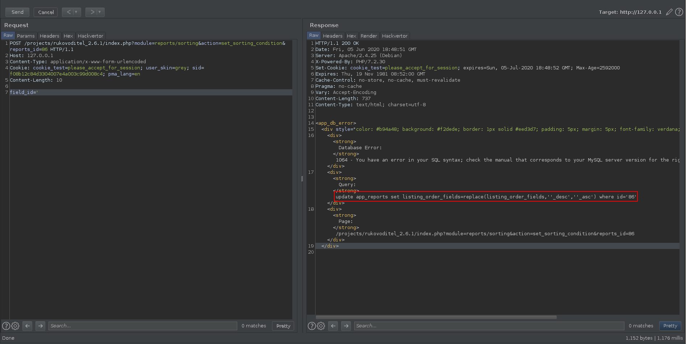
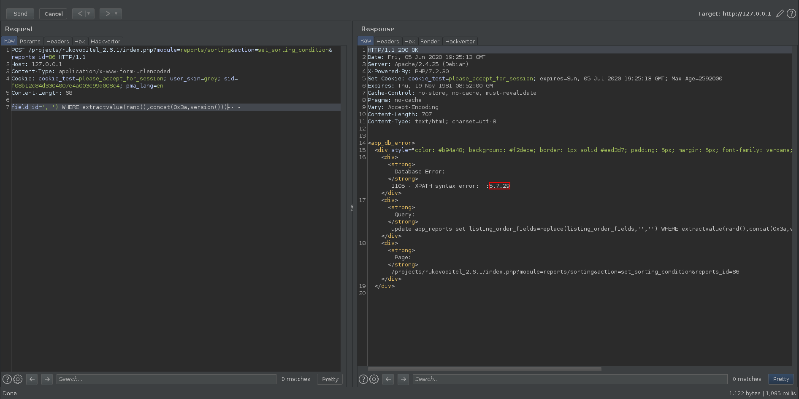
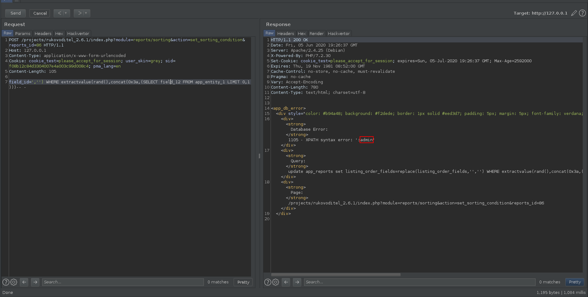


# C1001: Rukovoditel v2.7, SQL injection (authenticated)

As for the vulnerability presented in the previous chapter, it is necessary to have an account with at least the "Client" role.

The discovery of this vulnerability was made in white box, meaning that I only used the source code of the application. I was looking for user-controlled parameters that could be concatenated within SQL queries. These parameters must not supposed to be cleaned up for the vulnerability to be exploited.

## Why?

After discovering the previous vulnerability I understood that when a request is made to the route:

```
POST /projects/rukovoditel_2.6.1/index.php?module=reports/reports&action=save
```

The code from file <span style="color:red">\<ROOT\>/modules/reports/actions/reports.php</span> was executed. So I used grep in recursive mode from the folder <span style="color:red">\<ROOT\>/modules/</span> assuming that the identified code would be reachable.

```
▶ grep -R "'\" \. \$_POST"
items/actions/export.php:			db_query("update app_items_export_templates set is_default=1 where users_id='" . db_input($app_user['id']) . "' and id='" . $_POST['id'] . "'");
items/actions/export.php:			db_perform('app_items_export_templates', $sql_data_array,'update',"users_id='" . db_input($app_user['id']) . "' and id='" . $_POST['id'] . "'");
items/actions/export.php:			db_perform('app_items_export_templates', $sql_data_array,'update',"users_id='" . db_input($app_user['id']) . "' and id='" . $_POST['id'] . "'");
items/actions/listing.php:  	db_query("update app_reports set listing_order_fields = '" . db_input($_POST['listing_order_fields']) . "' where id='" . $_POST['reports_id'] . "'");  	
reports/actions/sorting.php:        db_query("update app_reports set listing_order_fields=replace(listing_order_fields,'" . $_POST['field_id']. "_asc','" . $_POST['field_id']. "_desc') where id='" . db_input($_GET['reports_id']) . "'");
reports/actions/sorting.php:        db_query("update app_reports set listing_order_fields=replace(listing_order_fields,'" . $_POST['field_id']. "_desc','" . $_POST['field_id']. "_asc') where id='" . db_input($_GET['reports_id']) . "'");
reports/actions/reports.php:		db_query("update app_reports set listing_col_width='" . $_POST['listing_col_width']. "' where id={$reports_id}");
entities/actions/fields.php:       db_query("update app_fields set is_heading=1 where id='" . $_POST['heading_field_id'] . "' and entities_id ='" . db_input($_GET['entities_id']) . "'");
```

Thanks to the identified results, I was interested in the code contained in the file <span style="color:red">\<ROOT\>/modules/reports/actions/sorting.php</span>.

```php

...

switch($app_module_action)
{

  ...

  case 'set_sorting_condition':
      if($_POST['condition']=='desc')
      {
        db_query("update app_reports set listing_order_fields=replace(listing_order_fields,'" . $_POST['field_id']. "_asc','" . $_POST['field_id']. "_desc') where id='" . db_input($_GET['reports_id']) . "'");
      }
      else
      {
        db_query("update app_reports set listing_order_fields=replace(listing_order_fields,'" . $_POST['field_id']. "_desc','" . $_POST['field_id']. "_asc') where id='" . db_input($_GET['reports_id']) . "'");
      }
      exit();
    break;
}
```

From the above code we can clearly see that it is possible to perform an injection in the SQL query thanks to parameters `$_POST['field_id']`.

To build the route that will allow us to exploit, let's take as an element the action <span style="color:orange">set_sorting_condition</span>, the filename <span style="color:orange">sorting</span> as well as the folder containing it within modules <span style="color:orange">reports</span>.

## How?



Errors being displayed, we can use the function `ExtractValue()` to extract information.

>  The ExtractValue() function generates a SQL error when it is unable to parse the XML data passed to it. Fortunately, the XML data, and, in our case, the evaluated results of our SQL query, will be be embedded into the subsequent error message. Prepending a full stop or a colon (we use the hex representation of 0x3a below) to the beginning of the XML query will ensure the parsing will always fail, thus generating an error with our extracted data. (Note that this only works on MySQL version 5.1 or later. Use the LIMIT function to cycle through database information.)



Now that we managed to extract the MySQL version let's try to extract the username of the admin.



The author of the application has been informed of the vulnerability.

The next chapter will present how by chaining two vulnerabilities (File Upload + LFI) together it is possible to obtain an RCE.
