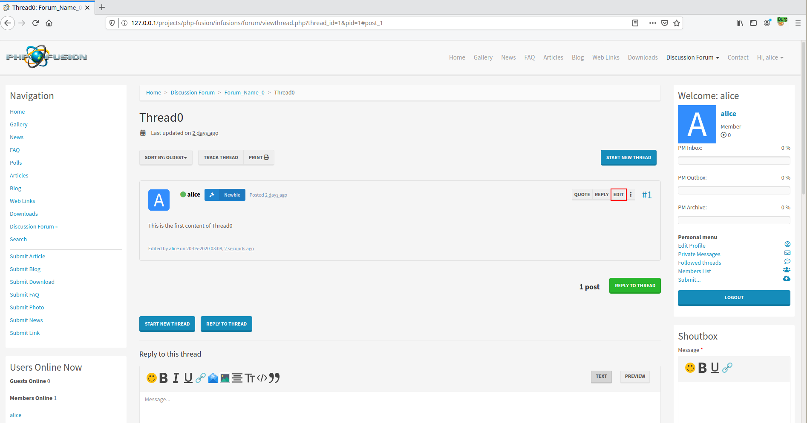
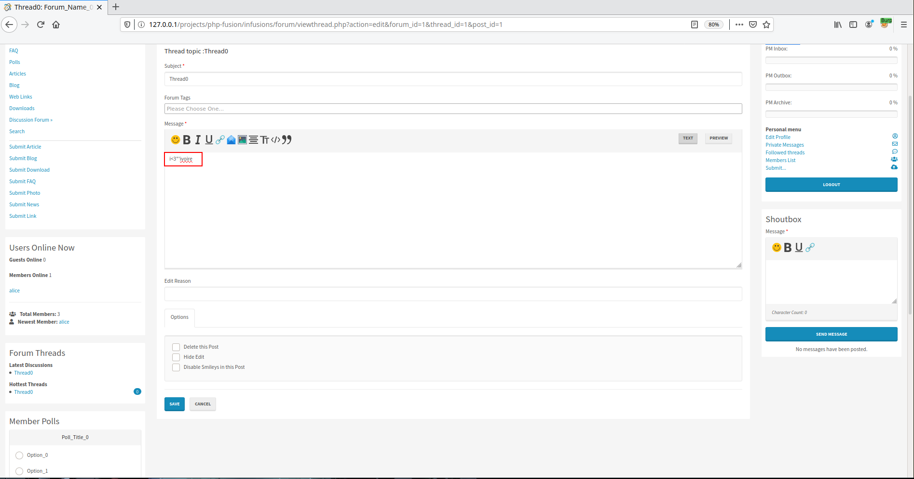
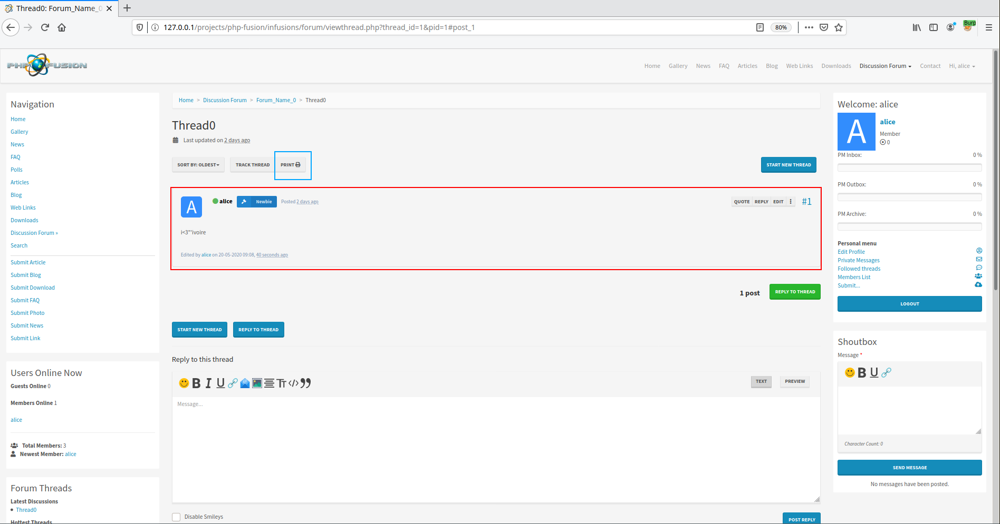
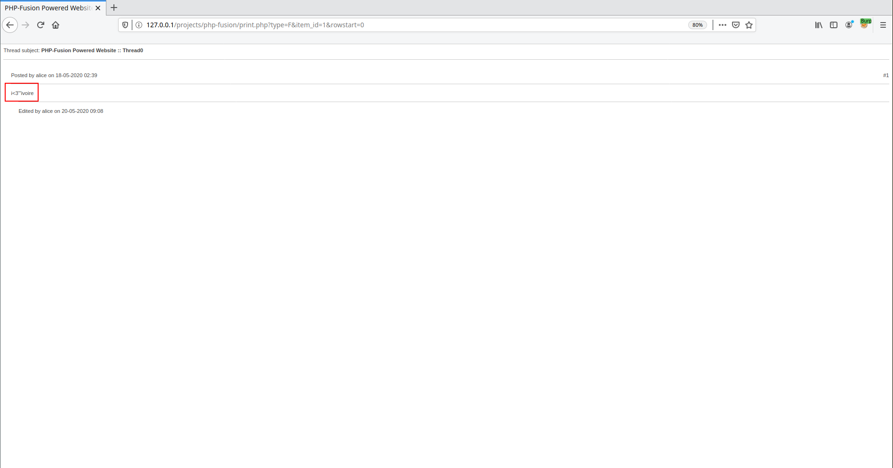
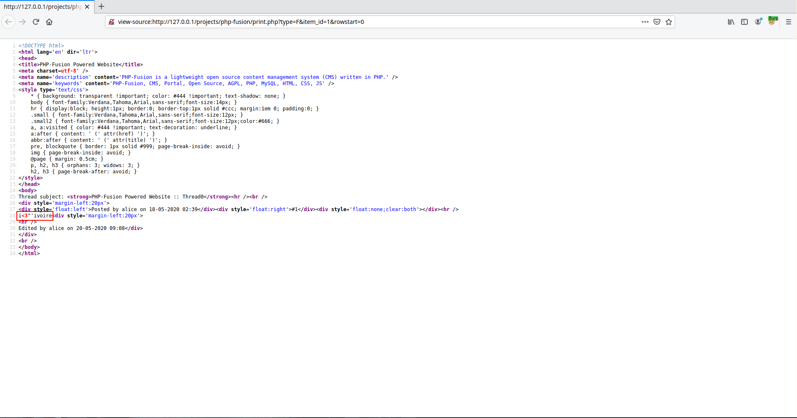


# C101: PHPFusion v9.03.50, Stored XSS (authenticated)

After having identified a first flaw, we will deal with the discovery of a Stored XSS. Using the same logic, we had to look within the application in order to identify the elements we can interact with once authenticated. It turns out that an authenticated user has the ability to create a thread or participate in a thread from a forum.



## How?

When creating a thread or editing one of his messages with HTML content, it turns out that the injected characters are correctly escaped as it can be seen when we tried here to fuzz the message field with the payload `i<3"'ivoire`.






It's when I became interested in the print feature that things turned out to be interesting. Indeed, the print function allows you to simplify the page as much as possible so that it contains only text. So the print function returns all messages in text format so that the content of a thread can be easily printed (button circled in blue in Figure 3). 





Once the page is generated by the print functionality we realized by analyzing the body of the server response, that our characters are no longer sanitized.

Now we just have to create a message that will allow us to execute JavaScript by replacing the contents of the previous message with:

```html

```


` within the page")

## Why?

As for most of the chapters written before we will see why this vulnerability is there within PHP-Fusion. 

The route requested to generate this result is the route <span style="color:red">\<ROOT\>/print.php?type=F&item_id=1&rowstart=0</span>. It is thus page <span style="color:red">\<ROOT\>/print.php</span> which is called, with the following parameters:

```
$_GET array (size=3)
    'type' => string 'F' (length=1)
    'item_id' => string '1' (length=1)
    'rowstart' => string '0' (length=1)
```

File: <span style="color:red">\<ROOT\>/print.php</span>
```php

...

case "F":
    ...

    echo parse_textarea($data['post_message']);

    ...

```

File: <span style="color:red">\<ROOT\>/includes/core_functions_include.php</span>
```php
function parse_textarea($text, $smileys = TRUE, $bbcode = TRUE, $decode = TRUE, $default_image_folder = IMAGES, $add_line_breaks = FALSE, $descript = TRUE) {
    $text = $decode == TRUE ? html_entity_decode(stripslashes($text), ENT_QUOTES, fusion_get_locale('charset')) : $text;
    $text = $decode == TRUE ? html_entity_decode($text, ENT_QUOTES, fusion_get_locale('charset')) : $text; // decode for double encoding.
    $text = !empty($default_image_folder) ? parse_imageDir($text, $default_image_folder) : $text;
    $text = $smileys == TRUE ? parsesmileys($text) : $text;
    $text = $bbcode == TRUE ? parseubb($text) : $text;
    $text = fusion_parse_user($text);
    $text = $add_line_breaks ? nl2br($text) : $text;
    $text = $descript == TRUE ? descript($text) : $text;

    return (string)$text;
}
```

As you can see by reading the code of function `parse_textarea()`, the `$text` variable is not sanitized, which leads to the Stored XSS.

The author of the application has been informed of the vulnerability.

## Ref

- [https://www.exploit-db.com/exploits/48497](https://www.exploit-db.com/exploits/48497)
