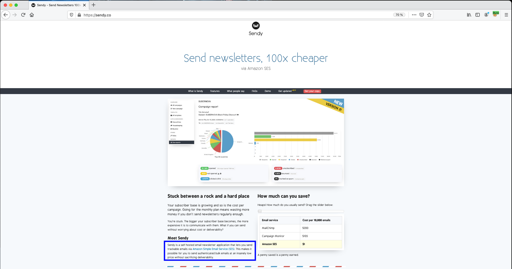
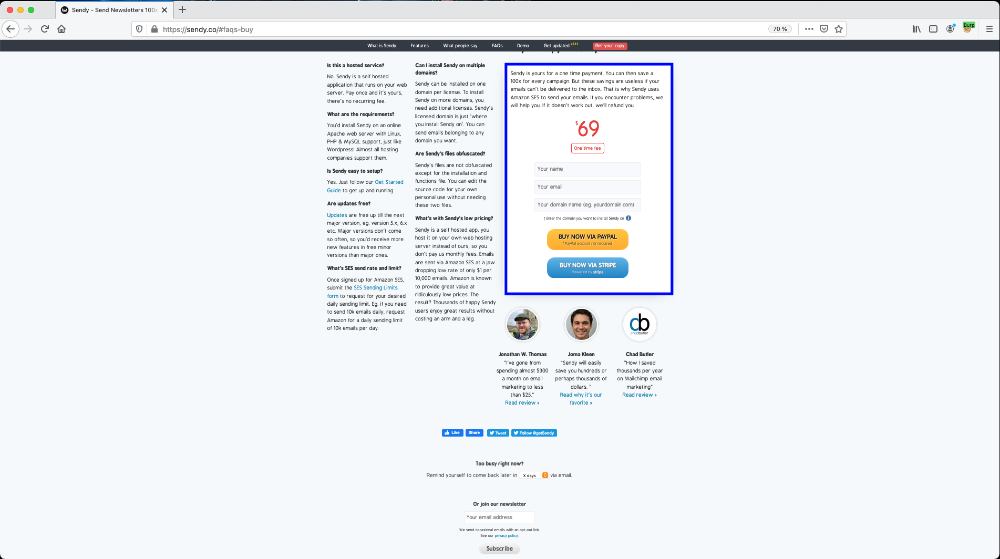
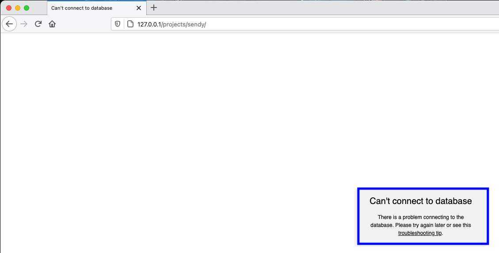
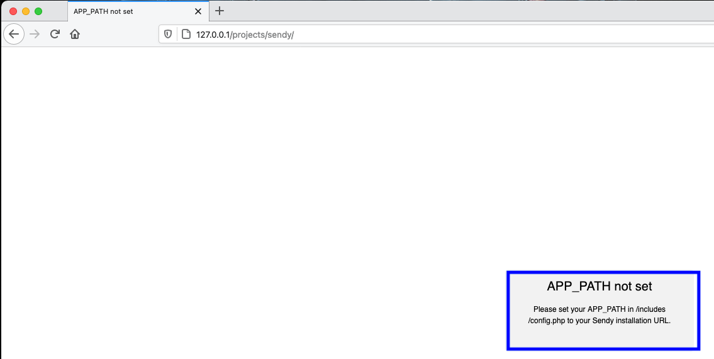
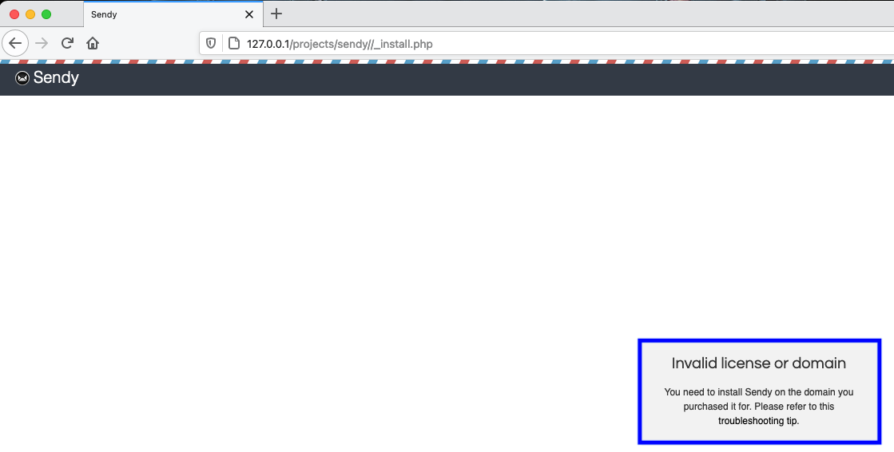
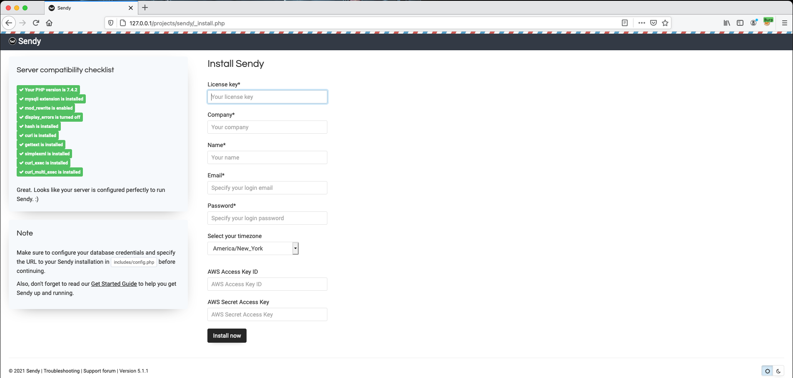
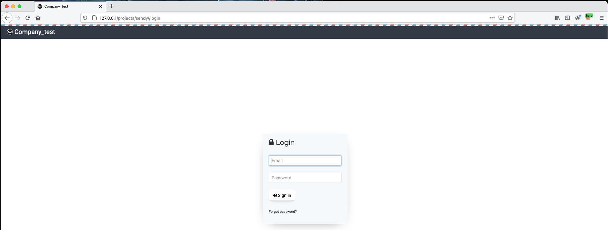
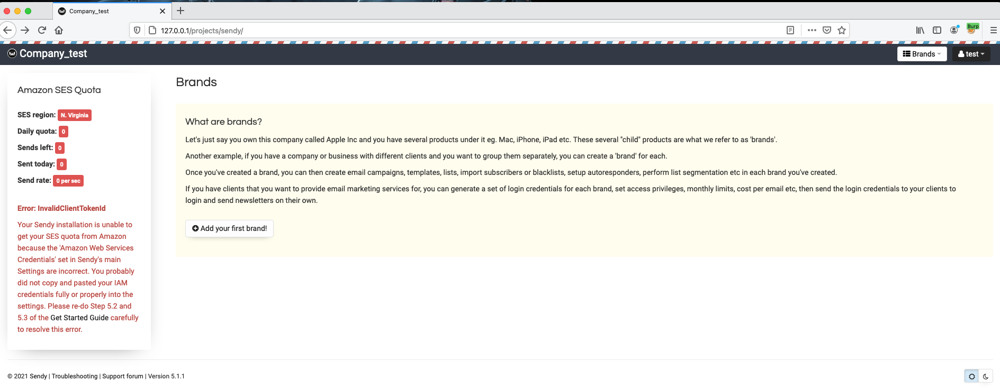
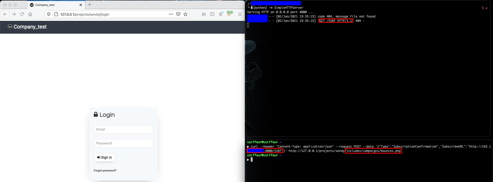
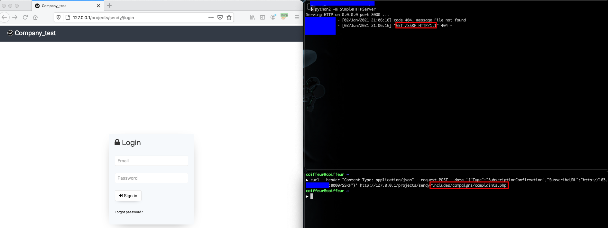


# C10100: Sendy 5.1.1, SSRF (pre-auth)

<span style="color:pink">The following article is for educational purposes only.</span>

Today's post will present the methodology used to identify an SSRF vulnerability in Sendy's source code.

## What is Sendy ?

[Sendy](https://sendy.co/) describes itself as :
> A self hosted email newsletter application that lets you send trackable emails via Amazon Simple Email Service (SES). This makes it possible for you to send authenticated bulk emails at an insanely low price without sacrificing deliverability.



## Sendy's installation

The source code for the Sendy Web application can be downloaded for a few dollars, what I obviously did in order to get my copy of it (I therefore recommend that you always pay for an application before auditing the code).



Once you have your license key it is possible to get the latest update available via:
- [https://sendy.co/get-updated](https://sendy.co/get-updated)

The audited version used to write this post is version 5.1.1 as stated in the title, however it is possible that the vulnerabilities identified may also be present in earlier versions of the application.

```
▶ md5 sendy-5.1.1.zip
MD5 (sendy-5.1.1.zip) = 1746fc20815eeb0a40c2eb184f47d0f6
```

After decompressing the archive at the root of the Web server, we access the application via http://127.0.0.1/projects/sendy/.



As we can see, the application is not able to communicate with the database because it's not configured yet. To solve this problem we just need to edit the file <span style="color:red">\<ROOT\>/includes/config.php</span> like this:

File: <span style="color:red">\<ROOT\>/includes/config.php</span>
```php

...

    /*  MySQL database connection credentials (please place values between the apostrophes) */
    $dbHost = '127.0.0.1'; //MySQL Hostname
    $dbUser = 'sendy'; //MySQL Username
    $dbPass = 'sendy'; //MySQL Password
    $dbName = 'sendy'; //MySQL Database Name

...

```

We return to the application and we now face another error message.



Which can be corrected by defining the PATH of the application in <span style="color:red">\<ROOT\>/includes/config.php</span>.

File: <span style="color:red">\<ROOT\>/includes/config.php</span>
```php
<?php
    //----------------------------------------------------------------------------------//
    //                               COMPULSORY SETTINGS
    //----------------------------------------------------------------------------------//

    /*  Set the URL to your Sendy installation (without the trailing slash) */
    define('APP_PATH', 'http://127.0.0.1/projects/sendy/');

...

```

However, after correctly configuring the application we realize that the application doesn't launch due to a license problem in the file <span style="color:red">\<ROOT\>/_install.php</span>.



> Invalid license or domain. You need to install Sendy on the domain you purchased it for. Please refer to this troubleshooting tip.

We will therefore look at what the installation file does in order to identify where the problem comes from. 

```
▶ cat _install.php
<?php /* Sendy.co | Copyright © 2020 - All rights reserved. Checksum: 8613985ec49eb8f757ae6439e879bb2a */ eval(base64_decode("JElsbDExbGxsbDE9ZmlsZShwcmVnX3JlcGxhY2UoIkBcKC4qXCguKiRAIiwiIixfX0ZJTEVfXykpOwppZihwcmVnX3JlcGxhY2UoIkBcKC4qXCguKiRAIiwiIixfX0ZJTEVfXyk9PV9fRklMRV9fIG9yCnByZWdfcmVwbGFjZSgiQFwoLipcKC4qJEAiLCIiLF9fTElORV9fKSAhPSAzKWRpZSgiPHR0PkVSUk9SIik7"));eval(base64_decode("ZnVuY3Rpb24gTzBPT08wME9PMCgkYSwkYil7JGM9YXJyYXkoOTc0LDMyNCwzMiw2MjgzKTskaz1nemluZmxhdGUoYmFzZTY0X2RlY29kZSgiS3lyTlRjb3NLUVlBIikpOyRPME8wPSRrWzZdLiRrWzFdLiRrWzNdLiRrWzZdLiRrWzVdLiRrWzBdOyRPMD0ka1s1XS4ka1swXS4ka1s0XS4ka1syXTtpZigkYj09NDMpeyRkPSRPME8wKCRhLCRjWzBdKyRjWzFdLCRjWzJdKTt9ZWxzZWlmKCRiPT0xODgpeyRkPSRPME8wKCRhLCRjWzBdLCRjWzFdKTt9ZWxzZWlmKCRiPT0xMDUpeyRkPSRPMCgkTzBPMCgkYSwkY1swXSskY1sxXSskY1syXSkpO31yZXR1cm4kZDt9"));eval(base64_decode(O0OOO00OO0($Ill11llll1[0],188)));eval(O00O0O00OO(O0OOO00OO0($Ill11llll1[0],105),O0OOO00OO0($Ill11llll1[0],43),$Ill11llll1));__halt_compiler();90aWYoIWZ1bmN0aW9uX2V4aXN0cygiTzAwTzBPMDBPTyIpKXtmdW5jdGlvbiBPMDBPME8wME9PKCRhLCRiLCRjKXskZD1pbXBsb2RlKCRjKTskZD1wcmVnX3JlcGxhY2UoIi9fX2hhbHRfY29tcGlsZXIuKi8iLCIiLCRkKTtpZigkYj09aGFzaCgibWQ1IiwiJGQiKSl7cmV0dXJuKGd6aW5mbGF0ZShiYXNlNjRfZGVjb2RlKCRhKSkpO31lbHNle2RpZSgiPHR0Pm1kNSBDb2RlIG1hbmlwdWxhdGlvbiBkZXRlY3RlZDwvdHQ+Iik7fX19282b03646256dadbce2c46da44f553d57Txrc9s4kp

...

fpkN7CauhjV3/s6Y99/ZG/6WI4xBijd6jskzMwpSt2cnZ1bvS6ZmynQdsoDZYnYY1ik7PBdAJFn9rEG8zYdvH3IhrFRmSdvTs+ve5fspqFYtbYW7bVwDd7yDKLB9L74mne9RXNxkHNPWsqyiZNTPFc6JF5Lv6iiG3Vy11K9vD7VRqufMtKP5dMxf82/ZqTQ3KxVtgxTKZt05go/aZfuDtU+q7HuY7OPa5jHc9ROA6khN6MeWjQ/wA
```

Seriously ? The installation file is really "obfuscated".

### Deobfuscation

The file composed of 4 evaluations, can be reformat as:

File (reformated): <span style="color:red">\<ROOT\>/_install.php</span>
```php
<?php /* Sendy.co | Copyright © 2020 - All rights reserved. Checksum: 8613985ec49eb8f757ae6439e879bb2a */
eval(base64_decode("BASE64_ENCODED_STRING_1"));
eval(base64_decode("BASE64_ENCODED_STRING_2"));
eval(base64_decode(O0OOO00OO0($Ill11llll1[0],188)));
eval(O00O0O00OO(O0OOO00OO0($Ill11llll1[0],105),O0OOO00OO0($Ill11llll1[0],43),$Ill11llll1));
__halt_compiler();
BASE64_ENCODED_STRING_3
```

let's try to see what the first two evaluation does.

#### First `eval()`

```php
eval(base64_decode("JElsbDExbGxsbDE9ZmlsZShwcmVnX3JlcGxhY2UoIkBcKC4qXCguKiRAIiwiIixfX0ZJTEVfXykpOwppZihwcmVnX3JlcGxhY2UoIkBcKC4qXCguKiRAIiwiIixfX0ZJTEVfXyk9PV9fRklMRV9fIG9yCnByZWdfcmVwbGFjZSgiQFwoLipcKC4qJEAiLCIiLF9fTElORV9fKSAhPSAzKWRpZSgiPHR0PkVSUk9SIik7"));
```

```
▶ echo -n "JElsbDExbGxsbDE9ZmlsZShwcmVnX3JlcGxhY2UoIkBcKC4qXCguKiRAIiwiIixfX0ZJTEVfXykpOwppZihwcmVnX3JlcGxhY2UoIkBcKC4qXCguKiRAIiwiIixfX0ZJTEVfXyk9PV9fRklMRV9fIG9yCnByZWdfcmVwbGFjZSgiQFwoLipcKC4qJEAiLCIiLF9fTElORV9fKSAhPSAzKWRpZSgiPHR0PkVSUk9SIik7"|base64 -d
$Ill11llll1=file(preg_replace("@\(.*\(.*$@","",__FILE__));
if(preg_replace("@\(.*\(.*$@","",__FILE__)==__FILE__ or
preg_replace("@\(.*\(.*$@","",__LINE__) != 3)die("<tt>ERROR");
```

Which gives us the following PHP code:

```php
$Ill11llll1=file(preg_replace("@\(.*\(.*$@","",__FILE__));
if(preg_replace("@\(.*\(.*$@","",__FILE__)==__FILE__ or preg_replace("@\(.*\(.*$@","",__LINE__) != 3) die("<tt>ERROR");
```

Ok, so according to the first line, we can already say that the variable `$Ill11llll1` is an array, where each element represents a line of the current file (`__FILE__`) which is <span style="color:red">\<ROOT\>/_install.php</span>. 

#### Second `eval()`

```php
eval(base64_decode("ZnVuY3Rpb24gTzBPT08wME9PMCgkYSwkYil7JGM9YXJyYXkoOTc0LDMyNCwzMiw2MjgzKTskaz1nemluZmxhdGUoYmFzZTY0X2RlY29kZSgiS3lyTlRjb3NLUVlBIikpOyRPME8wPSRrWzZdLiRrWzFdLiRrWzNdLiRrWzZdLiRrWzVdLiRrWzBdOyRPMD0ka1s1XS4ka1swXS4ka1s0XS4ka1syXTtpZigkYj09NDMpeyRkPSRPME8wKCRhLCRjWzBdKyRjWzFdLCRjWzJdKTt9ZWxzZWlmKCRiPT0xODgpeyRkPSRPME8wKCRhLCRjWzBdLCRjWzFdKTt9ZWxzZWlmKCRiPT0xMDUpeyRkPSRPMCgkTzBPMCgkYSwkY1swXSskY1sxXSskY1syXSkpO31yZXR1cm4kZDt9"));
```

```
▶ echo -n "ZnVuY3Rpb24gTzBPT08wME9PMCgkYSwkYil7JGM9YXJyYXkoOTc0LDMyNCwzMiw2MjgzKTskaz1nemluZmxhdGUoYmFzZTY0X2RlY29kZSgiS3lyTlRjb3NLUVlBIikpOyRPME8wPSRrWzZdLiRrWzFdLiRrWzNdLiRrWzZdLiRrWzVdLiRrWzBdOyRPMD0ka1s1XS4ka1swXS4ka1s0XS4ka1syXTtpZigkYj09NDMpeyRkPSRPME8wKCRhLCRjWzBdKyRjWzFdLCRjWzJdKTt9ZWxzZWlmKCRiPT0xODgpeyRkPSRPME8wKCRhLCRjWzBdLCRjWzFdKTt9ZWxzZWlmKCRiPT0xMDUpeyRkPSRPMCgkTzBPMCgkYSwkY1swXSskY1sxXSskY1syXSkpO31yZXR1cm4kZDt9"|base64 -d
function O0OOO00OO0($a,$b){$c=array(974,324,32,6283);$k=gzinflate(base64_decode("KyrNTcosKQYA"));$O0O0=$k[6].$k[1].$k[3].$k[6].$k[5].$k[0];$O0=$k[5].$k[0].$k[4].$k[2];if($b==43){$d=$O0O0($a,$c[0]+$c[1],$c[2]);}elseif($b==188){$d=$O0O0($a,$c[0],$c[1]);}elseif($b==105){$d=$O0($O0O0($a,$c[0]+$c[1]+$c[2]));}return$d;}
```

Which gives us the following PHP code:

```php
function O0OOO00OO0($a, $b) {
    $c = array( 974, 324, 32, 6283 );
    $k = gzinflate(base64_decode("KyrNTcosKQYA"));
    $O0O0 = $k[6] . $k[1] . $k[3] . $k[6] . $k[5] . $k[0];
    $O0 = $k[5] . $k[0] . $k[4] . $k[2];
    if ($b == 43)
    {
        $d = $O0O0($a, $c[0] + $c[1], $c[2]);
    }
    elseif ($b == 188)
    {
        $d = $O0O0($a, $c[0], $c[1]);
    }
    elseif ($b == 105)
    {
        $d = $O0($O0O0($a, $c[0] + $c[1] + $c[2]));
    }
    return $d;
}
```

Let's unravel the mystery of this function with the help of the PHP interpreter.

```
php > $k = gzinflate(base64_decode("KyrNTcosKQYA"));
php > var_dump($k);
string(7) "rumbits"

php > $O0O0 = $k[6] . $k[1] . $k[3] . $k[6] . $k[5] . $k[0];
php > var_dump($O0O0);
string(6) "substr"

php > $O0 = $k[5] . $k[0] . $k[4] . $k[2];
php > var_dump($O0);
string(4) "trim"
```

and we obtain the result below:

```php
function O0OOO00OO0($a, $b) {
    if ($b == 43)
    {
        $d = substr($a, 1298, 32);
    }
    elseif ($b == 188)
    {
        $d = substr($a, 974, 324);
    }
    elseif ($b == 105)
    {
        $d = trim(substr($a, 1330));
    }
    return $d;
}
```

This method is a bit tedious and it must be taken into account that for the code to run correctly, the formatting of the file must not be changed because the next evaluation will be based on a partial decoding (use of offset) of the first line. So we will make the deobfuscation steps go faster by only using the PHP interpreter.

```
▶ php -a
Interactive shell

php > $Ill11llll1=file(preg_replace("@\(.*\(.*$@","","_install.php"));
php > eval(base64_decode("ZnVuY3Rpb24gTzBPT08wME9PMCgkYSwkYil7JGM9YXJyYXkoOTc0LDMyNCwzMiw2MjgzKTskaz1nemluZmxhdGUoYmFzZTY0X2RlY29kZSgiS3lyTlRjb3NLUVlBIikpOyRPME8wPSRrWzZdLiRrWzFdLiRrWzNdLiRrWzZdLiRrWzVdLiRrWzBdOyRPMD0ka1s1XS4ka1swXS4ka1s0XS4ka1syXTtpZigkYj09NDMpeyRkPSRPME8wKCRhLCRjWzBdKyRjWzFdLCRjWzJdKTt9ZWxzZWlmKCRiPT0xODgpeyRkPSRPME8wKCRhLCRjWzBdLCRjWzFdKTt9ZWxzZWlmKCRiPT0xMDUpeyRkPSRPMCgkTzBPMCgkYSwkY1swXSskY1sxXSskY1syXSkpO31yZXR1cm4kZDt9"));
php > eval(base64_decode(O0OOO00OO0($Ill11llll1[0],188)));
php > file_put_contents("_install_deobfuscated.txt", O00O0O00OO(O0OOO00OO0($Ill11llll1[0],105),O0OOO00OO0($Ill11llll1[0],43),$Ill11llll1));
```

Now that we have a deobfuscated version of <span style="color:red">\<ROOT\>/_install.php</span>, lets replace the initial one with our version in order to identify the source of the message "Invalid license or domain".

```
▶ cp _install.php _install.php.old
▶ echo "<?php" > _install.php && cat _install_deobfuscated.txt >> _install.php
```

The license seems to be verified using a call to Sendy's servers at different place in the code.

File (deobfuscated): <span style="color:red">\<ROOT\>/_install.php</span>
```php

...

//Define current version
define('CURRENT_VERSION', '5.1.1');

//check license
$url = $_SERVER["SERVER_NAME"];
$licensed = file_get_contents_curl('http://gateway.sendy.co/gateway/'.$url.'/-/-/-/'.CURRENT_VERSION.'/-');
if($licensed=='blocked') //Firewall blocked outgoing connections, license cannot be verified
{
    echo "<!DOCTYPE html><html><head><meta http-equiv=\"Content-Type\" content=\"text/html;charset=utf-8\"/><link rel=\"Shortcut Icon\" type=\"image/ico\" href=\"/img/favicon.png\"><title>Outgoing connections is blocked</title></head><style type=\"text/css\">body{background: #ffffff;font-family: Helvetica, Arial;}#wrapper{background: #f2f2f2;width: 330px;height: 120px;margin: -140px 0 0 -165px;position: absolute;top: 50%;left: 50%;-webkit-border-radius: 5px;-moz-border-radius: 5px;border-radius: 5px;}p{text-align: center;line-height: 18px;font-size: 12px;padding: 0 30px;}h2{font-weight: normal;text-align: center;font-size: 20px;}a{color: #000;}a:hover{text-decoration: none;}</style><body><div id=\"wrapper\"><p><h2>Outgoing connections blocked</h2></p><p>Your server has a firewall blocking outgoing connections. Please <a href=\"https://sendy.co/troubleshooting#unlicensed-domain-error\" target=\"_blank\">see this troubleshooting tip</a>.</p></div></body></html>";
    exit;
}
else if(!$licensed) //User is installing Sendy on an unlicensed domain
{
    echo "<!DOCTYPE html><html><head><meta http-equiv=\"Content-Type\" content=\"text/html;charset=utf-8\"/><link rel=\"Shortcut Icon\" type=\"image/ico\" href=\"/img/favicon.png\"><title>Your domain is not licensed with us</title></head><style type=\"text/css\">body{background: #ffffff;font-family: Helvetica, Arial;}#wrapper{background: #f2f2f2;width: 300px;height: 130px;margin: -140px 0 0 -150px;position: absolute;top: 50%;left: 50%;-webkit-border-radius: 5px;-moz-border-radius: 5px;border-radius: 5px;}p{text-align: center;line-height: 18px;font-size: 12px;padding: 0 30px;}h2{font-weight: normal;text-align: center;font-size: 20px;}a{color: #000;}a:hover{text-decoration: none;}</style><body><div id=\"wrapper\"><p><h2>Invalid license or domain</h2></p><p>You need to install Sendy on the domain you purchased it for. Please refer to this <a href=\"https://sendy.co/troubleshooting#unlicensed-domain-error\" target=\"_blank\">troubleshooting tip</a>.</p></div></body></html>";
    exit;
}
else if($licensed=='version error')
{
    echo "<!DOCTYPE html><html><head><meta http-equiv=\"Content-Type\" content=\"text/html;charset=utf-8\"/><link rel=\"Shortcut Icon\" type=\"image/ico\" href=\"/img/favicon.png\"><title>Upgrade your license to 2.0</title></head><style type=\"text/css\">body{background: #ffffff;font-family: Helvetica, Arial;}#wrapper{background: #f2f2f2;width: 330px;height: 130px;margin: -140px 0 0 -165px;position: absolute;top: 50%;left: 50%;-webkit-border-radius: 5px;-moz-border-radius: 5px;border-radius: 5px;}p{text-align: center;line-height: 18px;font-size: 12px;padding: 0 30px;}h2{font-weight: normal;text-align: center;font-size: 20px;}a{color: #4572A6;text-decoration: underline;}a:hover{text-decoration: none;}</style><body><div id=\"wrapper\"><p><h2>Upgrade your license to 4.x</h2></p><p>Your Sendy license requires an upgrade to version 4.x. Please visit <a href=\"https://sendy.co/get-updated\" target=\"_blank\">https://sendy.co/get-updated</a> to purchase an upgrade in order to proceed.</p></div></body></html>";
    exit;
}

...

    if($company!='' && $name!='' && $email!='' && $password!='' && $license!='')
    {
        //Validate login email
        $validator = new EmailAddressValidator;
        if (!$validator->check_email_address($email))
        {
            echo '<script type="text/javascript">$("#error2").show();</script>';
            include('includes/footer.php');
            exit;
        }

        //check license
        $licensed = file_get_contents_curl('http://gateway.sendy.co/gateway/'.$current_domain.'/'.$license.'/'.ipaddress());
        if($licensed)
        {
            $r1 = mysqli_query($mysqli, $q1);
            $r2 = mysqli_query($mysqli, $q2);
            $r3 = mysqli_query($mysqli, $q3);
            $r4 = mysqli_query($mysqli, $q4);
            $r5 = mysqli_query($mysqli, $q5);
            $r6 = mysqli_query($mysqli, $q6);
            if ($r1 && $r2 && $r3 && $r4 && $r5 && $r6)
            {
                $q = 'INSERT INTO login (company, name, username, password, s3_key, s3_secret, api_key, license, timezone) VALUES ("'.$company.'", "'.$name.'", "'.$email.'", "'.$pass_encrypted.'", "'.$aws_key.'", "'.$aws_secret.'", "'.$api_key.'", "'.$license.'", "'.$timezone.'")';
                $r = mysqli_query($mysqli, $q);
                if ($r)
                {
                    echo '<script type="text/javascript">window.location = "'.get_app_info('path').'/login";</script>';
                }
            }
        }
    }

...

```

So we just have to patch the code in the following way:

Replace:

```php
$licensed = file_get_contents_curl('http://gateway.sendy.co/gateway/'.$url.'/-/-/-/'.CURRENT_VERSION.'/-');
```

By:

```php
$licensed = "bypassed";
```

And:

```php
$licensed = file_get_contents_curl('http://gateway.sendy.co/gateway/'.$current_domain.'/'.$license.'/'.ipaddress());
```

By:

```php
$licensed = "bypassed";
```

And we finally get the possibility to install the application.





Except that whatnce we try to identify ourselves, we have to restart the previous step but for the file <span style="color:red">\<ROOT\>/includes/functions.php</span>

```
▶ cat functions.php
<?php /* Sendy.co | Copyright © 2020 - All rights reserved. Checksum: 24d4feb62b0a17e44e0210261fed9401 */ eval(base64_decode("JEkxMWwxbGxJbDE9ZmlsZShwcmVnX3JlcGxhY2UoIkBcKC4qXCguKiRAIiwiIixfX0ZJTEVfXykpOwppZihwcmVnX3JlcGxhY2UoIkBcKC4qXCguKiRAIiwiIixfX0ZJTEVfXyk9PV9fRklMRV9fIG9yCnByZWdfcmVwbGFjZSgiQFwoLipcKC4qJEAiLCIiLF9fTElORV9fKSAhPSAzKWRpZSgiPHR0PkVSUk9SIik7"));eval(base64_decode("ZnVuY3Rpb24gSWwxSTFJMWwxbCgkYSwkYil7JGM9YXJyYXkoOTc2LDMyNCwzMiwxMzcwNyk7JGs9Z3ppbmZsYXRlKGJhc2U2NF9kZWNvZGUoIkt5ck5UY29zS1FZQSIpKTskTzBPMD0ka1s2XS4ka1sxXS4ka1szXS4ka1s2XS4ka1s1XS4ka1swXTskTzA9JGtbNV0uJGtbMF0uJGtbNF0uJGtbMl07aWYoJGI9PTQ4KXskZD0kTzBPMCgkYSwkY1swXSskY1sxXSwkY1syXSk7fWVsc2VpZigkYj09NTgpeyRkPSRPME8wKCRhLCRjWzBdLCRjWzFdKTt9ZWxzZWlmKCRiPT02Nyl7JGQ9JE8wKCRPME8wKCRhLCRjWzBdKyRjWzFdKyRjWzJdKSk7fXJldHVybiRkO30="));eval(base64_decode(Il1I1I1l1l($I11l1llIl1[0],58)));eval(I11IlI1I11(Il1I1I1l1l($I11l1llIl1[0],67),Il1I1I1l1l($I11l1llIl1[0],48),$I11l1llIl1));__halt_compiler();R4LCptaWYoIWZ1bmN0aW9uX2V4aXN0cygiSTExSWxJMUkxMSIpKXtmdW5jdGlvbiBJMTFJbEkxSTExKCRhLCRiLCRjKXskZD1pbXBsb2RlKCRjKTskZD1wcmVnX3JlcGxhY2UoIi9fX2hhbHRfY29tcGlsZXIuKi8iLCIiLCRkKTtpZigkYj09aGFzaCgibWQ1IiwiJGQiKSl7cmV0dXJuKGd6aW5mbGF0ZShiYXNlNjRfZGVjb2RlKCRhKSkpO31lbHNle2RpZSgiPHR0Pm1kNSBDb2RlIG1hbmlwdWxhdGlvbiBkZXRlY3RlZDwvdHQ

...

WFMh8u4U0NZ2DMpfrB2DWCFG6prvNIopPVngG8Gr9c3k671pSvzPc2uMLP1h111McK5xB9NwCz+6Kz8wR5x+lLAJUikIG14pEH+CioBG2YCH/dARLyw0FaKL8lEC1GNwwqjYVTZrFJxBzG9DfF63pTne15VoVcZpcu6y6tFYsuKxMXI5Y/Y+y1b3DuQX257PWb/C6egQT13wINHnIQ+rWAqQ0C9BZjMjpE/BgosXkaJ1GmOR0JgOQ3wYOH1IA6ixyaDnSHPOB6veez+n1v7b9FAZvQ8Uvc+piQumIJ2xPvXI+6NHwsHOqmE4nTmYt2YyRR5dDzs/NCeOr7cSH0kJMSELCFGh19PH01JZ3BYQAjGY++xJ2MBDZrxuEfdx0JgzJYikLpf6DEwCOkydwETzlo09nI44dm9fafiOcfXosfzcrXcWbqjk3CxmyQg8v00WfTQLsWLxkOxn7C45zRgPgIZiAf7iWKN05Vv0FriKmZALU5rFuah2Dg0uBav9liMyQwsH4tU+f0w0Ber/28
```

Let's go straight to the point:

```
▶ echo -n "JEkxMWwxbGxJbDE9ZmlsZShwcmVnX3JlcGxhY2UoIkBcKC4qXCguKiRAIiwiIixfX0ZJTEVfXykpOwppZihwcmVnX3JlcGxhY2UoIkBcKC4qXCguKiRAIiwiIixfX0ZJTEVfXyk9PV9fRklMRV9fIG9yCnByZWdfcmVwbGFjZSgiQFwoLipcKC4qJEAiLCIiLF9fTElORV9fKSAhPSAzKWRpZSgiPHR0PkVSUk9SIik7"|base64 -d
$I11l1llIl1=file(preg_replace("@\(.*\(.*$@","",__FILE__));
if(preg_replace("@\(.*\(.*$@","",__FILE__)==__FILE__ or
preg_replace("@\(.*\(.*$@","",__LINE__) != 3)die("<tt>ERROR");
```

```
▶ php -a
Interactive shell

php > $I11l1llIl1=file(preg_replace("@\(.*\(.*$@","","functions.php"));
php > eval(base64_decode("ZnVuY3Rpb24gSWwxSTFJMWwxbCgkYSwkYil7JGM9YXJyYXkoOTc2LDMyNCwzMiwxMzcwNyk7JGs9Z3ppbmZsYXRlKGJhc2U2NF9kZWNvZGUoIkt5ck5UY29zS1FZQSIpKTskTzBPMD0ka1s2XS4ka1sxXS4ka1szXS4ka1s2XS4ka1s1XS4ka1swXTskTzA9JGtbNV0uJGtbMF0uJGtbNF0uJGtbMl07aWYoJGI9PTQ4KXskZD0kTzBPMCgkYSwkY1swXSskY1sxXSwkY1syXSk7fWVsc2VpZigkYj09NTgpeyRkPSRPME8wKCRhLCRjWzBdLCRjWzFdKTt9ZWxzZWlmKCRiPT02Nyl7JGQ9JE8wKCRPME8wKCRhLCRjWzBdKyRjWzFdKyRjWzJdKSk7fXJldHVybiRkO30="));
php > eval(base64_decode(Il1I1I1l1l($I11l1llIl1[0],58)));
php > file_put_contents("functions_deobfuscated.txt", I11IlI1I11(Il1I1I1l1l($I11l1llIl1[0],67),Il1I1I1l1l($I11l1llIl1[0],48),$I11l1llIl1));
```

```
▶ cp functions.php functions.php.old
▶ echo "<?php" > functions.php && cat functions_deobfuscated.txt >> functions.php
```

We can identify that a license check is performed:

File (deobfuscated): <span style="color:red">\<ROOT\>/includes/functions.php</span>
```php

...

	//-------------------------------------------------- Check license on login --------------------------------------------------//	
	if(isset($_SESSION[$_SESSION['license']]))
	{
		if($_SESSION[$_SESSION['license']] != hash('sha512', $_SESSION['license'].'ttcwjc8Q4N4J7MS7/hTCrRSm9Uv7h3GS')) 
		//User is installing Sendy on an unlicensed domain
		{
			show_error(_('Invalid license or domain'), '<p>'._('Please refer to this <a href="https://sendy.co/troubleshooting#unlicensed-domain-error" target="_blank">troubleshooting tip</a>.').'</p>', false);
			unlog_session();
			exit;
		}
	}
	else
	{
		$license = file_get_contents_curl(str_replace(' ', '%20', 'http://gateway.sendy.co/gateway/'.CURRENT_DOMAIN.'/'.$_SESSION['license'].'/'.ipaddress().'/'.str_replace('/', '|s|', APP_PATH).'/'.CURRENT_VERSION.'/'.time().'/'));
		if($license=='blocked')//Firewall blocked outgoing connections, license cannot be verified
		{
			show_error(_('Outgoing connections blocked'), '<p>'._('Your server has a firewall blocking outgoing connections. Please refer to this <a href="https://sendy.co/troubleshooting#unlicensed-domain-error" target="_blank">troubleshooting tip</a>.').'</p>', false);
			exit;
		}
		else if($license=='version error')
		{
			show_error(_('Upgrade your license to 5.x'), '<p>'._('Your Sendy license requires an upgrade to version 5.x. Please visit <a href="https://sendy.co/get-updated" target="_blank">https://sendy.co/get-updated</a> to purchase an upgrade in order to proceed.').'</p>', false);
			exit;
		}
		else if($license) $_SESSION[$_SESSION['license']] = hash('sha512', $_SESSION['license'].'ttcwjc8Q4N4J7MS7/hTCrRSm9Uv7h3GS'); //valid license
		else 
		{
			//Not a valid license, but check if user is using a custom domain
			$q = 'SELECT id FROM apps WHERE custom_domain = "'.CURRENT_DOMAIN.'"';
			$r = mysqli_query($mysqli, $q);
			if (mysqli_num_rows($r) > 0) 
			{
				//valid license
			}
			else $_SESSION[$_SESSION['license']] = ''; //not valid license
		}
		
		//Check custom domain on first login
		check_custom_domain_licenses();
	}
	//-----------------------------------------------------------------------------------------------------------------------------//
	
	//Check custom domain in these pages
	if(
		currentPage()=='new-brand.php'
	 || currentPage()=='edit-brand.php'
	 || currentPage()=='send-to.php'
	 )
	{
		//Check custom domain
		check_custom_domain_licenses();
	}
	
	session_write_close();
}
    
...

//--------------------------------------------------------------//
function check_custom_domain_licenses() 
//--------------------------------------------------------------//
{
	//Check custom domain
	$licensed_custom_domain_used = licensed_custom_domain_used();
	$licensed_custom_domain_count = licensed_custom_domain_count();
    if($licensed_custom_domain_used > $licensed_custom_domain_count && ($licensed_custom_domain_used!=0 && $licensed_custom_domain_count!=''))
    {
	    show_error(_('Unlicensed custom domains'), '<p>'._('You are using more custom domains than your license allow. Please purchase custom domain licenses here →').' <a href="https://sendy.co/custom-domain-licenses" target="_blank">https://sendy.co/custom-domain-licenses</a></p>', false);
	    unlog_session();
		exit;
    }
}

...

```

But that this can be circumvented by replacing:
```php
if($_SESSION[$_SESSION['license']] != hash('sha512', $_SESSION['license'].'ttcwjc8Q4N4J7MS7/hTCrRSm9Uv7h3GS')) 
```

By:

```php
if($_SESSION[$_SESSION['license']] != hash('sha512', $_SESSION['license'].'ttcwjc8Q4N4J7MS7/hTCrRSm9Uv7h3GS') and 1=0) 
```

And:

```php
//--------------------------------------------------------------//
function check_custom_domain_licenses() 
//--------------------------------------------------------------//
{
	//Check custom domain
	$licensed_custom_domain_used = licensed_custom_domain_used();
	$licensed_custom_domain_count = licensed_custom_domain_count();
    if($licensed_custom_domain_used > $licensed_custom_domain_count && ($licensed_custom_domain_used!=0 && $licensed_custom_domain_count!=''))
    {
	    show_error(_('Unlicensed custom domains'), '<p>'._('You are using more custom domains than your license allow. Please purchase custom domain licenses here →').' <a href="https://sendy.co/custom-domain-licenses" target="_blank">https://sendy.co/custom-domain-licenses</a></p>', false);
	    unlog_session();
		exit;
    }
}
```

By:

```php
//--------------------------------------------------------------//
function check_custom_domain_licenses() 
//--------------------------------------------------------------//
{

}
```

Which now allows us to have a functional application to audit.



## Pre-Auth Server Side Request Forgery

Server-Side Request Forgery (SSRF) exploits the trust relationship between a web server and other backend systems that are normally not accessible to an attacker (e.g. due to firewalls or application rules).

### How ?

By sending JSON datas via a HTTP POST request to the route <span style="color:red">\<ROOT\>/includes/campaigns/bounces.php</span> it's possible to trigger the SSRF.



### Why ?

File: <span style="color:red">\<ROOT\>/includes/campaigns/bounces.php</span>
```php

...

	if (!isset($HTTP_RAW_POST_DATA)) $HTTP_RAW_POST_DATA = file_get_contents('php://input');
	$data = json_decode($HTTP_RAW_POST_DATA);	
	$time = time();
	$bounce_simulator_email = 'bounce@simulator.amazonses.com';
	
	//Confirm SNS subscription
	if($data->Type == 'SubscriptionConfirmation')
	{		
		file_get_contents_curl($data->SubscribeURL);
	}

...

	//--------------------------------------------------------------//
	function file_get_contents_curl($url) 
	//--------------------------------------------------------------//
	{
		//Get server path
		$server_path_array = explode('includes/campaigns/bounces.php', $_SERVER['SCRIPT_FILENAME']);
	    $server_path = $server_path_array[0];
	    $ca_cert_bundle = $server_path.'certs/cacert.pem';
	    
		$ch = curl_init();
		curl_setopt($ch, CURLOPT_HEADER, 0);
		curl_setopt($ch, CURLOPT_RETURNTRANSFER, 1);
		curl_setopt($ch, CURLOPT_URL, $url);
		curl_setopt($ch, CURLOPT_SSL_VERIFYHOST, 2);
		curl_setopt($ch, CURLOPT_SSL_VERIFYPEER, 1);
		curl_setopt($ch, CURLOPT_CAINFO, $ca_cert_bundle);
		$data = curl_exec($ch);
		curl_close($ch);
		return $data;
    }
    
...

```

The file <span style="color:red">\<ROOT\>/includes/campaigns/complaints.php</span> is affected by the same vulnerability since they seem to have reused equivalent code.

File: <span style="color:red">\<ROOT\>/includes/campaigns/complaints.php</span>
```php

...

	if (!isset($HTTP_RAW_POST_DATA)) $HTTP_RAW_POST_DATA = file_get_contents('php://input');
	$data = json_decode($HTTP_RAW_POST_DATA);
	$time = time();
	$complaint_simulator_email = 'complaint@simulator.amazonses.com';
	
	//Confirm SNS subscription
	if($data->Type == 'SubscriptionConfirmation')
	{
		file_get_contents_curl($data->SubscribeURL);
	}

...

	//--------------------------------------------------------------//
	function file_get_contents_curl($url) 
	//--------------------------------------------------------------//
	{
		//Get server path
		$server_path_array = explode('includes/campaigns/complaints.php', $_SERVER['SCRIPT_FILENAME']);
	    $server_path = $server_path_array[0];
	    $ca_cert_bundle = $server_path.'certs/cacert.pem';
	    
		$ch = curl_init();
		curl_setopt($ch, CURLOPT_HEADER, 0);
		curl_setopt($ch, CURLOPT_RETURNTRANSFER, 1);
		curl_setopt($ch, CURLOPT_URL, $url);
		curl_setopt($ch, CURLOPT_SSL_VERIFYHOST, 2);
		curl_setopt($ch, CURLOPT_SSL_VERIFYPEER, 1);
		curl_setopt($ch, CURLOPT_CAINFO, $ca_cert_bundle);
		$data = curl_exec($ch);
		curl_close($ch);
		return $data;
    }
    
...

```

#### POC


