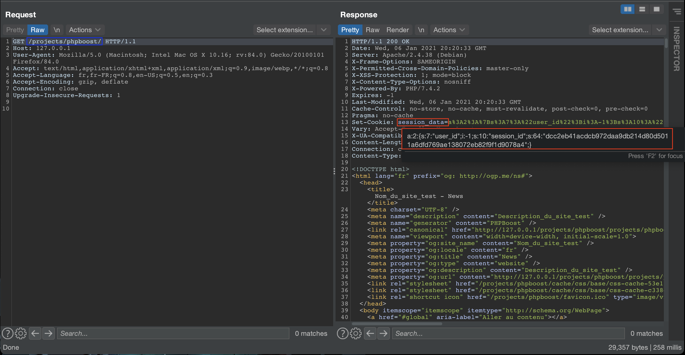
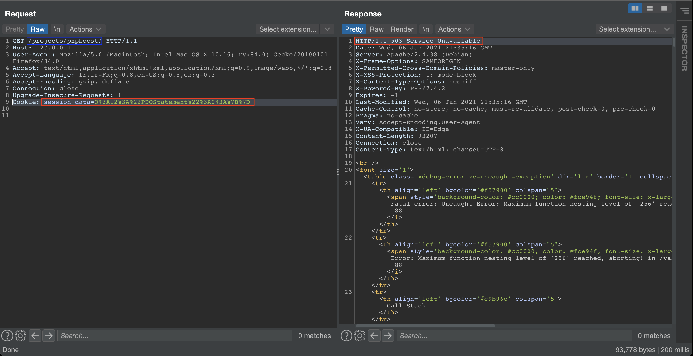
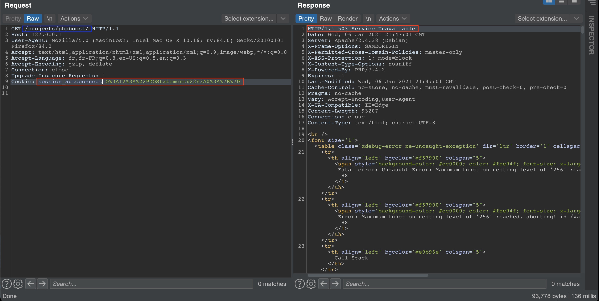


# C10100: PHPBoost CMS 5.2, PHP Object Injection (pre-auth)

Always looking for new tricks in order to understand how things work, it took me a little bit of jumping between function calls to identify this PHP Object Injection.



## How ?

It is within two session cookies that it is possible to inject PHP objects that will be deserialized by the application.

- `$_COOKIE["session_data"]`
- `$_COOKIE["session_autoconnect"]`

A simple way to test for the presence of a POI is to use the "fake" serialized object `O:12:"PDOStatement":0:{}`. The `PDOStatement` does not suport PHP object serialization/unserialization which triggers an 503 error.

Example:
```
(1/1) PDOException
You cannot serialize or unserialize PDOStatement instances
```





## Why ?

Sessions are handled by the Session class defined in <span style="color:red">\<ROOT\>/kernel/framework/phpboost/user/session/Session.class.php</span>.

File: <span style="color:red">\<ROOT\>/kernel/framework/phpboost/user/session/Session.class.php</span>
```php
class Session {

    ...

    public static function __static() {
        $config=SessionsConfig::load();
        self::$DATA_COOKIE_NAME=$config->get_cookie_name().'_data';
        self::$AUTOCONNECT_COOKIE_NAME=$config->get_cookie_name().'_autoconnect';
        self::$request=AppContext::get_request();
        self::$response=AppContext::get_response();
    }

    ...

    public static function start() {
        try {
            if(self::$request->has_cookieparameter(self::$DATA_COOKIE_NAME)) {
                return self::connect();
            } if(self::$request->has_cookieparameter(self::$AUTOCONNECT_COOKIE_NAME)) {
                return self::autoconnect();
            }
            return self::create_visitor();
        } catch(UnexpectedValueException $ex) {
            return self::create_visitor();
        }
    }

    ...

    private static function connect() {
        try {
            return SessionData::from_cookie(self::$request->get_cookie(self::$DATA_COOKIE_NAME));
        } catch(SessionNotFoundException $ex) {
            if (self::$request->has_cookieparameter(self::$AUTOCONNECT_COOKIE_NAME)) {
                return self::autoconnect();
            }
            return self::create_visitor();
        }
    }

    ...

    private static function autoconnect() {
        $cookie = self::$request->get_cookie(self::$AUTOCONNECT_COOKIE_NAME);
        $user_id = AutoConnectData::get_user_id_from_cookie($cookie);
        if ($user_id != Session::VISITOR_SESSION_ID) {
            return SessionData::create_from_user_id($user_id);
        } else {
            self::$response->delete_cookie(self::$AUTOCONNECT_COOKIE_NAME);
            return self::create_visitor();
        }
    }

    ...

```

By default the values `self::$DATA_COOKIE_NAME` and `self::$AUTOCONNECT_COOKIE_NAME` will take the values "session_data" and "session_autoconnect". Then the function `has_cookieparameter()` will be called twice with these values as parameters.

File: <span style="color:red">\<ROOT\>/kernel/framework/io/http/HTTPRequestCustom.class.php</span>
```php

...

public function has_cookieparameter($parameter) {
    return $this->has_rawparameter($parameter,$_COOKIE);
}

...

private function has_rawparameter($parameter,&$array) {
    return isset($array[$parameter]);
}

...

```

If the cookies mentioned above are present in a request, either function `connect()` or `autoconnect()` will be called.

The vulnerability is triggered by these lines `return SessionData::from_cookie(self::$request->get_cookie(self::$DATA_COOKIE_NAME))` and `$user_id=AutoConnectData::get_user_id_from_cookie($cookie);`.

The function `from_cookie()` make a call to `TextHelper::unserialize()` a wrapper to the real `unserialize()` function that will take as parameter data controlled by the user.

File: <span style="color:red">\<ROOT\>/kernel/framework/phpboost/user/session/SessionData.class.php</span>
```php

...

public static function from_cookie($cookie_content) {
    $values = TextHelper::unserialize($cookie_content);
    if ($values === false || empty($values[self::$KEY_USER_ID]) || empty($values[self::$KEY_SESSION_ID])){
        throw new UnexpectedValueException('invalid session data cookie content: "' . $cookie_content . '"');
    } try {
        $user_id = $values[self::$KEY_USER_ID];
        $session_id = $values[self::$KEY_SESSION_ID];
        $columns = array(
            'token',
            'timestamp',
            'ip',
            'location_script',
            'location_title',
            'location_id',
            'data',
            'cached_data'
        );
        $condition = 'WHERE user_id=:user_id AND session_id=:session_id';
        $parameters = array(
            'user_id' => $user_id,
            'session_id' => $session_id
        );
        $row = PersistenceContext::get_querier()->select_single_row(DB_TABLE_SESSIONS, $columns, $condition, $parameters);
        $data = self::init_from_row($user_id, $session_id, $row);
        $data->timestamp = time();
        return $data;
    }
    catch(RowNotFoundException $ex) {
        throw new SessionNotFoundException($user_id, $session_id);
    }
}

...

```

File: <span style="color:red">\<ROOT\>/kernel/framework/helper/TextHelper.class.php</span>
```php

...

public static function unserialize($string) {
    return unserialize(self::is_base64($string)?base64_decode($string):$string);
}

...

```

The function `get_user_id_from_cookie()` also make a call to `TextHelper::unserialize()` with as parameter data controlled by the user.

File: <span style="color:red">\<ROOT\>/kernel/framework/phpboost/user/session/AutoConnectData.class.php</span>
```php

...

public static function get_user_id_from_cookie($cookie_content) {
    $autoconnect = TextHelper::unserialize($cookie_content);
    if ($autoconnect === false || empty($autoconnect['user_id']) || empty($autoconnect['key']))
    {
        throw new UnexpectedValueException('invalid autoconnect cookie content: "' . $cookie_content . '"');
    }
    $data = new AutoConnectData($autoconnect['user_id'], $autoconnect['key']);
    if ($data->is_valid()) {
        return $autoconnect['user_id'];
    }
    return Session::VISITOR_SESSION_ID;
}

...

```
