
# C11: YesWiki version cercopitheque 2020-04-18-1, LFI to RCE (pre-auth)

After spending some time looking for the previous vulnerabilities, I thought it might be intersting to get a pre-auth RCE but this time I didn't want to dive into the code and was just interested in what could be done from the browser. In order to achieve this, I had to find an exploit chain that would allow me to execute PHP code on the underlying server.

Before presenting the exploit chain, I would like to present very briefly the application and its user rights managment.

As explained in chapter [C1](/c1), the goal of this application (or CMS) is to manage a(multiple) wiki(s). As a wiki, it is understood in the very spirit of the application that users can create and edit pages.

A first problem is then encountered, it turns out that on a standard installation (out of the box) a non-authenticated user can edit pages as you can see on the figures below. It is useless to specify that an authenticated user having by default the right to edit pages could also exploit the vulnerability.

Click on "edit this page" (The area framed in blue shows that we are currently not connected).

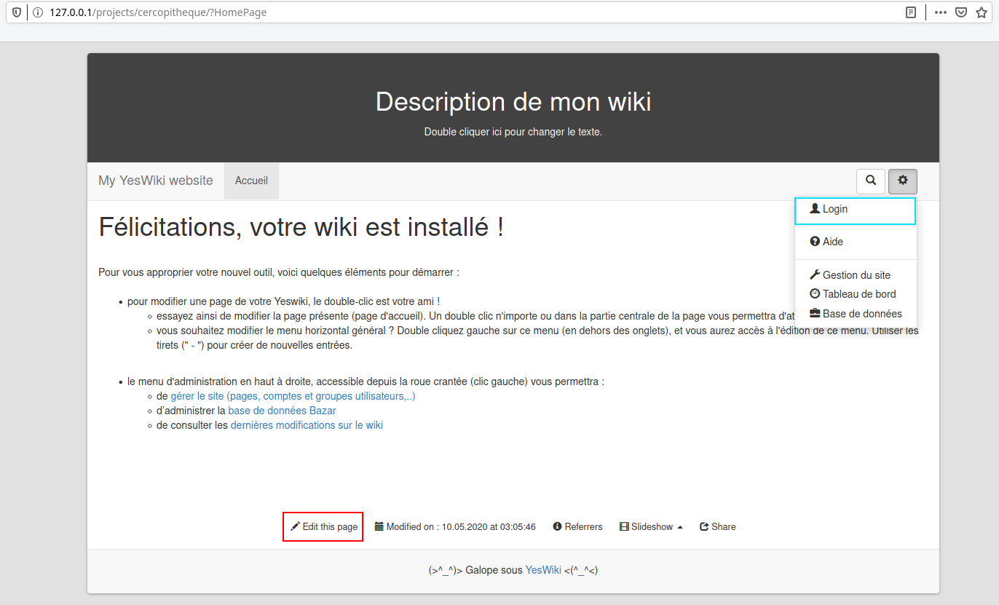

Once we are in edit mode, it is possible to modify the content of the page.

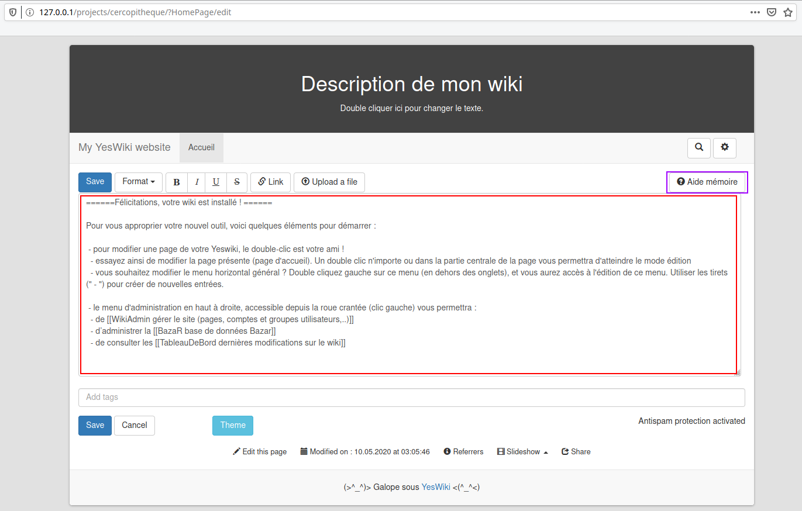

The area I highlighted in pink in the above figure is called memory aid, so I thought it was essential to see how page editing is handled.

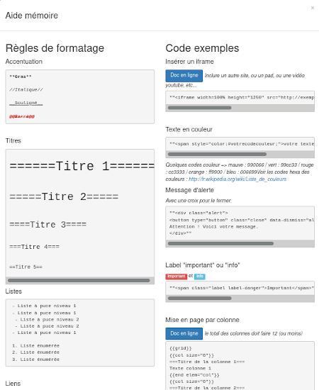

> Note: We have the possibility to insert application specific tags and HTML code within the page. Even if this is not the goal here, I wanted to show that it was possible to get a stored XSS by adding the following payload to the page `""<a href="xxx" onmouseover=alert(1)>html injection</a>""` (see screenshot [Stored XSS (part 1)](https://github.com/therealcoiffeur/therealcoiffeur.github.io/blob/master/captures/c3_4.png) and [Stored XSS (part 2)](https://github.com/therealcoiffeur/therealcoiffeur.github.io/blob/master/captures/c3_5.png)).

## How?

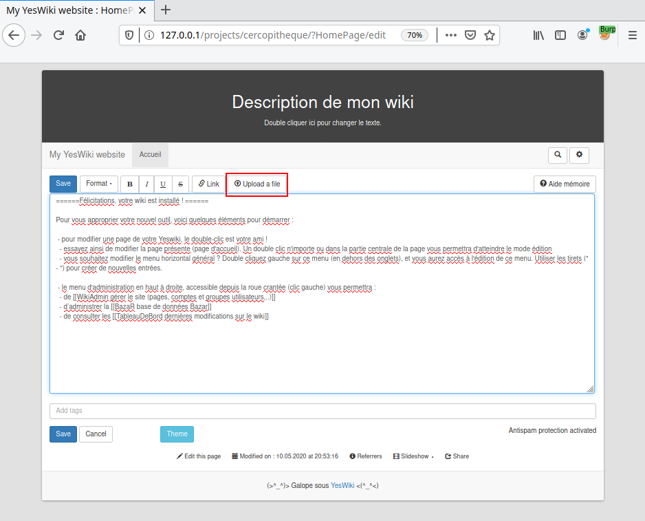

Analyzing this editing feature, I realized that it is possible to upload a file but only if his extension is from the list below:

- jpg, png, gif, jpeg, bmp, tif, svg, aiff, anx, axa, axv, asf, avi, flac, flv, mid, mng, mka, mkv, mov, mp3, mp4, mpg, oga, ogg, ogv, ogx, qt, ra, ram, rm, spx, swf, wav, wmv, 3gp, abw, ai, bz2, bin, blend, c, cls, css, csv, deb, doc, docx, djvu, dvi, eps, gz, h, kml, kmz, mm, pas, pdf, pgn, ppt, pptx, ps, psd, pub, rpm, rtf, sdd, sdw, sit, sty, sxc, sxi, sxw, tex, tgz, torrent, ttf, txt, xcf, xspf, xls, xlsx, xml, zip, odt, ods, odp, odg, odc, odf, odb, odi, odm, ott, ots, otp, otg

Otherwise the following error is returned to us:

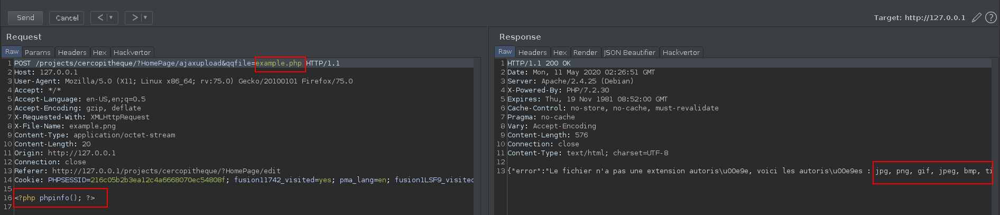

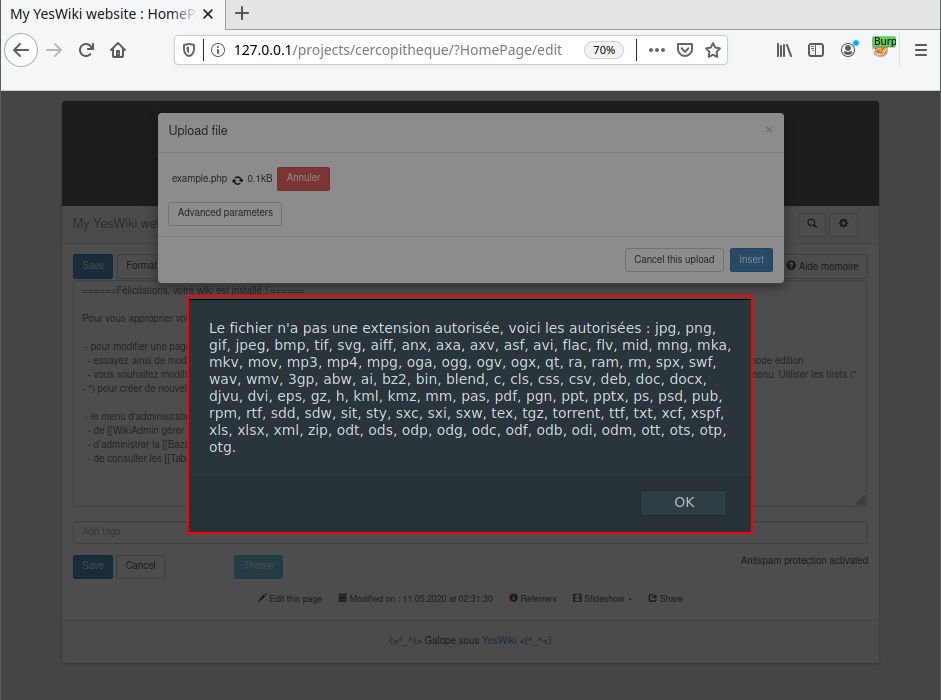

So if we upload PHP code within a file with png extension, we obtain the following result by intercepting the request with [Burp Suite](https://portswigger.net/burp): 

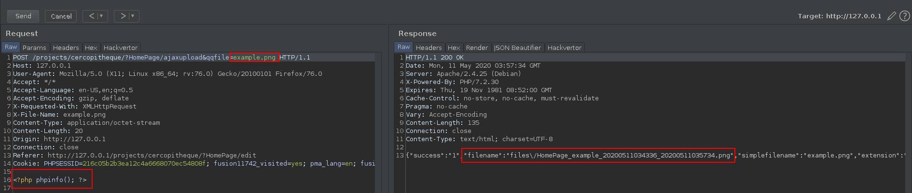

Moreover, thanks to the server's response, we can identify a part of the path use to access the file, which is <span style="color:red">\<SOMETHING\>/files/HomePage_example_20200511034336_20200511035809.png</span>.

Even if you don't have the possibility to use a proxy it is still possible to get the path of this file. Save the changes made to the page, then click on the newly added image tag.

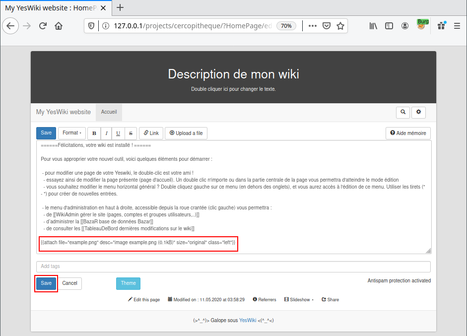

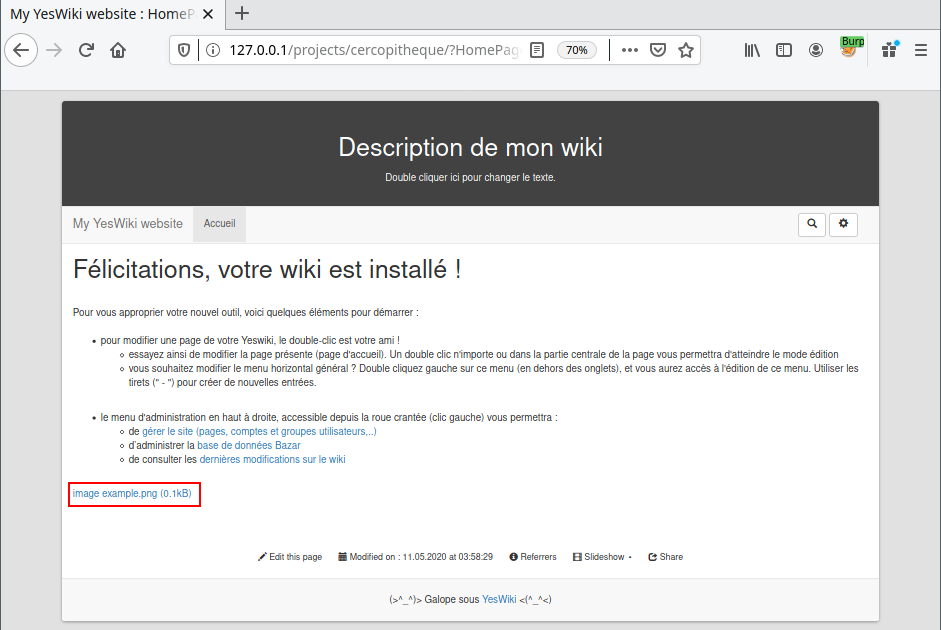

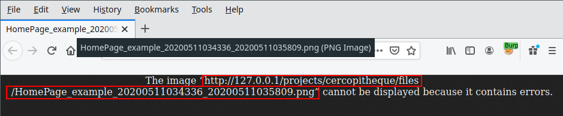

Now that we've managed to upload a file containing PHP to the server, all we have to do is execute it. To do so, we will now use the second vulnerability of this exploit chain.

After browsing the application to find the different tags that can be used within a page, one of them seemed interesting to me, `{{bazarliste}}`. The reason why this tag seemed more interesting than the others, is because this tag is generated from an attribute called template, which is shown in the example below as the name of a template file within the application.

Example:

```
{{bazarliste id="1" template="liste_accordeon.tpl.html" width="100%" height="600px" lat="46.22763" lon="2.213749" markersize="big" provider="OpenStreetMap.Mapnik" zoom="5" groups="" titles="" groupsexpanded="false"}}
```

It turns out that this file path is <span style="color:red">\<ROOT\>/tools/bazar/presentation/templates/liste_accordeon.tpl.html</span>. The question we can then ask ourselves is, what happens if we define an arbitrary template file. 

To do so, you just have to edit a page and add the tag:

```
{{bazarliste template="../../../../../../../../../../../etc/passwd"}}
```

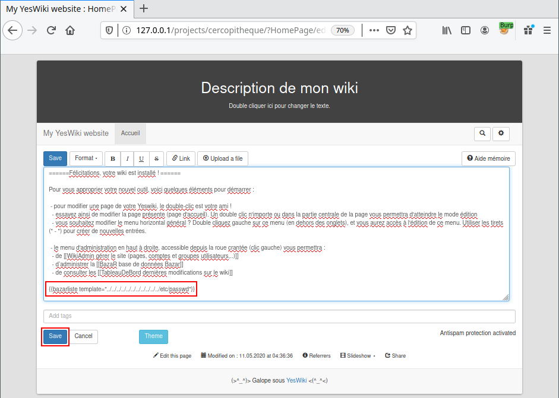


So now we are reading arbitrary files on the underlying system. All we have left is to use what we have achieved in the previous stage. And define as an arbitrary template our image containing the PHP code.

```
{{bazarliste template="../../../../../../../../../../../var/www/html/projects/cercopitheque/files/HomePage_example_20200511034336_20200511035809.png"}}
```

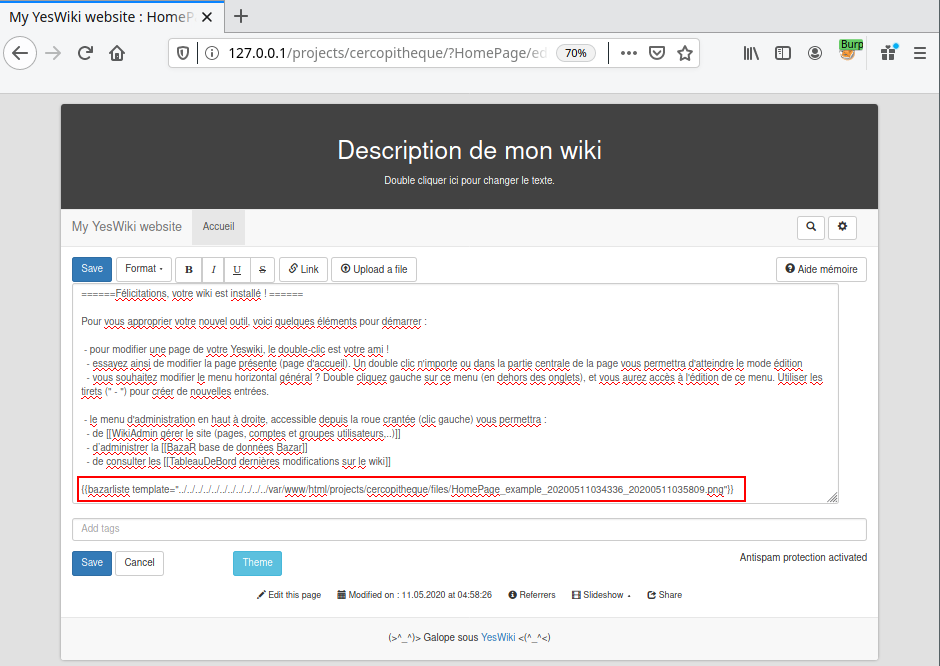

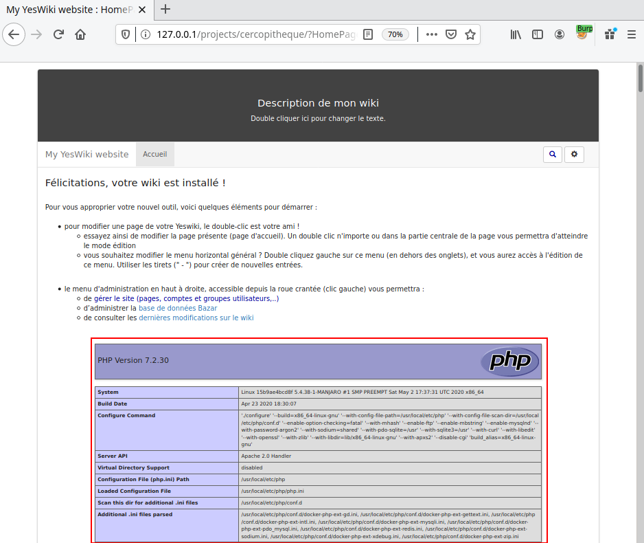

The author of the application has been informed of the vulnerability.

It was cool to be able to discover different types of vulnerabilities within the application. I decided to stop looking at this one and work on something new soon.
