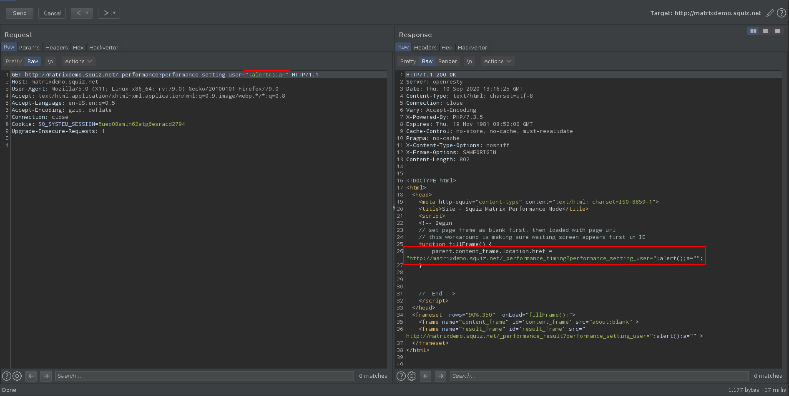
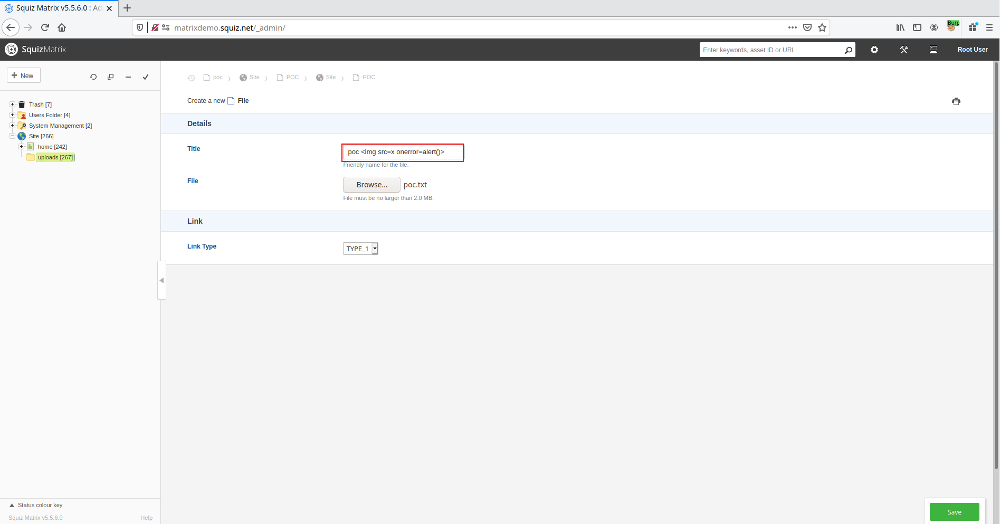


# C1111: Squiz Matrix, multiple XSS (authenticated)

[Squiz Matrix](https://www.squiz.net/platform/products/cms) is an enterprise CMS which help in the creation of websites, portals, intranets, campaign sites and mobile apps with ease as it is explained on their website.

> Squiz Matrix is an enterprise CMS built to help you create extraordinary websites, portals, intranets, campaign sites and mobile apps with ease. With Squiz Matrix, you can build, publish and optimise content, across thousands of applications and support unlimited users from one place; making it the right tool for delivering all of your digital experiences.

It is by reading and comparing the source code of the versions 5.5.6.0 and 5.5.6.3 that I could discover the presence of two authenticated XSS.

- Reflected Raw XSS affecting versions below 5.5.6.3
- Stored XSS affecting versions below 5.5.6.0

The code of the latest version (5.5.6.3) can be found in an archive at the following address:
- https://matrix.squiz.net/__data/assets/file/0030/35967/matrix-5-5-6-3.tgz

In order to test the CMS without wasting time trying to install it, Squiz proposes an .ova image with an installation of the version 5.5.6.0 accessible at the following address:

- https://squiz-matrix.s3-us-west-1.amazonaws.com/matrixdemo.squiz.net-5-5-6-0.ova

Once the image is imported into virtualbox, we can authenticate ourselves on the system with the following credentials:

> matrixdemo's login: root<br>matrixdemo's password: squiz

And start testing the CMS with the privileged account:


> Username: root<br>Password: root

## Reflected Raw XSS

This vulnerability is not significant because it really needs the planets to be aligned for it to be triggered.

Indeed, the following three conditions must be met:
- The user must be authenticated and must be able to perform a call on [_performance]() (supposedly admin).
- The user must use an old browser.
- The user must visit a malicious link




Within the file <span style="color:red">\<ROOT\>/core/include/performance_manager.inc</span> we can notice that the parameters `$timing_url` and `$result_url` are directly reflected in the HTML content without being sanitized.

File: <span style="color:red">\<ROOT\>/core/include/performance_manager.inc</span>
```php

...

    public function printFrames($asset)
    {
        $primary_url = current_url(TRUE, TRUE);
        $this->_clearPerformanceData();
        
        // save switch setting to session
        if(isset($_GET['performance_setting_caching'])) {
            $_SESSION['SQ_PERFORMANCE_SETTING']['caching'] = $_GET['performance_setting_caching'] ;
            unset($_GET['performance_setting_caching']);
        } else { 
            //default value of the performance cache is set to 'Off'
            $_SESSION['SQ_PERFORMANCE_SETTING']['caching'] = 'Off';  
        }
        
        // save current user id to the session, so we can restore it
        if(isset($_GET['performance_setting_user'])) {
            $_SESSION['SQ_PERFORMANCE_SETTING']['default_user'] = $GLOBALS['SQ_SYSTEM']->user->id; 
        }

        // make up original page url
        $param_string = $_SERVER['QUERY_STRING'];
        if(!empty($param_string)) {
            $param_string = '?'.$param_string;
        }

        $timing_url = $primary_url.'/_performance_timing'.$param_string;
        
        // make up result page url
        $result_url = $primary_url.'/_performance_result'.$param_string;

        // title
        $title =  $asset->name . ' - Squiz Matrix Performance Mode';
?>

<!DOCTYPE html>
<html>
    <head>
        <meta http-equiv="content-type" content="text/html; charset=ISO-8859-1">
        <title><?php echo $title; ?></title>
        <script>
        <!-- Begin
        // set page frame as blank first, then loaded with page url
        // this workaround is making sure waiting screen appears first in IE
        function fillFrame() {
                parent.content_frame.location.href = "<?php echo ($timing_url); ?>";
        }


        //  End -->
        </script>
    </head>
    <frameset  rows="90%,350"  onLoad="fillFrame();">
      <frame name="content_frame" id='content_frame' src="about:blank" >
      <frame name="result_frame" id='result_frame' src="<?php echo $result_url; ?>" >
    </frameset>
</html>

<?php 
    }// end printFrames()

...

```

And it turns out that  `$timing_url` and `$result_url` are the concatenation of a string and the parameters of the query, which results in the XSS.

```php

        ...

        // make up original page url
        $param_string = $_SERVER['QUERY_STRING'];
        if(!empty($param_string)) {
            $param_string = '?'.$param_string;
        }

        $timing_url = $primary_url.'/_performance_timing'.$param_string;
        
        // make up result page url
        $result_url = $primary_url.'/_performance_result'.$param_string;

        ...

```

In order to ensure that the vulnerability is present in the latest version of the CMS we can use the tool md5sum.

```
▶ cat performance_manager.inc_v5.6.0 | md5sum 
29874d73ff7b7250d88735d6fb03d1f0  -
▶ cat performance_manager.inc_v5.6.3 | md5sum
29874d73ff7b7250d88735d6fb03d1f0  -
```

# Stored XSS

This vulnerability is more critical than the previous one, however its exploitation is difficult because it requires an account to add a file via the management interface.



Request:
```
POST http://matrixdemo.squiz.net/_admin/?SQ_BACKEND_PAGE=main&backend_section=am&am_section=add_asset&parent_assetid=267&pos=-1&type_code=file&link_type=1&asset_ei_screen=details&sq_link_path=&sq_asset_path= HTTP/1.1
Host: matrixdemo.squiz.net
User-Agent: Mozilla/5.0 (X11; Linux x86_64; rv:79.0) Gecko/20100101 Firefox/79.0
Accept: */*
Accept-Language: en-US,en;q=0.5
Accept-Encoding: gzip, deflate
X-Requested-With: XMLHttpRequest
Content-Type: multipart/form-data; boundary=---------------------------184207501025508161682573302096
Content-Length: 2610
Origin: http://matrixdemo.squiz.net
Connection: close
Referer: http://matrixdemo.squiz.net/_admin/?SQ_BACKEND_PAGE=main&backend_section=am&am_section=add_asset&type_code=file&link_type=1&parent_assetid=267&pos=-1
Cookie: SQ_SYSTEM_SESSION=5ueo08amln62atg6esracd2794

-----------------------------184207501025508161682573302096
Content-Disposition: form-data; name="process_form"

1
-----------------------------184207501025508161682573302096
Content-Disposition: form-data; name="changes"

0
-----------------------------184207501025508161682573302096
Content-Disposition: form-data; name="state"

0:poc ;1:C:\fakepath\poc.txt;2:0;
-----------------------------184207501025508161682573302096
Content-Disposition: form-data; name="allowconfirm"

1
-----------------------------184207501025508161682573302096
Content-Disposition: form-data; name="token"

81f234462090cc21b0b7cfdf962deb6f1588f7b7
-----------------------------184207501025508161682573302096
Content-Disposition: form-data; name="userid"

10
-----------------------------184207501025508161682573302096
Content-Disposition: form-data; name="userFirstName"

Root
-----------------------------184207501025508161682573302096
Content-Disposition: form-data; name="userLastName"

User
-----------------------------184207501025508161682573302096
Content-Disposition: form-data; name="username"

root
-----------------------------184207501025508161682573302096
Content-Disposition: form-data; name="am_form_submitted"

1
-----------------------------184207501025508161682573302096
Content-Disposition: form-data; name="asset_action"

create
-----------------------------184207501025508161682573302096
Content-Disposition: form-data; name="sq_link_path"


-----------------------------184207501025508161682573302096
Content-Disposition: form-data; name="sq_preview_url"


-----------------------------184207501025508161682573302096
Content-Disposition: form-data; name="backend_assetid"

0
-----------------------------184207501025508161682573302096
Content-Disposition: form-data; name="backend_version"


-----------------------------184207501025508161682573302096
Content-Disposition: form-data; name="file_0_39"

poc 
-----------------------------184207501025508161682573302096
Content-Disposition: form-data; name="file_0"; filename="poc.txt"
Content-Type: text/plain

JUNK

-----------------------------184207501025508161682573302096
Content-Disposition: form-data; name="link_type"

1
-----------------------------184207501025508161682573302096
Content-Disposition: form-data; name="sq_lock_release"

0
-----------------------------184207501025508161682573302096
Content-Disposition: form-data; name="sq_committing"

1
-----------------------------184207501025508161682573302096--
```

Repsonse:
```html
HTTP/1.1 200 OK
Server: openresty
Date: Thu, 10 Sep 2020 14:32:50 GMT
Content-Type: text/html; charset=utf-8
Connection: close
Vary: Accept-Encoding
X-Powered-By: PHP/7.3.5
Expires: Thu, 19 Nov 1981 08:52:00 GMT
Cache-Control: no-store, no-cache, must-revalidate
Pragma: no-cache
X-Content-Type-Options: nosniff
X-Frame-Options: SAMEORIGIN
Content-Length: 59484

        <!DOCTYPE html>
                    <!--[if !IE]> -->	<html class="main" lang="en-AU"> <!-- <![endif]-->
                    <head>
            <meta charset="utf-8"/>
            <meta http-equiv="X-UA-Compatible" content="IE=edge,chrome=1"/>
            <title>poc.txt</title>
            <link rel="stylesheet" type="text/css" href="http://matrixdemo.squiz.net/__lib/web/css/reset.css?1312567-1581484407-1941" />

            ...
            
                                        <td class="sq-backend-data">
                                                        <div class="sq-file-info pb-10" data-assetId="274" data-assetName="poc " >
                                <ul class="sq-list-unstyled sq-inline-block">
                                            <li>
                            <strong class="sq-inline-block" style="min-width: 90px;">Title</strong><a href="/?a=274" target="_blank" title="Preview in new window">poc </a>							</strong>
                        </li>

                        ...

                </body>
            </html>
        
```


After reading the code of <span style="color:red">\<ROOT\>/core/assets/files/file/file_edit_fns.inc</span>, we realize that the variable is integrated to the server response without being sanitized in the version 5.5.6.0 but is no longer in the latest version. 

File: <span style="color:red">\<ROOT\>/core/assets/files/file/file_edit_fns.inc</span> (v5.5.6.3)
```php
	public function printExistingFileInfo(File $asset)
	{
		$existing = $asset->getExistingFile();
		$exclusively_in_trash = $GLOBALS['SQ_SYSTEM']->am->assetInTrash($asset->id, TRUE);
		if (!empty($existing)) {
			require_once SQ_FUDGE_PATH.'/general/datetime.inc'; ?>
			<div class="sq-file-info pb-10" data-assetId="<?php echo $asset->id; ?>" data-assetName="<?php echo $asset->attr('title'); ?>" >
				<?php $this->_printFilePreview($asset); ?>
				<ul class="sq-list-unstyled sq-inline-block">
					<?php if(isset($existing['path'])) { ?>
						<li>
							<strong class="sq-inline-block" style="min-width: 90px;"><?php echo translate('Title'); ?></strong>
							<?php
								echo (!$exclusively_in_trash)  ? '<a href="/?a=' . $asset->id . '" target="_blank" title="' . translate('Preview in new window') . '">' : '<span>';
								if ($asset->short_name) echo htmlspecialchars($asset->short_name);
								echo (!$exclusively_in_trash) ? '</a>' : '</span>';
							?>
						</li>
					<?php } ?>
					<li><strong class="sq-inline-block" style="min-width: 90px;"><?php echo translate('Size'); ?></strong> <?php echo easy_filesize($existing['size'])?></li>
					<li><strong class="sq-inline-block" style="min-width: 90px;"><?php echo translate('Updated'); ?></strong> <?php echo readable_datetime($existing['modified'])?></li>
					<?php if(isset($existing['width']) && isset($existing['height'])) { ?>
						<li><strong class="sq-inline-block" style="min-width: 90px;"><?php echo translate('Dimensions'); ?></strong> <?php echo $existing['width']; ?> x <?php echo $existing['height'];?> pixels</li>
					<?php } ?>
				</ul>
			</div> <!-- .sq-file-info --> <?php
		}
```

```
▶ diff file_edit_fns.inc_v5.6.0 file_edit_fns.inc_v5.6.3
12c12,13
< 							<strong class="sq-inline-block" style="min-width: 90px;"><?php echo translate('Title'); ?></strong><?php
---
> 							<strong class="sq-inline-block" style="min-width: 90px;"><?php echo translate('Title'); ?></strong>
> 							<?php
14,16c15,17
< 								if ($asset->short_name) echo $asset->short_name;
< 								echo (!$exclusively_in_trash) ? '</a>' : '</span>'; ?>
< 							</strong>
---
> 								if ($asset->short_name) echo htmlspecialchars($asset->short_name);
> 								echo (!$exclusively_in_trash) ? '</a>' : '</span>';
> 							?>
27,28d27
< 
< 	}//end printExistingFileInfo()
```

## Conclusion ...

Sometimes we identify vulnerabilities that are in practice difficult to exploit, but the most important thing is not to give up and to keep looking until the day when we will find a vulnerability that is really worth it.

